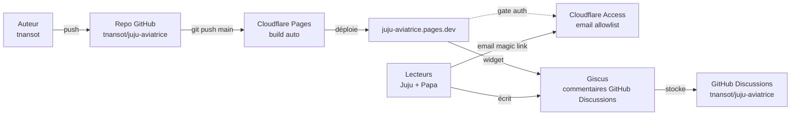

# Déploiement

Doc d'opérations pour le maintien du site `juju-aviatrice.pages.dev`. Pas destinée à Juju (c'est pour ça qu'elle vit à la racine et pas dans [wiki/](wiki/), qui est rendu dans le site).

## Vue d'ensemble



**Stack** :

- **Source** : Markdown dans [wiki/](wiki/), config dans [mkdocs.yml](mkdocs.yml).
- **Build** : MkDocs Material via Python (déps figées dans [requirements.txt](requirements.txt)).
- **Hébergement** : Cloudflare Pages (intégration GitHub, build auto à chaque push sur `main`).
- **Authentification** : Cloudflare Access (zero-trust, email magic link / Google SSO).
- **Commentaires** : Giscus (adossé à GitHub Discussions du repo).

## Workflow de mise à jour

99 % du temps :

```bash
# Édition locale d'un .md ou de la config
.venv/bin/mkdocs serve   # preview live sur http://127.0.0.1:8000

# Quand c'est bon
# (depuis Claude Code) "/safe-commit" → audit + commit + push automatique
# (sinon) git add <fichiers> && git commit -m "..." && git push
```

Le push déclenche un build Cloudflare Pages qui prend ~1 min. Pendant le build, l'ancienne version reste servie. Une fois le build OK, la nouvelle version remplace l'ancienne instantanément.

## Cloudflare Pages — config du build

Dashboard : **Workers & Pages → juju-aviatrice → Settings → Build & deployments**.

| Paramètre | Valeur |
|---|---|
| Production branch | `main` |
| Build command | `pip install -r requirements.txt && mkdocs build` |
| Build output directory | `site` |
| Root directory | _(vide)_ |
| Build system version | 2 (par défaut) |

**Variables d'environnement** (Settings → Environment variables) :

| Nom | Valeur | Scope |
|---|---|---|
| `PYTHON_VERSION` | `3.12` | Production + Preview |

> Si on bouge sur Python 3.13 ou +, ajuster cette variable. La 3.14 a marché en local mais CF Pages n'expose pas toujours la dernière minor immédiatement.

**Preview deployments** : activés par défaut sur chaque branche autre que `main`. Utile pour valider une grosse refonte avant merge. Chaque preview a son URL `<hash>.juju-aviatrice.pages.dev`.

## Cloudflare Access — gérer les emails autorisés

Dashboard : **Zero Trust → Access → Applications → juju-aviatrice docs → Policies**.

La policy active autorise une liste d'emails (Include → Emails). Pour ajouter un proche qui doit pouvoir lire :

1. Éditer la policy `Famille`.
2. Sous **Include → Emails**, ajouter l'adresse.
3. Save. La personne peut désormais demander un lien magique à l'URL du site.

Pour révoquer : retirer l'email de la liste. La session active expire selon la **Session duration** configurée (1 mois par défaut, modifiable dans Settings de l'application).

**Méthodes d'authentification** (Zero Trust → Settings → Authentication) :

- **One-time PIN** (par défaut) : code par mail, pas de compte requis côté visiteur.
- **Google SSO** : connexion en un clic avec un Gmail. Activer si Juju préfère.

> Note : `juju-aviatrice.pages.dev` n'est pas un domaine que tu possèdes. L'application Access a été créée via le toggle **Workers & Pages → juju-aviatrice → Settings → Access policy**, pas via le formulaire "Add Application" classique de Zero Trust (qui n'aurait pas accepté un hostname `*.pages.dev`).

## Giscus — commentaires

Configuration côté repo GitHub `tnansot/juju-aviatrice` :

- **Discussions activées** : Settings → General → Features → Discussions.
- **App Giscus installée** : [github.com/apps/giscus](https://github.com/apps/giscus), scope limité à ce repo.
- **Catégorie utilisée** : `General` (modifier si on veut séparer la doc des autres usages).

Configuration côté MkDocs : voir [overrides/main.html](overrides/main.html). Les valeurs publiques :

| Attribut | Valeur |
|---|---|
| `data-repo` | `tnansot/juju-aviatrice` |
| `data-repo-id` | `R_kgDOR-4qKw` |
| `data-category` | `General` |
| `data-category-id` | `DIC_kwDOR-4qK84C6iNQ` |
| `data-mapping` | `pathname` (un fil par page) |

Ces IDs sont **publics par design** (visibles dans le HTML rendu). Ils ne nécessitent aucune protection.

Pour régénérer la config si on change de catégorie ou de repo : aller sur [giscus.app/fr](https://giscus.app/fr), refaire le formulaire, recopier les attributs `data-*` dans [overrides/main.html](overrides/main.html).

**Désactiver les commentaires sur une page** : ajouter dans le front-matter du `.md` :

```yaml
---
comments: false
---
```

## Développement local

```bash
# Première fois
python3 -m venv .venv
.venv/bin/pip install -r requirements.txt

# À chaque session
.venv/bin/mkdocs serve
# → http://127.0.0.1:8000, hot-reload sur sauvegarde
```

Pour tester un build de production :

```bash
.venv/bin/mkdocs build --strict
# → site/ (gitignoré), à inspecter ou servir avec un static server
```

`--strict` fait échouer le build sur les warnings (liens cassés, fichiers de doc orphelins…). Toujours l'utiliser avant un push pour ne pas pousser un site cassé.

## Dépannage

### Le push est passé mais le site n'est pas à jour

1. Aller sur **Workers & Pages → juju-aviatrice → Deployments**.
2. Vérifier que le dernier build est en `Success`. S'il est en `Building`, attendre.
3. S'il est en `Failed`, cliquer dessus → onglet "Build log" pour voir l'erreur. Causes fréquentes :
   - `requirements.txt` qui pointe sur une version incompatible avec `PYTHON_VERSION`.
   - Erreur dans `mkdocs.yml` (YAML invalide, plugin manquant).
   - Lien cassé en mode `--strict` (mais le build CF Pages n'utilise pas `--strict` par défaut, donc rare).

### Le visiteur tape l'URL et tombe directement sur le contenu sans gate Access

L'application Access n'est pas active. Vérifier dans **Workers & Pages → juju-aviatrice → Settings → Access policy** que le toggle est ON pour Production.

### Giscus n'apparaît pas en bas des pages

Trois causes possibles :

1. **Page avec `comments: false`** dans son front-matter — comportement attendu.
2. **Bloqueur de pubs** chez le visiteur — Giscus ressemble à un script tiers, certains uBlock filtrent.
3. **App Giscus désinstallée** du repo GitHub — réinstaller via [github.com/apps/giscus](https://github.com/apps/giscus).

### "Repository not found" dans la console Giscus

Soit le repo est redevenu privé (Giscus exige un repo public), soit l'app Giscus a perdu accès. Réinstaller l'app et vérifier que Discussions est toujours activé.

### Build qui prend > 5 min

Le free tier Cloudflare Pages a une limite de **20 min par build** et **500 builds/mois**. Au rythme actuel (quelques pushes par semaine), aucun risque. Si on devait s'en approcher, voir l'option de cache des deps Python via `wrangler.toml` ou un build hook personnalisé.

## Coûts

Tout est gratuit dans les quotas actuels :

| Service | Quota free | Usage estimé |
|---|---|---|
| Cloudflare Pages — builds | 500/mois | ~10/mois |
| Cloudflare Pages — bandwidth | illimité | n/a |
| Cloudflare Access — utilisateurs | 50 | 2 |
| GitHub — Discussions | illimité | très bas |
| Giscus | gratuit | n/a |

Une CB est demandée par Cloudflare lors de l'activation Zero Trust mais rien n'est facturé tant que les quotas ne sont pas dépassés.

## Fichiers à connaître

| Fichier | Rôle |
|---|---|
| [mkdocs.yml](mkdocs.yml) | Config du site (thème, nav, plugins, math) |
| [requirements.txt](requirements.txt) | Deps Python pour le build |
| [overrides/main.html](overrides/main.html) | Override de template — intégration Giscus |
| [wiki/javascripts/mathjax.js](wiki/javascripts/mathjax.js) | Config MathJax pour les formules |
| [.gitignore](.gitignore) | Exclut `site/`, `.venv/`, `.DS_Store` |
| [.claude/skills/safe-commit/SKILL.md](.claude/skills/safe-commit/SKILL.md) | Workflow commit avec audit anti-données-sensibles |

## Migration / sortie de plateforme

Le site est statique. Pour quitter Cloudflare :

- **Vers GitHub Pages** : ajouter un workflow GitHub Actions qui exécute `mkdocs build` et déploie `site/` sur `gh-pages`. Compter 30 min. Limite : pas d'équivalent Access gratuit (il faudrait passer le repo en privé + GitHub Pages privé sur compte payant, ou OAuth-proxy maison).
- **Vers Netlify / Vercel** : config build identique (`pip install -r requirements.txt && mkdocs build`, output `site/`). Auth via leur "Identity" / "Password Protection" (payant chez les deux pour la version qui ressemble à Access).
- **Vers self-hosted** : `mkdocs build` → upload `site/` vers n'importe quel serveur web statique. Auth via nginx + auth_request, ou Authelia.

Aucun lock-in : tout l'investissement est dans les `.md`, qui sont portables tels quels.
