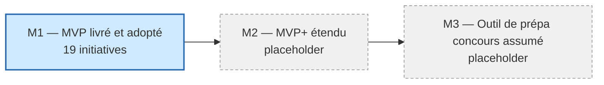
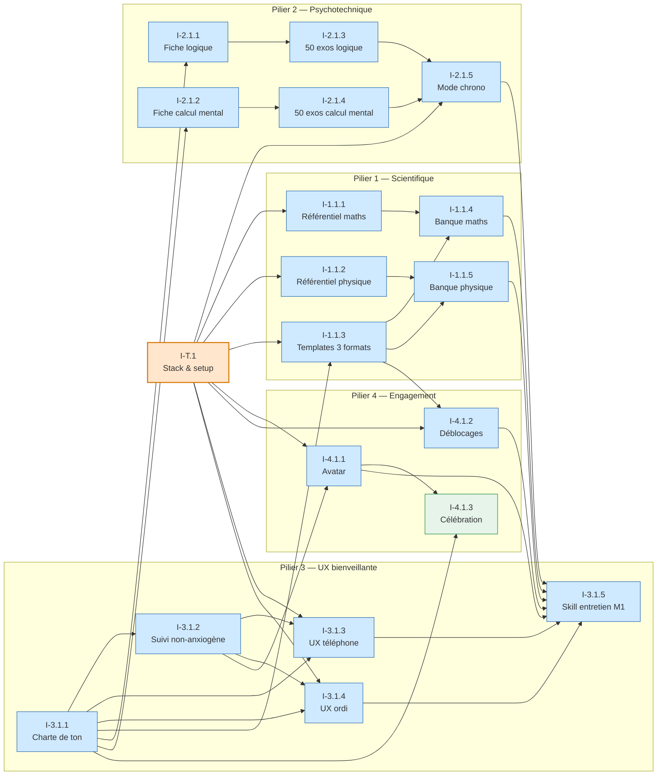

# Initiatives stratégiques — juju-aviatrice

> Initiatives rattachées aux OKRs par milestone produit. Chaque initiative est priorisée MoSCoW (Must / Should / Could) et a ses dépendances explicites.
>
> **Date** : 2026-05-13 — **Auteur** : Thomas (Papa) avec assistance Claude

## Format adopté

- **3 milestones produit** sans dates fixes (cohérent avec l'horizon itératif retenu en Vision et OKRs)
- **M1 détaillé** (cible courante), **M2 / M3 placeholder** (à instancier une fois M1 atteint)
- **Pilier 5 « Ouverture multi-concours »** : pas d'initiative dédiée — il agit en **garde-fou transverse** sur les décisions de scope (cf. directive transverse dans `okrs.md`)
- Une **initiative transverse `I-T.1`** capture le choix de stack et le scaffolding du repo, prérequis bloquant pour toutes les autres en M1

## Vue d'ensemble

---

## Milestone M1 — MVP livré et adopté

### Initiative transverse

| # | Initiative | Priorité | OKR rattaché | Dépendances |
|---|---|---|---|---|
| I-T.1 | **Stack & setup repo** — trancher web / mobile / PWA via ADR avec Juju (phase Design), scaffolder `src/`, CI/CD minimal, conventions de tests | Must | Tous OKRs M1 (bloque) | — |

### Pilier 1 — Scientifique multi-niveaux (OKR 1.1)

| # | Initiative | Priorité | OKR rattaché | Dépendances |
|---|---|---|---|---|
| I-1.1.1 | Importer le référentiel **BO 1ère spé maths** (checklist chapitres officiels) | Must | KR-1.1.1 | I-T.1 |
| I-1.1.2 | Importer le référentiel **BO 1ère spé physique-chimie** | Must | KR-1.1.2 | I-T.1 |
| I-1.1.3 | Concevoir les **templates de contenu** pour les 3 formats (recherche + flashcard + QCM chronométré) | Must | KR-1.1.3 | I-T.1, I-3.1.1 |
| I-1.1.4 | Produire la **banque de contenu maths 1ère** sur tous les chapitres et les 3 formats | Must | KR-1.1.1, KR-1.1.3 | I-1.1.1, I-1.1.3 |
| I-1.1.5 | Produire la **banque de contenu physique-chimie 1ère** sur tous les chapitres et les 3 formats | Must | KR-1.1.2, KR-1.1.3 | I-1.1.2, I-1.1.3 |

### Pilier 2 — Psychotechnique démystifié (OKR 2.1)

| # | Initiative | Priorité | OKR rattaché | Dépendances |
|---|---|---|---|---|
| I-2.1.1 | Rédiger la **fiche méthode « Logique »** (c'est quoi, comment l'aborder, ressources externes) | Must | KR-2.1.1 | I-3.1.1 |
| I-2.1.2 | Rédiger la **fiche méthode « Calcul mental »** | Must | KR-2.1.1 | I-3.1.1 |
| I-2.1.3 | Banque **≥ 50 exercices de logique** avec correction expliquée | Must | KR-2.1.2 | I-2.1.1 |
| I-2.1.4 | Banque **≥ 50 exercices de calcul mental** avec correction expliquée | Must | KR-2.1.2 | I-2.1.2 |
| I-2.1.5 | **Mode chronométré** opérationnel pour logique et calcul mental (paramétrable) | Must | KR-2.1.3 | I-T.1, I-2.1.3, I-2.1.4 |

### Pilier 3 — UX bienveillante (OKR 3.1)

| # | Initiative | Priorité | OKR rattaché | Dépendances |
|---|---|---|---|---|
| I-3.1.1 | **Charte de ton & vocabulaire** — formulations positives, anti-stigmatisation, liste des termes interdits (« note sur 20 », « échec »…). Infuse toutes les autres initiatives | Must | KR-3.1.1 | — |
| I-3.1.2 | **Suivi de progression non-anxiogène** — compteur d'exercices + indicateur d'avancement par chapitre, validé sur maquette par Juju | Must | KR-3.1.3 | I-3.1.1 |
| I-3.1.3 | **UX session courte téléphone (15 min)** — parcours rapide, exercices courts, low-friction | Must | KR-3.1.2 | I-T.1, I-3.1.1, I-3.1.2 |
| I-3.1.4 | **UX session longue ordi (week-end)** — parcours immersif, exercices de recherche longs | Must | KR-3.1.2 | I-T.1, I-3.1.1, I-3.1.2 |
| I-3.1.5 | Concevoir et implémenter le **skill `juju-entretien-m1`** — outil de mesure qualitative des KRs ressenti (peur, ressenti des messages, suivi, envie de revenir) | Must | KR-2.1.4, KR-3.1.1, KR-3.1.3, KR-4.1.3 | I-1.1.4, I-1.1.5, I-2.1.5, I-3.1.3, I-3.1.4, I-4.1.1, I-4.1.2 |

### Pilier 4 — Engagement par le jeu (OKR 4.1)

| # | Initiative | Priorité | OKR rattaché | Dépendances |
|---|---|---|---|---|
| I-4.1.1 | **Avatar progressif** — états + déclencheurs d'évolution adossés aux progrès | Must | KR-4.1.1 | I-T.1, I-3.1.2 |
| I-4.1.2 | **Mécanisme de déblocage** — au moins une zone / chapitre / format qui se débloque selon les progrès | Must | KR-4.1.2 | I-T.1, I-1.1.3 |
| I-4.1.3 | **Célébration positive** des avancées (animations légères, messages alignés sur la charte de ton) | Should | KR-4.1.3 | I-3.1.1, I-4.1.1 |

---

## Graphe de dépendances M1

**Lecture du graphe** :

- **I-T.1** (orange) est le **prérequis absolu** : tant que la stack n'est pas tranchée, rien d'autre ne peut démarrer côté code
- **I-3.1.1 (Charte de ton)** est le second prérequis large : elle conditionne tout ce qui produit du texte (fiches, contenu, messages, célébration)
- **I-3.1.5 (Skill entretien M1)** est le **dernier maillon** : il dépend de la livraison effective de tout le reste pour pouvoir mesurer le ressenti de Juju

---

## Milestone M2 — MVP+ étendu (placeholder)

> Initiatives à détailler une fois M1 atteint et l'entretien Juju post-M1 dépouillé. Les Objectives M2 dans `okrs.md` (1.2, 2.2, 3.2, 4.2, NEW.1) serviront de point de départ.

---

## Milestone M3 — Outil de prépa concours assumé (placeholder)

> Initiatives à détailler une fois M2 atteint et la voie cible de Juju clarifiée. C'est à ce milestone que le **pilier 5 (Ouverture)** sera instancié explicitement (calibrage par école : PILAPT vs DLR vs PSY Air France).

---

## Traçabilité

| Dépendance | Référence |
|---|---|
| Vision produit (piliers, MVP, tensions à acter) | [vision-produit.md](vision-produit.md) |
| OKRs (Objectives, KRs, milestones produit) | [okrs.md](okrs.md) |
| Cadrage initial — priorités exprimées par Juju | [cadrage-brouillon/besoins-juju.md](../../cadrage-brouillon/besoins-juju.md) |
| Étapes envisagées par le porteur (logique + calcul mental en premier) | [cadrage-brouillon/prochaines-etapes.md](../../cadrage-brouillon/prochaines-etapes.md) |
| Pattern de skill conversationnel à réutiliser pour `juju-entretien-m1` | [.claude/skills/safe-commit/SKILL.md](../../.claude/skills/safe-commit/SKILL.md) |
| ADR stack technique (à produire en phase Design — couvert par I-T.1) | [docs/03-design/](../03-design/) (à venir) |
