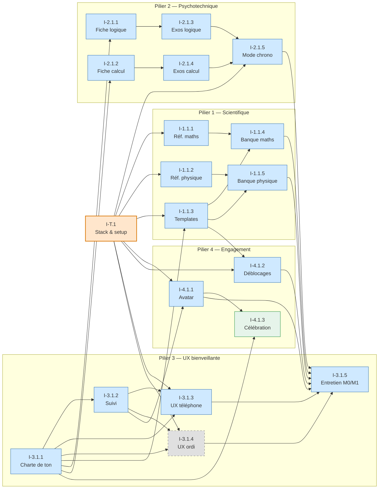

# Initiatives stratégiques — juju-aviatrice

> Initiatives rattachées aux OKRs par milestone. Priorisation MoSCoW, dépendances explicites.
> **2026-05-13** — Thomas (Papa) avec Claude

M0 (prototype validable) puis M1 (MVP complet) détaillés, M2/M3 placeholder. La colonne **Milestone** indique le premier jalon où l'initiative est requise ; quand le scope M0 est réduit par rapport à M1, c'est précisé entre parenthèses (scope complet en M1). Pilier 5 « Ouverture » agit en garde-fou transverse (pas d'initiative dédiée). Initiative transverse I-T.1 (stack + scaffolding) bloque toutes les autres côté code.

---

## M0 / M1 — Du prototype au MVP complet

### Initiative transverse

| # | Initiative | Prio | OKR | Milestone | Dépendances |
|---|---|---|---|---|---|
| I-T.1 | **Stack & setup repo** — ADR avec Juju (phase Design), scaffold `src/`, CI/CD, conventions tests | Must | Tous | M0 | — |

### Pilier 1 — Scientifique (OKR 1.0 / 1.1)

| # | Initiative | Prio | OKR | Milestone | Dépendances |
|---|---|---|---|---|---|
| I-1.1.1 | Référentiel **BO 1ère spé maths** (checklist chapitres) | Must | KR-1.1.1 | M1 (M0 : 3 chapitres choisis avec Juju) | I-T.1 |
| I-1.1.2 | Référentiel **BO 1ère spé physique-chimie** | Must | KR-1.1.2 | M1 (M0 : 3 chapitres choisis avec Juju) | I-T.1 |
| I-1.1.3 | **Templates contenu** — flashcard + QCM chrono (M0), + recherche (M1) | Must | KR-1.0.2, KR-1.1.3 | M0 | I-T.1, I-3.1.1 |
| I-1.1.4 | **Banque contenu maths 1ère** (M0 : 3 chapitres × 2 formats · M1 : tous × 3) | Must | KR-1.0.1, KR-1.1.1 | M0 | I-1.1.1, I-1.1.3 |
| I-1.1.5 | **Banque contenu physique 1ère** (M0 : 3 chapitres × 2 formats · M1 : tous × 3) | Must | KR-1.0.1, KR-1.1.2 | M0 | I-1.1.2, I-1.1.3 |

### Pilier 2 — Psychotechnique (OKR 2.0 / 2.1)

| # | Initiative | Prio | OKR | Milestone | Dépendances |
|---|---|---|---|---|---|
| I-2.1.1 | **Fiche méthode « Logique »** | Must | KR-2.0.1, KR-2.1.1 | M0 | I-3.1.1 |
| I-2.1.2 | **Fiche méthode « Calcul mental »** | Must | KR-2.0.1, KR-2.1.1 | M0 | I-3.1.1 |
| I-2.1.3 | **Exercices logique** avec correction (M0 : ~5 · M1 : ≥ 50) | Must | KR-2.0.2, KR-2.1.2 | M0 | I-2.1.1 |
| I-2.1.4 | **Exercices calcul mental** avec correction (M0 : ~5 · M1 : ≥ 50) | Must | KR-2.0.2, KR-2.1.2 | M0 | I-2.1.2 |
| I-2.1.5 | **Mode chronométré** logique + calcul mental | Must | KR-2.0.3, KR-2.1.3 | M0 | I-T.1, I-2.1.3, I-2.1.4 |

### Pilier 3 — UX bienveillante (OKR 3.0 / 3.1)

| # | Initiative | Prio | OKR | Milestone | Dépendances |
|---|---|---|---|---|---|
| I-3.1.1 | **Charte de ton & vocabulaire** — formulations positives, termes interdits | Must | KR-3.0.2, KR-3.1.1 | M0 | — |
| I-3.1.2 | **Suivi progression non-anxiogène** — compteur + avancement par chapitre | Must | KR-3.0.4, KR-3.1.3 | M0 | I-3.1.1 |
| I-3.1.3 | **UX session courte** (15 min, téléphone) | Must | KR-3.0.1, KR-3.1.2 | M0 | I-T.1, I-3.1.1, I-3.1.2 |
| I-3.1.4 | **UX session longue** (ordi, week-end) | Must | KR-3.1.2 | M1 | I-T.1, I-3.1.1, I-3.1.2 |
| I-3.1.5 | **Skill `juju-entretien-m0`** puis **`juju-entretien-m1`** — mesure qualitative KRs ressenti | Must | KR-2.0.4, 3.0.3, 3.0.4, 4.0.3 (M0) · KR-2.1.4, 3.1.1, 3.1.3, 4.1.3 (M1) | M0 | Toutes les autres M0 |

### Pilier 4 — Engagement (OKR 4.0 / 4.1)

| # | Initiative | Prio | OKR | Milestone | Dépendances |
|---|---|---|---|---|---|
| I-4.1.1 | **Avatar progressif** (M0 : 3-4 états minimal · M1 : complet) | Must | KR-4.0.1, KR-4.1.1 | M0 | I-T.1, I-3.1.2 |
| I-4.1.2 | **Mécanisme de déblocage** (M0 : 1 mécanisme · M1 : zone/chapitre/format) | Must | KR-4.0.2, KR-4.1.2 | M0 | I-T.1, I-1.1.3 |
| I-4.1.3 | **Célébration positive** (M0 : sobre · M1 : animations, messages alignés charte) | Should | KR-4.0.3, KR-4.1.3 | M0 | I-3.1.1, I-4.1.1 |

---

## Graphe de dépendances M0 / M1

**Légende** : bleu = M0 (scope réduit puis complété en M1) · gris pointillé = M1 uniquement · vert = Should.

**Nœuds critiques** : I-T.1 (prérequis absolu) → I-3.1.1 (conditionne tout texte) → I-3.1.5 (dernier maillon, dépend de tout M0).

---

## M2 / M3 — placeholder

**M2** : à détailler post-M1 et entretien Juju. Objectives esquissés dans `okrs.md` (O-1.2, O-2.2, O-3.2, O-4.2, O-NEW.1).

**M3** : à détailler post-M2 et clarification voie cible. Première instanciation pilier 5 (calibrage par école).

---

## Traçabilité

| Dépendance | Référence |
|---|---|
| Vision produit | [vision-produit.md](vision-produit.md) |
| OKRs | [okrs.md](okrs.md) |
| Cadrage initial | [cadrage-brouillon/besoins-juju.md](../../cadrage-brouillon/besoins-juju.md) |
| Étapes envisagées | [cadrage-brouillon/prochaines-etapes.md](../../cadrage-brouillon/prochaines-etapes.md) |
| Pattern skill conversationnel | [.claude/skills/safe-commit/SKILL.md](../../.claude/skills/safe-commit/SKILL.md) |
| ADR stack technique (à venir) | [docs/03-design/](../03-design/) |
