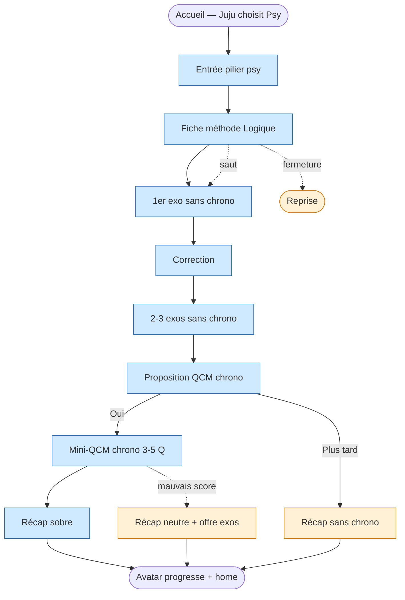

<!-- Copyright (C) 2026 Cyril Vrillaud - SPDX-License-Identifier: AGPL-3.0-only -->

# Parcours utilisateur : Découverte-psychotechniques (J3)

> Premier face-à-face de Juju avec une fiche méthode psy puis un test chronométré. Doit **désarmer la peur** exprimée le 11/04/2026 (« je n'ai aucune idée de ce que sont les tests psychotechniques »). En M0 : logique d'abord, calcul mental ensuite.
> **Périmètre** : M0 — critique. **Date** : 2026-05-13.

## Contexte et déclencheur

Juju a déjà utilisé l'app (J1/J2), passé du temps sur le pilier sciences mais pas encore touché au psy. À un moment (spontané ou suggestion du système après quelques sessions sciences réussies), elle décide d'aller voir. Probablement smartphone, pas trop fatiguée (premier contact psy demande un minimum d'attention).

## Objectif du parcours

Faire passer Juju de « je n'ai aucune idée » à « j'ai compris ce qu'est un test de logique et j'ai essayé, c'est pas si pire » en < 10 min, en 3 temps : **comprendre** (fiche méthode) → **s'entraîner sans pression** (exos sans chrono) → **tester en conditions réelles** (mini-QCM chrono, optionnel). Le calcul mental vient après, même structure.

## Pré-conditions

- [ ] Fiche méthode « Logique » rédigée (I-2.1.1)
- [ ] ≥ 5 exercices logique avec correction expliquée
- [ ] Mode chronométré opérationnel (I-2.1.5)
- [ ] Onboarding J1 complété, avatar en progression

## Scénario nominal

**1. Accès au pilier Psy** — Juju choisit « Psychotechniques » pour la 1ère fois. Écran d'entrée (« Bienvenue dans la zone Psy »), types M0 (logique + calcul mental), logique en 1er choix recommandé. → *Curieuse, légèrement appréhensive*.

**2. Fiche méthode Logique** — Juju choisit « Commencer par la logique ». Fiche en 3 sections courtes : *C'est quoi ?* (1 paragraphe), *Ce que ça évalue* (3-5 puces), *Comment l'aborder* (3-5 conseils). Ton charte, pas de jargon. → *Rassurée* — enfin une réponse simple.

**3. Premier exo sans chrono** — Exercice de logique court (série, analogie, syllogisme). **Aucun chronomètre.** Bouton « Voir la correction » quand elle est prête. → *Concentrée* — pas de pression de temps.

**4. Correction expliquée** — Bonne réponse + explication pédagogique courte (le raisonnement attendu). Formulation neutre, sans verdict. → *Éclairée* — « ah ok, c'est ça qu'ils veulent ».

**5. Enchaînement 2-3 exos sans chrono** — Variétés de typologies (série, analogie, raisonnement déductif). Corrections à chaque fois. Encart sobre « Tu as fait X exos de logique ». → *Apprivoisée* — elle reconnaît les familles.

**6. Proposition mini-QCM chrono** — Non-obligatoire. 3-5 questions, chrono paramétrable (par défaut indulgent). Formulation : « Tu veux essayer en chronométré ? Tu peux toujours arrêter ». → *Intriguée* — accessible.

**7. Mini-QCM chronométré** — Juju accepte, répond sous chrono. Chronomètre discret mais visible. Pas de feedback intermédiaire (style concours). Récap : combien de bonnes réponses, en quel temps, **sans note /N ni classement**. Ex. : « 3 justes sur 5, en 1 min 47. C'est ton 1er chrono — l'idée, c'est qu'il devienne familier. » → *Adrénaline modérée → soulagée*.

**8. Bilan et retour** — Récap sobre (fiche lue + N exos sans chrono + 1 mini-QCM). Avatar marque la progression (1er badge psy implicite). Suggestion : retour accueil ou même séquence sur calcul mental. → *Fière* — premier passage complet sur la zone redoutée.

## Scénarios alternatifs

**Alt 1 — Saut fiche méthode** (étape 2) : Juju passe directement aux exos. Le système n'insiste pas. En fin de séquence, suggestion de revenir sur la fiche.

**Alt 2 — Refus QCM chrono** (étape 6) : « Plus tard ». Séquence fiche + exos sans chrono validée, progression avatar actée. QCM chrono reste disponible et re-suggérable.

**Alt 3 — Fermeture en cours de fiche** (étape 2) : prochaine ouverture sans reproche. Pilier psy accessible, fiche marquée « en cours » (non bloquante).

**Alt 4 — Score 0/5 ou 1/5 au QCM** (étape 7) : récap neutre, proposition de refaire des exos sans chrono. Progression avatar validée (le passage compte, pas le score).

## Flow diagram

## Expérience utilisateur

**Satisfaction** : fiche méthode courte et lisible · exos sans chrono d'abord (comprendre avant évaluer) · QCM chrono optionnel · récap sans note /N · avatar valide le 1er passage psy.

**Pain points** : fiche trop longue ou jargonneuse (Haute) · 1er exo trop dur (Haute — renforce la peur) · chrono trop court ou anxiogène visuellement (Haute) · restitution QCM perçue comme note (Bloquante — charte de ton) · saut vers QCM sans étape sans chrono si alt 1 mal géré (Moyenne).

**Courbe émotionnelle** : curieuse+appréhensive → rassurée → concentrée → éclairée → apprivoisée → intriguée → adrénaline modérée → fière. L'amplitude positive finale doit compenser l'appréhension initiale.

## Post-conditions

- [ ] Fiche méthode Logique lue (ou sautée, accessible plus tard)
- [ ] ≥ 3 exercices logique avec correction
- [ ] Opportunité QCM chrono proposée (acceptée ou différée)
- [ ] Avatar a marqué le 1er passage psy
- [ ] Historique consigne la séquence pour suggestions futures (J2)

## Accessibilité

Fiche méthode : structure visuelle nette (titres, puces) lisible sur smartphone · chrono paramétrable · pas de feedback sonore brusque · boutons « Plus tard » toujours visibles · formulations strictement positives (charte I-3.1.1).

## Wireframes

À créer en Design : `wf-pilier-psy-entree`, `wf-fiche-methode-logique`, `wf-exo-logique-sans-chrono`, `wf-correction-exo-psy`, `wf-proposition-qcm-chrono`, `wf-qcm-psy-chrono`, `wf-recap-sequence-psy`.

## Notes complémentaires

- **Logique d'abord** : plus visuelle/intuitive, fait moins peur, évite la confusion avec un test de maths déguisé. Calcul mental démystifié sur la même structure ensuite.
- **Pas de journey « découverte-calcul-mental » séparé en M0** : séquence isomorphe (fiche + exos + QCM). Si la pédagogie diverge en M1+ (ex. flashcards de tables), un journey séparé pourra être ouvert.
- **J3 est un rite de passage unique** : après la 1ère exécution, les sessions psy empruntent le pattern J2 (suggestion + Go) en alternant sciences/psy.
- **Lien J5** : la baisse de la peur (KR-2.1.4) sera mesurée en entretien. J3 est le parcours dont dépend cette mesure.

## Traçabilité

| Dépendance | Référence |
|---|---|
| persona Juju (peur psy, besoins M0) | [Persona Juju](../personas/persona-juju-utilisatrice.md) |
| product brief — fiches méthode + exos psy + mode chrono | [Product Brief](../product-brief.md) |
| vision — Pilier 2 (psychotechnique démystifié) | [Vision produit](../../01-strategy/vision-produit.md) |
| OKRs — KR-2.1.1, KR-2.1.2, KR-2.1.3, KR-2.1.4 | [OKRs](../../01-strategy/okrs.md) |
| initiatives I-2.1.1, I-2.1.3, I-2.1.5 | [Initiatives](../../01-strategy/initiatives.md) |
| J1 — onboarding | [J1](journey-premiere-utilisation.md) |
| J2 — usage récurrent | [J2](journey-soir-semaine-smartphone.md) |
| J5 — entretien (mesure baisse peur) | [J5](journey-entretien-jalon-m0.md) |
