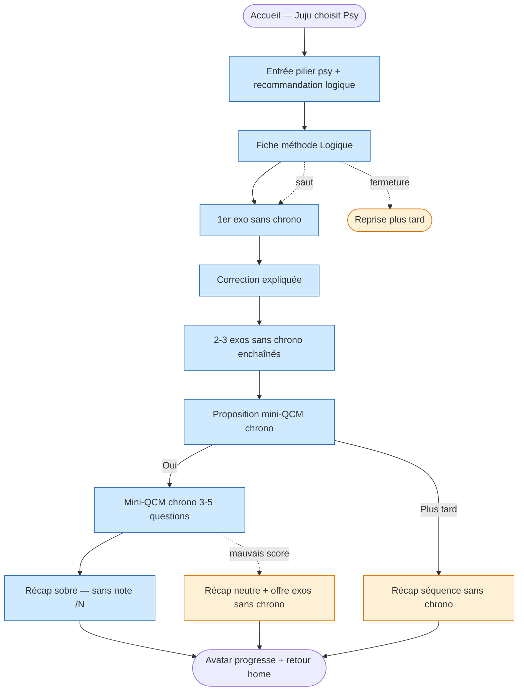

<!-- Copyright (C) 2026 Cyril Vrillaud - SPDX-License-Identifier: AGPL-3.0-only -->

# Parcours utilisateur : Découverte-psychotechniques (J3)

> Premier face-à-face de Juju avec une fiche méthode psychotechnique puis un test chronométré. C'est le parcours qui doit **désarmer la peur** exprimée pendant l'entretien du 11/04/2026 (« je n'ai aucune idée de ce que sont les tests psychotechniques »). En M0 : logique d'abord (calcul mental dans un second temps).
>
> **Périmètre** : M0 — critique. **Date** : 2026-05-13.

## Contexte et déclencheur

### Situation initiale

Juju a déjà utilisé l'app au moins une fois (J1 / J2). Elle a passé du temps sur le pilier sciences mais n'a pas encore osé toucher au pilier psy. À un moment donné — provoqué ou spontané — elle décide de regarder ce qu'il y a sous le pavé « Psychotechniques ».

Elle est probablement sur smartphone, dans un état pas trop fatigué (premier contact psy demande un minimum de capacité d'attention). Le système peut aussi proposer ce parcours en suggestion contextuelle après quelques sessions sciences réussies.

### Déclencheur

Juju, depuis l'écran d'accueil ou via une suggestion contextuelle du système, choisit d'aller sur le pilier Psy pour la première fois.

## Persona concernée

**Persona principale** : Juju — [Fiche persona](../personas/persona-juju-utilisatrice.md)
**Personas secondaires** : aucune.

## Objectif du parcours

Faire passer Juju de **« je n'ai aucune idée de ce que sont les tests psychotechniques »** à **« j'ai compris ce qu'est un test de logique et j'ai essayé, c'est pas si pire »** en moins de 10 min, en 3 temps :

1. **Comprendre** ce qu'est la logique et comment l'aborder (fiche méthode).
2. **S'entraîner sans pression** sur quelques exercices, sans chronomètre.
3. **Tester en conditions réelles** un mini-QCM chronométré court (à la fin, sur option ou suggestion).

Le calcul mental sera proposé dans un second journey ou en suite logique, **après** que la logique a été démystifiée.

## Pré-conditions

- [ ] La fiche méthode « Logique » est rédigée et accessible (initiative I-2.1.1)
- [ ] Au moins 5 exercices de logique avec correction expliquée sont disponibles (M0)
- [ ] Le mode chronométré est opérationnel (initiative I-2.1.5)
- [ ] L'onboarding J1 a été complété, l'avatar est en cours de progression

## Scénario nominal

### Étape 1 : Accès au pilier Psy pour la 1ère fois

**Action** : Juju, depuis l'écran d'accueil, choisit le pilier « Psychotechniques » pour la première fois.
**Système** : Affiche un écran d'entrée du pilier psy qui signale explicitement que c'est sa 1ère fois (« Bienvenue dans la zone Psy »), présente brièvement les types qui seront couverts en M0 (logique + calcul mental) et oriente vers **logique** en premier choix recommandé (chemin court, pas obligatoire).
**Émotion** : Curieuse, légèrement appréhensive — elle entre en territoire inconnu mais cadré.
**Touchpoint** : Écran d'entrée pilier psy — zone *Catalogue / psy*.

### Étape 2 : Ouverture de la fiche méthode Logique

**Action** : Juju choisit « Commencer par la logique ».
**Système** : Affiche la fiche méthode « Logique » : 3 sections courtes — *C'est quoi ?* (1 paragraphe), *Ce que ça évalue* (3-5 puces), *Comment l'aborder* (3-5 conseils concrets). Pas de jargon technique inutile. Ton de la charte (positif, bienveillant).
**Émotion** : Rassurée — elle a enfin une réponse simple à « c'est quoi ces tests ». Le contenu est court, lisible sur smartphone, ne déborde pas.
**Touchpoint** : Écran fiche méthode — zone *Fiches méthode psy*.

### Étape 3 : Premier exercice de logique sans chronomètre

**Action** : Juju active le bouton « Essayer un premier exo ».
**Système** : Démarre un exercice de logique court (par exemple : série à compléter, analogie, syllogisme simple). **Aucun chronomètre visible**. Affiche un bouton « Voir la correction » que Juju active quand elle est prête.
**Émotion** : Concentrée — pas de pression de temps, elle peut prendre le temps de réfléchir.
**Touchpoint** : Écran d'exercice psy — zone *Session d'entraînement / psy*.

### Étape 4 : Correction expliquée

**Action** : Juju active « Voir la correction ».
**Système** : Affiche la bonne réponse + une explication courte et pédagogique (le raisonnement attendu, pas seulement la réponse). Formulation neutre, sans verdict sur la réponse de Juju.
**Émotion** : Éclairée — même si elle s'est trompée, elle comprend le raisonnement. Premier déclic « ah ok, c'est ça qu'ils veulent ».
**Touchpoint** : Écran de correction — zone *Session d'entraînement / psy*.

### Étape 5 : Enchaînement de 2-3 exos sans chronomètre

**Action** : Juju enchaîne 2 à 3 exercices supplémentaires de logique, toujours sans chronomètre.
**Système** : Variétés de typologies (série, analogie, raisonnement déductif simple) pour donner une vue d'ensemble. Corrections expliquées à chaque fois. Affiche un encart sobre « Tu as fait X exos de logique » pour matérialiser l'avancée.
**Émotion** : Apprivoisée — elle commence à reconnaître des familles d'exercices, à anticiper le raisonnement.
**Touchpoint** : Écrans successifs d'exercice + correction — zone *Session d'entraînement / psy*.

### Étape 6 : Proposition du mini-QCM chronométré

**Action** : Juju arrive au bout du paquet sans chronomètre.
**Système** : Propose, de manière non-obligatoire, un **mini-QCM chronométré court** : 3 à 5 questions, chronomètre paramétrable (par défaut indulgent). Présente la proposition comme une option (« Tu veux essayer en chronométré ? Tu peux toujours arrêter »), pas une suite forcée.
**Émotion** : Intriguée — la première marche du « conditions réelles » est annoncée comme accessible, pas comme un saut dans le vide.
**Touchpoint** : Écran de transition vers le QCM chrono — zone *Session d'entraînement / psy*.

### Étape 7 : Mini-QCM chronométré

**Action** : Juju accepte. Le QCM démarre, elle répond aux questions sous chrono.
**Système** : Affiche le chronomètre de manière discrète mais visible. Pas de feedback intermédiaire entre les questions (style concours). À la fin, affiche le récap : combien de bonnes réponses, en quel temps, **sans note /N et sans classement**. Formulation type : « 3 réponses justes sur 5, en 1 min 47. C'est ton 1er chrono — l'idée, c'est qu'il devienne familier. »
**Émotion** : Adrénaline modérée (le chrono fait son effet) — mais soulagée à la fin que le format soit clair et que la restitution ne soit pas humiliante.
**Touchpoint** : Écran QCM chrono + écran récap — zone *Session d'entraînement / psy*.

### Étape 8 : Bilan et retour à la maison

**Action** : Juju ferme la session ou choisit son action suivante.
**Système** : Récap sobre de la séquence (fiche méthode lue + N exos sans chrono + 1 mini-QCM chrono). L'avatar marque la progression (premier badge implicite « tu as ouvert la zone Psy »). Suggère un retour à l'accueil ou la même séquence sur le **calcul mental** (autre type psy M0).
**Émotion** : Fière — elle a accompli un premier passage complet sur le pilier qu'elle redoutait.
**Touchpoint** : Écran de fin de séquence — zone *Avatar et progression / Home*.

## Scénarios alternatifs

### Scénario alternatif 1 : Juju ne lit pas la fiche méthode et va directement aux exos

**Déclencheur** : Impatience ou habitude d'apprendre par la pratique.
**Divergence à l'étape** : 2.
**Déroulement** :

1. Juju active « Passer la fiche méthode ».
2. Le système n'insiste pas, propose directement le 1er exo sans chrono (étape 3).
3. À la fin de la séquence, le système suggère de **revenir** sur la fiche méthode (« Si tu veux relire ce qu'on cherche dans ces exos, la fiche méthode est là »).

### Scénario alternatif 2 : Juju refuse le mini-QCM chronométré

**Déclencheur** : Trop fatiguée, pas envie de chrono ce soir-là, ou pas encore prête.
**Divergence à l'étape** : 6.
**Déroulement** :

1. Juju choisit « Plus tard ».
2. Le système enregistre la séquence « fiche méthode + exos sans chrono » comme complète et valide la progression d'avatar correspondante.
3. Le mini-QCM chrono devient disponible et **redevient suggérable** ultérieurement (pas un blocage).

### Scénario alternatif 3 : Juju quitte en cours de fiche méthode

**Déclencheur** : Interruption, désintérêt ponctuel.
**Divergence à l'étape** : 2.
**Déroulement** :

1. Juju ferme l'app sans avoir fini la fiche méthode.
2. À la prochaine ouverture, l'app ne reproche rien.
3. Le pilier psy reste accessible et la fiche méthode est marquée « en cours » (non bloquante).

### Scénario alternatif 4 : Le mini-QCM se solde par 0/5 ou 1/5

**Déclencheur** : Juju ne maîtrise pas encore le format, ou perd ses moyens sous chrono.
**Divergence à l'étape** : 7.
**Déroulement** :

1. Le récap final reste strictement neutre, sans formulation négative.
2. Le système propose explicitement de **refaire la séquence sans chrono** sur d'autres exos (« Tu veux refaire quelques exos tranquillement ? »).
3. La progression d'avatar liée au 1er passage est tout de même validée (le passage compte, pas le score).

## Flow diagram

## Expérience utilisateur

### Points de satisfaction

1. **La fiche méthode courte et lisible** — répond directement au « je n'ai aucune idée de ce que sont ces tests ».
2. **Les exos sans chrono d'abord** — confirme la promesse pédagogique « comprendre avant d'évaluer ».
3. **Le mini-QCM chrono optionnel** — donne accès aux conditions réelles sans imposer le saut.
4. **Le récap sobre, sans note /N** — incarne la règle d'or sur le terrain le plus sensible (psy).
5. **L'avatar qui valide le 1er passage psy** — l'engagement par le jeu sécurise le passage vers la zone redoutée.

### Pain points

1. **Fiche méthode trop longue ou jargonneuse** — **Criticité** : Haute (anéantit l'effet de démystification).
2. **Premier exo trop dur** — **Criticité** : Haute (peut renforcer la peur au lieu de la désamorcer ; à valider en Plan / contenu).
3. **Chrono du mini-QCM trop court ou anxiogène visuellement** — **Criticité** : Haute (les premiers chronos sont des moments charnières).
4. **Restitution du mini-QCM perçue comme une note** — **Criticité** : Bloquante (la formulation est interdite par la charte de ton ; risque de récurrence).
5. **Saut direct vers QCM chrono sans étape sans chrono** (si scénario alternatif 1 mal géré) — **Criticité** : Moyenne (la séquence en 3 temps doit rester proposée même quand Juju saute).

### Courbe émotionnelle

L'objectif est que l'amplitude positive de la fin compense largement l'appréhension du début. Aucun pic négatif ne doit dépasser le seuil de l'appréhension initiale.

## Post-conditions

- [ ] Juju a lu la fiche méthode Logique (ou a explicitement choisi de la sauter et garde la possibilité d'y revenir)
- [ ] Juju a fait au moins 3 exercices de logique avec correction expliquée
- [ ] Juju a eu l'opportunité d'essayer le mini-QCM chronométré (accepté ou différé)
- [ ] L'avatar a marqué le 1er passage psy avec une progression visible
- [ ] L'historique consigne la séquence pour suggestions futures (J2)
- [ ] Juju a une opinion plus claire sur ce que sont les tests de logique

## Touchpoints (Points de contact)

| Étape | Touchpoint | Type | Zone fonctionnelle |
|---|---|---|---|
| 1 | Écran d'entrée pilier psy | Interface smartphone | Catalogue / psy |
| 2 | Écran fiche méthode Logique | Interface smartphone | Fiches méthode psy |
| 3 | Écran exo logique sans chrono | Interface smartphone | Session d'entraînement / psy |
| 4 | Écran de correction expliquée | Interface smartphone | Session d'entraînement / psy |
| 5 | Écrans successifs exos sans chrono | Interface smartphone | Session d'entraînement / psy |
| 6 | Écran de proposition QCM chrono | Interface smartphone | Session d'entraînement / psy |
| 7 | Écran mini-QCM chrono | Interface smartphone | Session d'entraînement / psy |
| 8 | Écran récap final | Interface smartphone | Avatar et progression |

## Considérations d'accessibilité

### Recommandations

- **Lisibilité de la fiche méthode** : structure visuelle nette (titres, puces) pour permettre une lecture rapide sur smartphone.
- **Chronomètre paramétrable** : la durée par défaut du chrono doit pouvoir être ajustée par Juju elle-même (M0 ou M1 selon décision Design). Indispensable pour adapter la pression.
- **Pas de feedback sonore brusque** sur l'écoulement du chrono : visuel discret, pas de tic-tac stressant.
- **Boutons « Plus tard » toujours visibles** : Juju doit pouvoir sortir de la séquence chrono à tout moment sans culpabilisation.
- **Formulations strictement positives** dans toutes les corrections et le récap final (charte de ton I-3.1.1).

## Wireframes associés

À créer en phase Design. Écrans pressentis : `wf-pilier-psy-entree`, `wf-fiche-methode-logique`, `wf-exo-logique-sans-chrono`, `wf-correction-exo-psy`, `wf-proposition-qcm-chrono`, `wf-qcm-psy-chrono`, `wf-recap-sequence-psy`.

## Notes complémentaires

- **Choix « logique d'abord » (calcul mental après)** : retenu parce que la logique est plus visuelle/intuitive, fait souvent moins peur, et permet à Juju de toucher au format psy sans confondre avec un test de maths déguisé. Le calcul mental peut être démystifié sur la même structure dans une 2e séquence.
- **Pas de version « decouverte-calcul-mental » séparée en M0** : la séquence est isomorphe (fiche méthode + exos sans chrono + mini-QCM chrono), et peut être reprise sur le même journey en remplaçant le type. Si en M1 ou plus tard la pédagogie diverge (par exemple : flashcards de tables avant exos), un journey séparé pourra être ouvert.
- **Articulation avec J2** : une fois la 1ère exécution de J3 faite, les sessions psy ultérieures empruntent le pattern J2 (suggestion + Go) en alternant sciences/psy. J3 n'est pas un parcours récurrent — c'est un **rite de passage** qui a lieu une fois.
- **Lien avec le skill `juju-entretien-m0`** (J5) : la baisse de la peur des psychotechniques (KR-2.1.4) sera mesurée en entretien. J3 est le parcours dont dépend directement cette mesure.

## Traçabilité

| Dépendance | Référence |
|---|---|
| persona Juju (peur des psychotechniques, besoins prioritaires M0) | [Persona Juju](../personas/persona-juju-utilisatrice.md) |
| product brief — 2 fiches méthode + 10 exos psy + mode chrono | [Product Brief](../product-brief.md) |
| vision produit — pilier 2 (psychotechnique démystifié) | [Vision produit](../../01-strategy/vision-produit.md) |
| OKRs — KR-2.1.1, KR-2.1.2, KR-2.1.3, KR-2.1.4 | [OKRs](../../01-strategy/okrs.md) |
| initiatives I-2.1.1 (fiche logique), I-2.1.3 (exos), I-2.1.5 (mode chrono) | [Initiatives](../../01-strategy/initiatives.md) |
| journey amont — onboarding | [J1 — première utilisation](journey-premiere-utilisation.md) |
| journey adjacent — usage récurrent | [J2 — soir-semaine-smartphone](journey-soir-semaine-smartphone.md) |
| journey aval — entretien (mesure de la baisse de peur) | [J5 — entretien-jalon-m0](journey-entretien-jalon-m0.md) |
