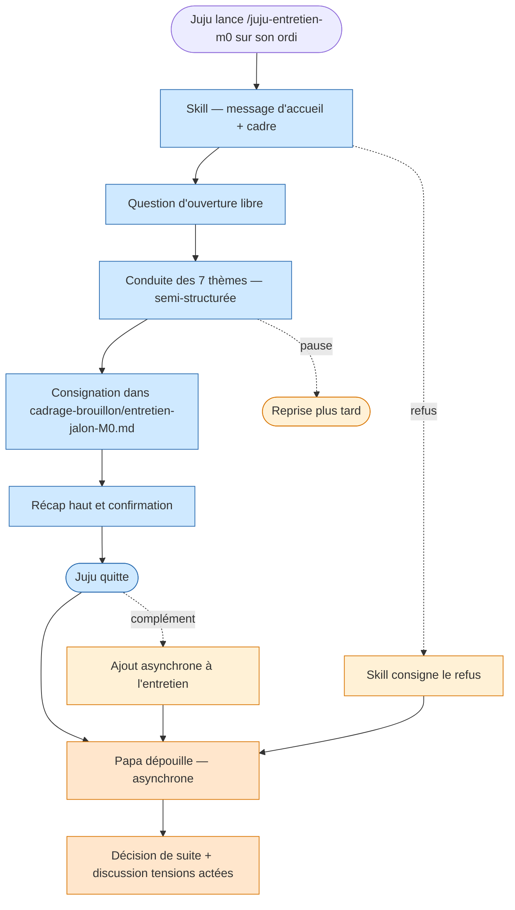
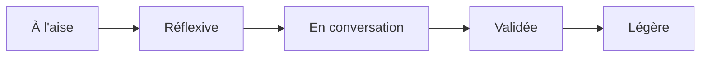

<!-- Copyright (C) 2026 Cyril Vrillaud - SPDX-License-Identifier: AGPL-3.0-only -->

# Parcours utilisateur : Entretien-jalon-m0 (J5)

> Exécution du skill `juju-entretien-m0` à la livraison du prototype M0. **Juju conduit elle-même l'entretien sur son ordinateur, en autonomie, dans Claude Code**. Papa dépouille ensuite les retours consignés. Les tensions actées (priorité maths>psy, périmètre concours élargi) sont **présentées hors skill**, en discussion parent/enfant séparée.
>
> **Périmètre** : M0 — critique. **Date** : 2026-05-13.

## Contexte et déclencheur

### Situation initiale

Plusieurs semaines après la livraison du prototype M0, Juju a utilisé l'application en conditions réelles : sessions courtes smartphone en semaine (J2), au moins un passage onboarding (J1), au moins une découverte du pilier psy (J3). Suffisamment d'usage pour avoir un ressenti à exprimer.

Le skill `juju-entretien-m0` est disponible sur le poste de Juju (Claude Code installé sur son ordinateur — pré-requis technique nouveau introduit par ce choix de cadre). Une configuration minimale (alias ou raccourci pour lancer le skill) a été préparée par Papa.

État cognitif de Juju : disponible, calme, sur son ordinateur, dans un moment choisi par elle.

### Déclencheur

Juju lance le skill `juju-entretien-m0` dans Claude Code sur son ordinateur (par exemple via un alias `/juju-entretien-m0` ou un raccourci préparé par Papa).

## Persona concernée

**Persona principale** : Juju — [Fiche persona](../personas/persona-juju-utilisatrice.md)
**Personas secondaires** : Papa (Thomas) — [Fiche persona](../personas/persona-papa-porteur.md) (intervient **après** l'entretien, en dépouillement).

## Objectif du parcours

Recueillir un retour qualitatif structuré de Juju sur 7 thèmes liés au prototype M0, dans un format conversationnel adapté à elle, **sans surveillance comportementale**, et consigner les retours dans un fichier prêt à être dépouillé par Papa.

Sept thèmes couverts par le skill (cf. OKRs Strategy, à recalibrer pour M0) :

1. Peur des psychotechniques — avant vs après usage (mappe sur KR-2.1.4)
2. Ressenti des messages de l'app — positifs / neutres / négatifs, avec verbatims (KR-3.1.1)
3. Suivi de progression — visible / invisible / anxiogène / motivant (KR-3.1.3)
4. Envie de revenir et plaisir d'utilisation — intensité, déclencheurs (KR-4.1.3)
5. Avatar et déblocages — ressenti, envie d'aller plus loin (KR-4.1.3)
6. Sessions courtes — ce qui marche, ce qui ne marche pas dans le mode smartphone 15 min
7. Ouverture libre — ce qui marche, ce qui ne marche pas, ce qui manque, ce qui décourage

Le **8e thème prévu dans la spec Strategy (tensions actées)** est volontairement **exclu du skill** ; il fait l'objet d'une discussion parent/enfant séparée (hors application, hors skill).

## Pré-conditions

- [ ] Le prototype M0 est livré et a été utilisé par Juju pendant une période suffisante (typiquement 3-4 semaines)
- [ ] Le skill `juju-entretien-m0` est implémenté (initiative I-3.1.5 ré-étiquetée M0 — cf. analyse d'impact phase Discovery)
- [ ] Claude Code est installé sur l'ordinateur de Juju avec accès au skill
- [ ] Un fichier de sortie est prêt à recevoir les retours : `cadrage-brouillon/entretien-jalon-M0.md`
- [ ] La discussion sur les tensions actées (priorité maths>psy, périmètre concours élargi) a déjà eu lieu ou est **planifiée séparément** (Papa la conduit hors skill)

## Scénario nominal

### Étape 1 : Lancement du skill par Juju

**Action** : Juju ouvre Claude Code sur son ordinateur et lance `/juju-entretien-m0`.
**Système** : Le skill démarre. Affiche un message d'accueil qui explique en 2-3 phrases ce qu'il fait : « Je vais te poser quelques questions sur ce que tu as ressenti en utilisant l'app. Tes réponses sont consignées dans un fichier que Papa lira après. Tu peux arrêter quand tu veux. »
**Émotion** : À l'aise — le cadre est posé, l'objet de la conversation est clair, l'autonomie respectée.
**Touchpoint** : Terminal Claude Code sur l'ordinateur de Juju.

### Étape 2 : Question d'ouverture libre

**Action** : Juju lit la 1ère question et tape sa réponse.
**Système** : Pose une question ouverte d'amorçage (typiquement : « Quel est ton ressenti global après ces semaines d'usage ? »). Accueille la réponse sans jugement.
**Émotion** : Réflexive — elle commence à formuler ce qu'elle ressent, sans pression de format.
**Touchpoint** : Terminal Claude Code.

### Étape 3 : Conduite semi-structurée sur les 7 thèmes

**Action** : Juju traverse les 7 thèmes successivement. Pour chacun, le skill pose 1 à 3 questions, peut creuser selon les réponses (caractère adaptatif du skill, à l'image de l'entretien initial du 11/04/2026).
**Système** : Conduit la discussion avec un ton aligné sur la charte (I-3.1.1) : pas de formulation culpabilisante (« pourquoi tu n'es pas revenue plus souvent ? » → interdit ; « qu'est-ce qui t'aurait donné envie de revenir plus ? » → préféré). Distingue clairement les questions des relances pour ne pas la submerger.
**Émotion** : En conversation — pas d'impression de remplir un formulaire, plutôt de discuter avec quelqu'un qui écoute.
**Touchpoint** : Terminal Claude Code, succession de tours de parole.

### Étape 4 : Consignation des retours

**Action** : Au fil de la discussion, le skill consigne les retours.
**Système** : Écrit progressivement (à la fin de chaque thème ou à la fin de l'entretien) dans `cadrage-brouillon/entretien-jalon-M0.md` un fichier structuré par thème, avec citations verbatim et synthèses courtes. Précise la date et le contexte (semaines d'usage écoulées).
**Émotion** : Juju ne voit pas forcément le fichier se construire — elle est dans la conversation.
**Touchpoint** : Fichier `cadrage-brouillon/entretien-jalon-M0.md`.

### Étape 5 : Question de clôture

**Action** : Juju arrive au dernier thème (ouverture libre) et donne sa réponse finale.
**Système** : Récapitule en 3-5 lignes ce qu'il a retenu (synthèse haute), demande à Juju de confirmer ou corriger. Remercie sans flagornerie.
**Émotion** : Validée — sa parole a été entendue et reformulée correctement.
**Touchpoint** : Terminal Claude Code + fichier de retours finalisé.

### Étape 6 : Fin de session

**Action** : Juju ferme Claude Code ou continue sur autre chose.
**Système** : Confirme que le fichier est sauvegardé. Aucune relance, aucun message à Papa, aucune notification.
**Émotion** : Légère — elle a fait sa part, c'est terminé.
**Touchpoint** : Fermeture Claude Code.

### Étape 7 : Dépouillement par Papa (asynchrone, hors application)

**Action** : Papa, plus tard dans la journée ou les jours suivants, ouvre `cadrage-brouillon/entretien-jalon-M0.md`.
**Système** : Papa lit les retours, rapproche les verbatims des KRs cibles (la spec Strategy prévoit cette synthèse — voir `okrs.md` section « Skill d'entretien Juju »).
**Émotion** (Papa) : Engagé — il dispose d'une matière directe pour décider de la suite (poursuite Vague 1, ajustements, ré-itération M0).
**Touchpoint** : Fichier markdown dans `cadrage-brouillon/` consulté dans VS Code.

### Étape 8 : Décision de suite et discussion parent/enfant

**Action** : Sur la base des retours, Papa peut :
- décider de poursuivre vers M1,
- décider d'ajuster M0 avant d'élargir,
- déclencher la discussion parent/enfant sur les tensions actées (priorité maths>psy, périmètre concours élargi), si elle n'a pas déjà eu lieu.

**Système** : Aucun système n'orchestre cette étape : elle est humaine, conversationnelle, hors skill et hors application.
**Émotion** (Juju) : Si elle est ré-impliquée plus tard, posture d'égale à égale (sa parole a déjà été recueillie en autonomie).
**Touchpoint** : Discussion familiale, optionnellement nourrie d'une note manuelle dans `cadrage-brouillon/`.

## Scénarios alternatifs

### Scénario alternatif 1 : Juju interrompt l'entretien en cours de route

**Déclencheur** : Fatigue, distraction, besoin de pause.
**Divergence à l'étape** : 3.
**Déroulement** :

1. Juju tape une commande de pause (ou ferme Claude Code).
2. Le skill consigne ce qui a déjà été dit dans le fichier (état partiel) et ajoute un marqueur « entretien interrompu à tel thème ».
3. À la prochaine exécution du skill, il propose de **reprendre** où elle s'était arrêtée, ou de tout reprendre, au choix de Juju.

### Scénario alternatif 2 : Juju veut ajouter des éléments après coup

**Déclencheur** : Une idée lui revient un ou deux jours après l'entretien.
**Divergence à l'étape** : 6 ou 7.
**Déroulement** :

1. Juju relance le skill avec une option « ajouter à mon entretien précédent ».
2. Le skill ouvre le fichier existant, ajoute une section « complément du [date] » et conduit un mini-entretien rapide.
3. Papa voit la mise à jour au prochain dépouillement.

### Scénario alternatif 3 : Verbatim négatif fort sur la règle d'or

**Déclencheur** : Juju exprime qu'un message ou une mécanique l'a découragée (KR-3.1.1 ou KR-4.1.3 en alerte).
**Divergence à l'étape** : 3 ou 5.
**Déroulement** :

1. Le skill ne minimise pas, ne dramatise pas — il consigne la formulation **exacte** de Juju.
2. Dans la synthèse, le skill peut marquer ce point comme « à corriger en priorité » (signal explicite pour Papa).
3. Pas de promesse abusive (« on va corriger ça tout de suite ») — le skill respecte le pouvoir de décision de Papa et la valeur du recueil brut.

### Scénario alternatif 4 : Refus de l'entretien

**Déclencheur** : Juju, à la 1ère exécution, ne veut pas se lancer.
**Divergence à l'étape** : 1 ou 2.
**Déroulement** :

1. Juju tape un message du genre « pas envie ce soir », ou ferme.
2. Le skill consigne « entretien décliné le [date] » et propose poliment de relancer plus tard.
3. Papa peut, plus tard, ouvrir une discussion humaine sur ce refus — il est lui-même un signal qualitatif (à ne pas confondre avec un défaut de produit).

## Flow diagram

## Expérience utilisateur

### Points de satisfaction (côté Juju)

1. **Autonomie totale** sur l'entretien — elle décide quand le lancer, à quel rythme répondre, quand l'arrêter. Aucune surveillance.
2. **Caractère conversationnel** — c'est une discussion adaptative, pas un formulaire.
3. **Cohérence d'outillage** avec l'entretien initial du 11/04/2026 (même esprit, même méthode).
4. **Pas d'écran de Papa pendant l'entretien** — elle n'a pas à se censurer.

### Points de satisfaction (côté Papa)

1. **Matière qualitative directe** sans avoir à conduire l'entretien lui-même (gain de temps + neutralité).
2. **Verbatims préservés** — il lit ce que Juju a dit, pas une reformulation parentale.
3. **Format markdown dans le repo** — cohérent avec son outillage projet, exploitable directement avec Claude Code pour la synthèse.

### Pain points (côté Juju)

1. **Friction d'accès à Claude Code** : si l'installation/configuration n'est pas faite proprement, Juju ne lancera pas le skill — **Criticité** : Haute (la pré-condition tombe).
2. **Skill trop long ou trop scolaire** — **Criticité** : Haute (anéantit la promesse conversationnelle).
3. **Ton parent dans les questions** (formulations qui sonnent comme un reproche) — **Criticité** : Bloquante (charte de ton I-3.1.1 doit infuser le skill au même titre que l'app).

### Pain points (côté Papa)

1. **Verbatims trop courts / réponses laconiques** — **Criticité** : Moyenne (le skill doit savoir relancer sans insister).
2. **Manque de matière sur certains KRs** : si Juju a peu utilisé une fonctionnalité, le skill doit le constater factuellement plutôt que de tirer des conclusions hâtives — **Criticité** : Moyenne.

### Courbe émotionnelle (Juju)

## Post-conditions

- [ ] Le fichier `cadrage-brouillon/entretien-jalon-M0.md` existe et contient les retours de Juju (verbatims + synthèses)
- [ ] Les 7 thèmes ont été couverts (ou les manques sont explicitement marqués)
- [ ] Papa peut dépouiller en autonomie sans avoir besoin de re-questionner Juju
- [ ] L'avatar de Juju n'a pas été affecté par la conduite de l'entretien (l'entretien est hors application)
- [ ] Aucune notification ni message n'a été envoyé à Papa pendant l'entretien (asynchrone par construction)

## Touchpoints (Points de contact)

| Étape | Touchpoint | Type | Zone fonctionnelle |
|---|---|---|---|
| 1 | Terminal Claude Code (Juju) | CLI / interface conversationnelle | Outillage projet (hors app) |
| 2-5 | Terminal Claude Code (Juju) | CLI conversationnel | Outillage projet — skill |
| 4 | Fichier markdown `entretien-jalon-M0.md` | Fichier dans le repo | Cadrage-brouillon |
| 6 | Fermeture Claude Code | — | — |
| 7 | VS Code / éditeur Papa | Lecture markdown | Cadrage-brouillon |
| 8 | Conversation humaine | Discussion familiale | Hors outil |

**Note importante** : ce journey est le **seul** des 5 à utiliser **Claude Code / l'outillage projet** plutôt que l'application elle-même. C'est une dépendance technique nouvelle introduite par le choix de cadre d'entretien (Juju en autonomie). À acter en initiative.

## Considérations d'accessibilité

### Recommandations

- **Lisibilité dans le terminal Claude Code** : couleurs, taille de texte adaptées au contexte de l'écran de Juju (vérifier la configuration par défaut avant la 1ère exécution).
- **Tolérance aux fautes de frappe et au registre informel** : le skill doit accepter les réponses imparfaites sans demander de reformulation.
- **Pas de chronomètre, pas de timer** sur la durée de l'entretien.
- **Pas d'audio dépendant** : tout passe par texte.
- **Marqueurs explicites** dans le fichier de sortie pour distinguer questions, réponses, synthèses, tags.

## Wireframes associés

Pas de wireframe au sens classique : ce journey passe par le terminal Claude Code, dont l'interface est imposée. Les éléments à spécifier en Design sont :
- la **structure conversationnelle du skill** (équivalent d'un script d'animation, à concevoir en initiative I-3.1.5),
- le **gabarit du fichier `entretien-jalon-M0.md`** (sections, anchorage sur les KRs).

## Notes complémentaires

- **Choix « Juju seule sur son ordi »** : retenu pour maximiser l'authenticité (pas d'auto-censure devant Papa) et l'autonomie (cohérent avec la posture explicitement non-surveillante de Papa). Demande en contrepartie d'installer **Claude Code sur l'ordi de Juju** et de préparer un alias/raccourci simple — c'est une **dépendance technique nouvelle** à inscrire en plan d'implémentation (cf. analyse d'impact).
- **Tensions actées hors skill** : retenu sur décision explicite. Les deux tensions (priorité maths>psy, périmètre concours élargi) appartiennent à une discussion parent/enfant, pas à un recueil d'usage produit. Le skill resterait biaisé si on les y intégrait (réponse sur l'usage colorée par la discussion politique).
- **Renommage de l'initiative I-3.1.5 (Strategy) en M0** : la spec Strategy parle de `juju-entretien-m1`. Le brief Discovery introduit un milestone M0 et renomme en `juju-entretien-m0`. C'est une divergence à propager en Strategy (cf. step-04 — analyse d'impact).
- **Pré-requis technique « Claude Code sur ordi de Juju »** : à inscrire explicitement comme initiative ou tâche M0. Sans cela, J5 est inopérant.

## Traçabilité

| Dépendance | Référence |
|---|---|
| persona Juju (canal de feedback en face à face / autonome) | [Persona Juju](../personas/persona-juju-utilisatrice.md) |
| persona Papa (posture non-surveillante, skill d'entretien) | [Persona Papa](../personas/persona-papa-porteur.md) |
| product brief — skill juju-entretien-m0 (point 6 du périmètre M0) | [Product Brief](../product-brief.md) |
| OKRs — KR-2.1.4, KR-3.1.1, KR-3.1.3, KR-4.1.3, et section « Skill d'entretien Juju » | [OKRs](../../01-strategy/okrs.md) |
| initiative I-3.1.5 (concevoir et implémenter le skill) — à recalibrer M0 | [Initiatives](../../01-strategy/initiatives.md) |
| pattern de skill conversationnel à réutiliser | [.claude/skills/safe-commit/SKILL.md](../../../.claude/skills/safe-commit/SKILL.md) |
| entretien initial servant de référence méthodologique | [cadrage-brouillon/besoins-juju.md](../../../cadrage-brouillon/besoins-juju.md) |
| journeys M0 mesurés par cet entretien | [J1](journey-premiere-utilisation.md), [J2](journey-soir-semaine-smartphone.md), [J3](journey-decouverte-psychotechniques.md) |
