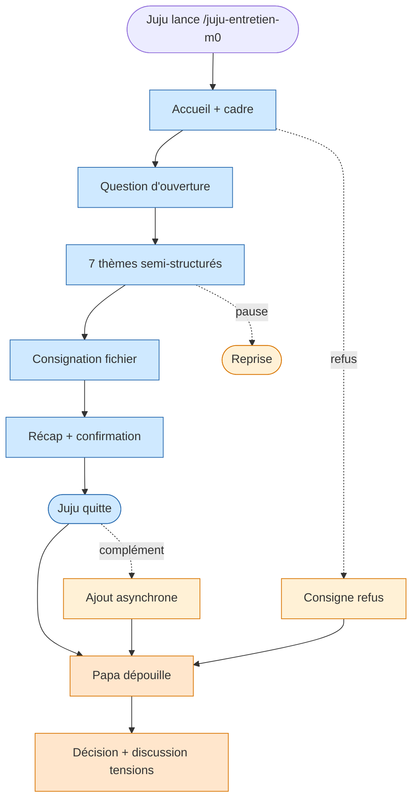

<!-- Copyright (C) 2026 Cyril Vrillaud - SPDX-License-Identifier: AGPL-3.0-only -->

# Parcours utilisateur : Entretien-jalon-m0 (J5)

> Exécution du skill `juju-entretien-m0` à la livraison du prototype. **Juju conduit l'entretien seule sur son ordinateur dans Claude Code.** Papa dépouille ensuite. Les tensions actées sont présentées **hors skill**, en discussion parent/enfant séparée.
> **Périmètre** : M0 — critique. **Date** : 2026-05-13.

## Contexte et déclencheur

Plusieurs semaines après livraison M0, Juju a utilisé l'app en conditions réelles (J1, J2, J3). Suffisamment d'usage pour avoir un ressenti. Claude Code est installé sur l'ordi de Juju avec un alias `/juju-entretien-m0` préparé par Papa. Juju lance le skill quand elle le décide.

## Objectif du parcours

Recueillir un retour qualitatif structuré sur 7 thèmes, sans surveillance comportementale, et consigner dans `cadrage-brouillon/entretien-jalon-M0.md`.

**7 thèmes** : (1) peur des psy — avant vs après (KR-2.1.4) · (2) ressenti des messages — positifs/neutres/négatifs + verbatims (KR-3.1.1) · (3) suivi de progression — visible/anxiogène/motivant (KR-3.1.3) · (4) envie de revenir + plaisir (KR-4.1.3) · (5) avatar et déblocages (KR-4.1.3) · (6) sessions courtes smartphone · (7) ouverture libre.

Le 8e thème (tensions actées) est **exclu du skill** — discussion parent/enfant séparée.

## Pré-conditions

- [ ] Prototype M0 utilisé ~3-4 semaines par Juju
- [ ] Skill `juju-entretien-m0` implémenté (I-3.1.5 recalibrée M0)
- [ ] Claude Code installé sur l'ordi de Juju avec accès au skill
- [ ] Fichier de sortie prêt : `cadrage-brouillon/entretien-jalon-M0.md`
- [ ] Discussion tensions actées déjà faite ou planifiée séparément

## Scénario nominal

**1. Lancement** — Juju lance `/juju-entretien-m0` dans Claude Code. Message d'accueil en 2-3 phrases : ce qu'il fait, que les réponses sont consignées pour Papa, qu'elle peut arrêter quand elle veut. → *À l'aise* — cadre posé, autonomie respectée.

**2. Question d'ouverture** — Question ouverte d'amorçage (« Quel est ton ressenti global ? »). Accueille la réponse sans jugement. → *Réflexive*.

**3. Conduite semi-structurée des 7 thèmes** — 1-3 questions par thème, creuse selon les réponses (adaptatif). Ton charte (I-3.1.1) : jamais de formulation culpabilisante. Distingue questions et relances. → *En conversation* — pas un formulaire.

**4. Consignation** — Le skill écrit progressivement dans `cadrage-brouillon/entretien-jalon-M0.md` : structure par thème, citations verbatim, synthèses courtes, date et contexte. → Juju ne voit pas le fichier se construire.

**5. Clôture** — Récap en 3-5 lignes, demande à Juju de confirmer ou corriger. Remercie sans flagornerie. → *Validée* — sa parole a été reformulée correctement.

**6. Fin** — Fichier sauvegardé. Aucune relance, notification ni message à Papa. → *Légère*.

**7. Dépouillement par Papa** (asynchrone) — Papa ouvre le fichier, rapproche les verbatims des KRs cibles. → *Engagé* — matière directe pour décider la suite.

**8. Décision et discussion** — Papa décide (poursuivre M1, ajuster M0, ou déclencher discussion tensions). Étape purement humaine, hors skill et hors app.

## Scénarios alternatifs

**Alt 1 — Interruption** (étape 3) : le skill consigne l'état partiel + marqueur « interrompu à tel thème ». Prochaine exécution : reprise ou tout reprendre, au choix de Juju.

**Alt 2 — Complément après coup** (étape 6-7) : Juju relance avec option « ajouter à mon entretien ». Section « complément du [date] » ajoutée. Papa voit la mise à jour.

**Alt 3 — Verbatim négatif fort** (étape 3-5) : le skill consigne la formulation **exacte**, sans minimiser ni dramatiser. Peut marquer « à corriger en priorité ». Pas de promesse abusive.

**Alt 4 — Refus** (étape 1-2) : le skill consigne « entretien décliné le [date] », propose poliment de relancer plus tard. Le refus est lui-même un signal qualitatif.

## Flow diagram

## Expérience utilisateur

**Satisfaction Juju** : autonomie totale · format conversationnel adaptatif · cohérence avec l'entretien initial du 11/04/2026 · pas d'écran de Papa pendant l'entretien.

**Satisfaction Papa** : matière qualitative directe sans conduire l'entretien · verbatims préservés · format markdown dans le repo.

**Pain points Juju** : friction accès Claude Code si mal installé (Haute) · skill trop long ou scolaire (Haute) · ton parent dans les questions (Bloquante — charte I-3.1.1).

**Pain points Papa** : verbatims trop courts / laconiques (Moyenne — skill doit relancer sans insister) · manque de matière si peu d'usage d'une fonctionnalité (Moyenne — constater plutôt que conclure).

**Courbe émotionnelle Juju** : à l'aise → réflexive → en conversation → validée → légère.

## Post-conditions

- [ ] Fichier `cadrage-brouillon/entretien-jalon-M0.md` avec retours (verbatims + synthèses)
- [ ] 7 thèmes couverts (ou manques marqués)
- [ ] Papa peut dépouiller sans re-questionner Juju
- [ ] Avatar non affecté (entretien hors application)
- [ ] Aucune notification envoyée à Papa pendant l'entretien

## Accessibilité

Lisibilité terminal Claude Code (vérifier config écran Juju) · tolérance fautes de frappe et registre informel · pas de timer · tout en texte · marqueurs explicites dans le fichier de sortie.

## Wireframes

Pas de wireframe classique (terminal Claude Code). À spécifier en Design : structure conversationnelle du skill (script d'animation, I-3.1.5) + gabarit du fichier `entretien-jalon-M0.md`.

## Notes complémentaires

- **Juju seule** : maximise l'authenticité (pas d'auto-censure) et l'autonomie. Demande d'installer Claude Code sur l'ordi de Juju + préparer alias — **dépendance technique nouvelle** à inscrire en plan.
- **Tensions hors skill** : décision explicite. Les deux tensions appartiennent à une discussion parent/enfant, pas à un recueil d'usage (biais sinon).
- **Renommage I-3.1.5** : Strategy parle de `juju-entretien-m1`. Discovery introduit M0 et renomme en `juju-entretien-m0`. Divergence à propager en Strategy.
- **Pré-requis Claude Code sur ordi Juju** : à inscrire comme initiative M0. Sans cela, J5 est inopérant.
- **Seul journey utilisant Claude Code** plutôt que l'app — dépendance technique à acter en initiative.

## Traçabilité

| Dépendance | Référence |
|---|---|
| persona Juju (feedback autonome) | [Persona Juju](../personas/persona-juju-utilisatrice.md) |
| persona Papa (posture non-surveillante) | [Persona Papa](../personas/persona-papa-porteur.md) |
| product brief — skill juju-entretien-m0 | [Product Brief](../product-brief.md) |
| OKRs — KR-2.1.4, KR-3.1.1, KR-3.1.3, KR-4.1.3 | [OKRs](../../01-strategy/okrs.md) |
| initiative I-3.1.5 (recalibrée M0) | [Initiatives](../../01-strategy/initiatives.md) |
| pattern skill conversationnel | [safe-commit/SKILL.md](../../../.claude/skills/safe-commit/SKILL.md) |
| entretien initial | [besoins-juju.md](../../../cadrage-brouillon/besoins-juju.md) |
| J1, J2, J3 (mesurés par cet entretien) | [J1](journey-premiere-utilisation.md), [J2](journey-soir-semaine-smartphone.md), [J3](journey-decouverte-psychotechniques.md) |
