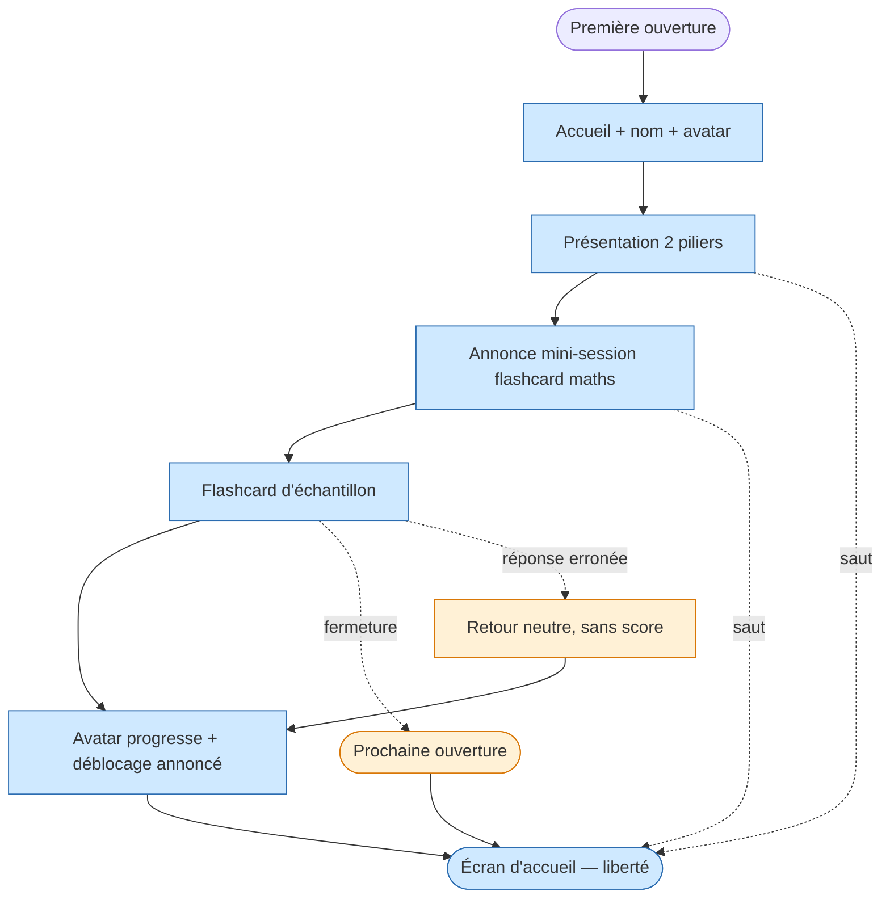

<!-- Copyright (C) 2026 Cyril Vrillaud - SPDX-License-Identifier: AGPL-3.0-only -->

# Parcours utilisateur : Première utilisation (J1)

> Premier contact de Juju avec l'application, à la livraison du prototype M0. Moment critique où l'engagement par le jeu doit accrocher dès la 1ère minute et où les deux piliers (sciences + psy) doivent être annoncés sans intimider.
>
> **Périmètre** : M0 — critique. **Date** : 2026-05-13.

## Contexte et déclencheur

### Situation initiale

Juju vient de recevoir le lien (ou l'installation) du prototype M0 de l'application, partagé par Papa. Elle n'a jamais ouvert l'outil ; elle sait qu'il est fait pour elle et qu'il couvre maths/physique 1ère + psychotechniques (logique + calcul mental). Elle a entendu parler des tensions actées (priorité maths/psy, périmètre concours élargi) mais cette discussion est volontairement disjointe de l'usage produit (cf. J5).

Elle est probablement chez elle, plutôt curieuse que tendue, sur son smartphone — c'est le terrain ciblé par M0.

### Déclencheur

Juju ouvre l'application pour la toute première fois.

## Persona concernée

**Persona principale** : Juju — [Fiche persona](../personas/persona-juju-utilisatrice.md)
**Personas secondaires** : aucune (Papa n'est pas présent pendant le parcours d'usage).

## Objectif du parcours

Faire comprendre à Juju, en moins de 3 minutes :

1. Que l'outil couvre **deux piliers** (sciences + psy) qui montent avec elle dans le temps.
2. Qu'un **avatar** progresse avec elle (premier signal d'engagement par le jeu).
3. Qu'elle peut **commencer maintenant** par quelque chose de simple, familier et court — sans saut dans l'inconnu.

À l'issue, elle a effectué un premier exercice (échantillon flashcard maths) et arrive sur l'écran d'accueil où la suite est à sa main.

## Pré-conditions

- [ ] Le prototype M0 est livré et accessible (URL ou app installée selon stack tranchée en Design)
- [ ] Le contenu d'au moins un chapitre maths est disponible (au minimum quelques flashcards)
- [ ] L'avatar est doté de son état initial (« stade 1 »)
- [ ] La discussion sur les tensions actées (priorité maths/psy, périmètre concours) a déjà eu lieu **avant** la 1ère ouverture, hors de l'application (cf. J5 ne couvre que l'entretien post-usage)

## Scénario nominal

### Étape 1 : Accueil et bienvenue

**Action** : Juju ouvre l'application pour la première fois.
**Système** : Affiche un écran de bienvenue très court, qui la nomme (« Salut Juju ») et présente l'idée que l'avatar à l'écran progressera avec elle. Pas de demande de compte, pas de questionnaire d'inscription.
**Émotion** : Curieuse, légèrement intriguée par l'avatar à son nom.
**Touchpoint** : Écran d'accueil de l'application — zone *Accueil et avatar*.

### Étape 2 : Présentation des deux piliers

**Action** : Juju passe à l'écran suivant.
**Système** : Présente les deux piliers en quelques mots et un visuel sobre : « Sciences (maths + physique-chimie 1ère) » et « Psychotechniques (logique + calcul mental) ». Annonce que le contenu va s'étendre avec le temps (allusion aux 4 niveaux et à l'élargissement psy), sans entrer dans le détail.
**Émotion** : Rassurée — elle comprend que le terrain est balisé et qu'elle n'a pas tout à découvrir d'un coup.
**Touchpoint** : Écran de présentation des piliers — zone *Catalogue*.

### Étape 3 : Annonce de la 1ère mini-session

**Action** : Juju passe à l'écran suivant.
**Système** : Annonce qu'on commence par une flashcard de maths 1ère pour démarrer en terrain familier, et propose un bouton unique pour lancer l'exercice. La formulation est positive (« Première flashcard, juste pour goûter »), sans aucune notation annoncée.
**Émotion** : Soulagée — on ne lui demande pas immédiatement de faire un test psy ou un QCM noté.
**Touchpoint** : Écran d'introduction à l'exo échantillon — zone *Catalogue / sciences*.

### Étape 4 : Exécution de la flashcard maths d'échantillon

**Action** : Juju lit la question, formule mentalement la réponse, retourne la flashcard pour voir la correction.
**Système** : Affiche la question, la réponse au verso, et un message neutre qui invite simplement à passer à la suite (pas de jugement « bonne/mauvaise réponse », pas de score).
**Émotion** : Apaisée — le format est familier (elle utilise déjà des flashcards mentales en révisions), rapide, sans piège.
**Touchpoint** : Écran d'exercice flashcard — zone *Session d'entraînement*.

### Étape 5 : Première progression visible de l'avatar

**Action** : Juju valide la fin de l'exercice.
**Système** : L'avatar marque une micro-progression visible (animation sobre, message positif aligné sur la charte de ton). Mention qu'un déblocage est imminent (par ex. le prochain chapitre se débloquera après X sessions, sans pression sur X).
**Émotion** : Satisfaite — quelque chose s'est passé, l'outil réagit à ce qu'elle a fait. Curieuse de voir ce qui débloquera.
**Touchpoint** : Écran de fin d'exercice — zone *Avatar et progression*.

### Étape 6 : Atterrissage sur l'écran d'accueil et liberté

**Action** : Juju arrive sur l'écran d'accueil de l'application.
**Système** : Affiche l'écran qui sera la « home » récurrente (cf. J2) : avatar, choix entre Sciences et Psy, suggestion de la prochaine activité. Liberté totale à partir de là.
**Émotion** : En confiance — elle sait où elle est, ce qu'elle peut faire, et qu'elle peut arrêter ou continuer à sa guise.
**Touchpoint** : Écran d'accueil principal — zone *Home*.

## Scénarios alternatifs

### Scénario alternatif 1 : Juju saute l'onboarding

**Déclencheur** : Juju veut passer directement à l'usage (impatiente, distraite, ou simplement curieuse de l'écran d'accueil).
**Divergence à l'étape** : 2 ou 3.
**Déroulement** :

1. Juju active un bouton de saut explicite (« passer », « plus tard »).
2. Le système arrive directement à l'étape 6 (écran d'accueil).
3. L'onboarding reste accessible si Juju veut le revoir plus tard (mais sans rappel insistant).
4. L'avatar reste à l'état initial — la 1ère progression interviendra à la 1ère session réelle.

### Scénario alternatif 2 : Juju ferme l'application en cours d'onboarding

**Déclencheur** : Interruption (notification, fatigue, désintérêt momentané).
**Divergence à l'étape** : n'importe laquelle entre 1 et 5.
**Déroulement** :

1. Au prochain lancement, le système ne reprend pas l'onboarding par défaut — il va directement à l'écran d'accueil (étape 6).
2. L'avatar est à l'état initial.
3. Pas de message culpabilisant (« tu as quitté trop tôt »). Le sujet n'est même pas mentionné.

### Scénario alternatif 3 : Juju rate la flashcard d'échantillon

**Déclencheur** : La question dépasse ce qu'elle a vu en cours, ou elle hésite, ou elle se trompe.
**Divergence à l'étape** : 4.
**Déroulement** :

1. Aucune sanction visuelle (pas de croix rouge, pas de score).
2. Le retour de l'application est strictement neutre : « C'était la réponse attendue : X. On continue. »
3. Le parcours continue normalement à l'étape 5. Juju n'aura jamais l'impression d'avoir « échoué » son onboarding.

## Flow diagram

## Expérience utilisateur

### Points de satisfaction

1. **L'avatar à son nom** dès la 1ère seconde — signal personnel, pas un produit générique.
2. **La flashcard maths comme premier exo** — terrain familier, dual-usage école+concours assumé d'entrée.
3. **L'absence totale de notation** sur l'exo d'échantillon — confirme la règle d'or « ne jamais décourager ».
4. **La micro-progression de l'avatar** en fin de 1ère session — premier signal concret que l'engagement par le jeu prend.

### Pain points

1. **Confusion possible sur le sens des deux piliers** si la présentation à l'étape 2 est trop succincte — **Criticité** : Moyenne (à valider sur maquette avec Juju).
2. **Frustration si la flashcard d'échantillon est sur un chapitre non couvert en cours** — **Criticité** : Moyenne (mitiger par le choix d'un chapitre déjà vu en classe par Juju, à arrêter en Plan).
3. **Désengagement si la 1ère progression d'avatar est invisible ou décevante** — **Criticité** : Haute (l'animation et le message doivent être visiblement satisfaisants ; à valider en Design + test maquette).
4. **Risque de message culpabilisant** en cas d'erreur à l'étape 4 — **Criticité** : Bloquante (toute formulation négative en onboarding fait basculer Juju vers le décrochage ; règle d'or absolue).

### Courbe émotionnelle

L'onboarding doit produire une courbe **monotone ascendante** sur 3 minutes. Aucun pic négatif n'est tolérable à ce moment.

## Post-conditions

- [ ] Juju a vu et nommé les deux piliers
- [ ] Juju a vu l'avatar dans son état initial et constaté qu'il progresse
- [ ] Juju a fait au moins 1 exercice flashcard (sans notation)
- [ ] Juju est sur l'écran d'accueil, libre de continuer ou de quitter
- [ ] L'historique consigne au moins 1 session effectuée (alimente le moteur de déblocage de J2)

## Touchpoints (Points de contact)

> Note : les bounded contexts et composants système précis seront définis en phase Design. Les zones fonctionnelles ci-dessous sont des **familles** de fonctions identifiées au niveau Discovery.

| Étape | Touchpoint | Type | Zone fonctionnelle |
|---|---|---|---|
| 1 | Écran d'accueil de bienvenue | Interface smartphone | Accueil et avatar |
| 2 | Écran de présentation des piliers | Interface smartphone | Catalogue |
| 3 | Écran d'introduction à l'exo échantillon | Interface smartphone | Catalogue / sciences |
| 4 | Écran d'exercice flashcard | Interface smartphone | Session d'entraînement |
| 5 | Écran de fin d'exercice + progression avatar | Interface smartphone | Avatar et progression |
| 6 | Écran d'accueil principal | Interface smartphone | Home |

## Considérations d'accessibilité

### Recommandations

- **Lisibilité smartphone** : taille de texte confortable même en condition de fatigue de fin de journée. La 1ère ouverture peut se faire le soir.
- **Pas de dépendance audio non doublée** : si l'animation de l'avatar a un son, elle doit rester compréhensible muette (les premières utilisations peuvent se faire dans la chambre, son coupé).
- **Tolérance à l'interruption** : la fermeture en plein onboarding n'enlève rien, ne reproche rien.
- **Affordances tactiles claires** : pas de bouton « passer » caché dans un coin. La sortie est toujours visible.

## Wireframes associés

À créer en phase Design (dossier `docs/03-design/3-wireframes/`). Écrans pressentis : `wf-onboarding-bienvenue`, `wf-onboarding-piliers`, `wf-onboarding-intro-exo`, `wf-flashcard-maths`, `wf-fin-exercice-progression`, `wf-accueil-home`.

## Notes complémentaires

- **Choix d'exercice d'échantillon (maths flashcard)** : retenu pour ancrer le dual-usage école+concours dès la première minute et ne pas exposer Juju à un test psy avant qu'elle ait été apprivoisée (cf. J3).
- **Hypothèse forte** : la 1ère ouverture a lieu **après** la discussion sur les tensions actées (priorité maths/psy, périmètre concours), conduite par Papa hors application (cf. J5). Si cette discussion n'a pas eu lieu, le produit ne tente pas de la palier dans l'onboarding — ce n'est pas son rôle.
- **Pas de questionnaire d'inscription** : pas de compte, pas de mot de passe, pas de profil à compléter. Produit personnel mono-utilisateur, identifiant implicite.

## Traçabilité

| Dépendance | Référence |
|---|---|
| persona Juju (besoins prioritaires M0, profil gameuse) | [Persona Juju](../personas/persona-juju-utilisatrice.md) |
| persona Papa (posture non-surveillante, tensions actées) | [Persona Papa](../personas/persona-papa-porteur.md) |
| product brief — MVP M0 (avatar simple, flashcards, 1 mécanisme de déblocage) | [Product Brief](../product-brief.md) |
| vision produit — règle d'or, pilier 4 (engagement par le jeu) | [Vision produit](../../01-strategy/vision-produit.md) |
| OKRs M1 (KR-4.1.1 avatar progressif, KR-4.1.2 déblocages) | [OKRs](../../01-strategy/okrs.md) |
| journey lié — usage récurrent post-onboarding | [J2 — soir-semaine-smartphone](journey-soir-semaine-smartphone.md) |
| journey lié — entretien post-livraison | [J5 — entretien-jalon-m0](journey-entretien-jalon-m0.md) |
