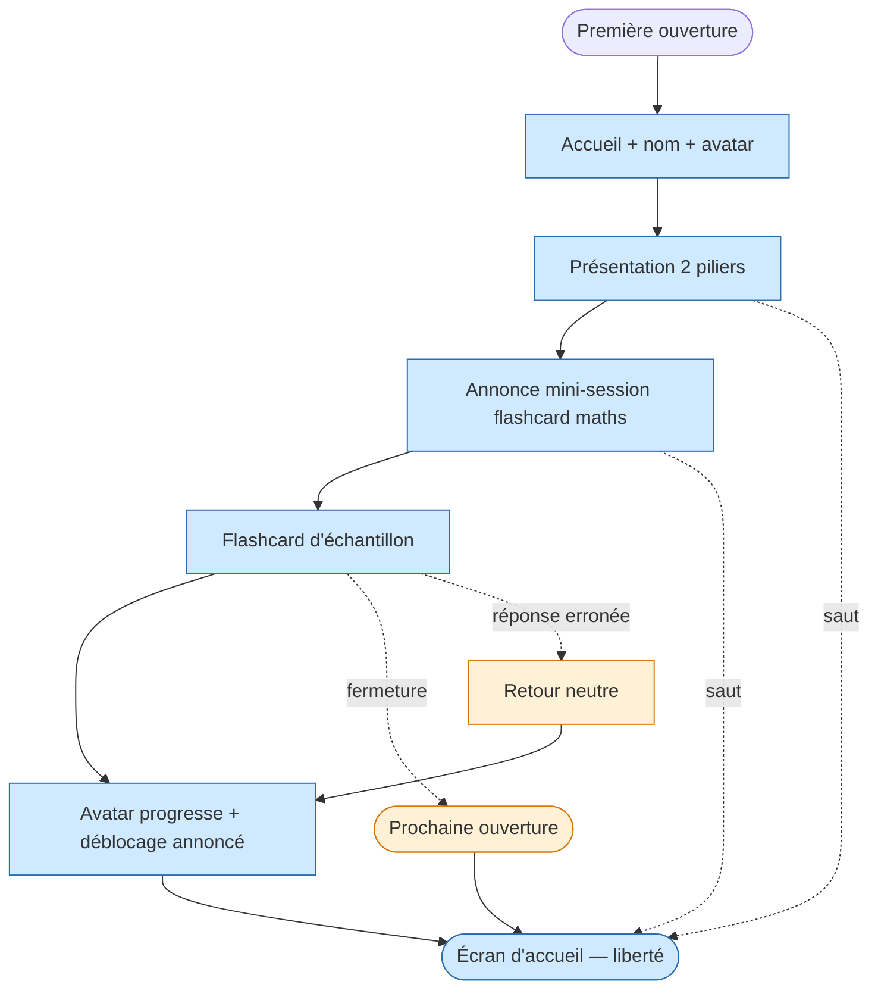

<!-- Copyright (C) 2026 Cyril Vrillaud - SPDX-License-Identifier: AGPL-3.0-only -->

# Parcours utilisateur : Première utilisation (J1)

> Premier contact de Juju avec l'app, à la livraison du prototype M0. L'engagement par le jeu doit accrocher dès la 1ère minute ; les deux piliers (sciences + psy) doivent être annoncés sans intimider.
> **Périmètre** : M0 — critique. **Date** : 2026-05-13.

## Contexte et déclencheur

Juju vient de recevoir le lien du prototype M0, partagé par Papa. Elle n'a jamais ouvert l'outil ; elle sait qu'il couvre maths/physique 1ère + psychotechniques. Elle a entendu parler des tensions actées mais cette discussion est disjointe de l'usage produit (cf. J5). Probablement chez elle, plutôt curieuse, sur smartphone. Elle ouvre l'app pour la toute première fois.

## Objectif du parcours

Faire comprendre à Juju, en < 3 minutes : (1) l'outil couvre deux piliers (sciences + psy) qui montent avec elle, (2) un avatar progresse avec elle, (3) elle peut commencer maintenant par quelque chose de simple et court. À l'issue, elle a fait 1 flashcard maths et arrive sur l'écran d'accueil.

## Pré-conditions

- [ ] Prototype M0 livré et accessible
- [ ] Contenu d'au moins 1 chapitre maths disponible (flashcards)
- [ ] Avatar doté de son état initial (stade 1)
- [ ] Discussion tensions actées déjà faite avant la 1ère ouverture, hors app (cf. J5)

## Scénario nominal

**1. Accueil** — Juju ouvre l'app. Écran de bienvenue très court qui la nomme (« Salut Juju ») et présente l'avatar qui progressera avec elle. Pas de compte, pas de questionnaire. → *Curieuse, intriguée par l'avatar*.

**2. Présentation des deux piliers** — Écran suivant : « Sciences (maths + physique-chimie 1ère) » et « Psychotechniques (logique + calcul mental) » en quelques mots + visuel sobre. Annonce que le contenu s'étendra avec le temps, sans détailler. → *Rassurée* — terrain balisé.

**3. Annonce 1ère mini-session** — On commence par une flashcard maths 1ère, terrain familier. Bouton unique. Formulation positive (« Première flashcard, juste pour goûter »), aucune notation annoncée. → *Soulagée* — pas de test psy ni QCM noté d'entrée.

**4. Flashcard maths d'échantillon** — Juju lit la question, formule sa réponse, retourne la flashcard. Message neutre invitant à passer à la suite, pas de jugement bonne/mauvaise réponse. → *Apaisée* — format familier, rapide.

**5. Première progression avatar** — L'avatar marque une micro-progression visible (animation sobre, message positif). Mention qu'un déblocage est imminent. → *Satisfaite* — l'outil réagit.

**6. Atterrissage écran d'accueil** — Home récurrente (cf. J2) : avatar, choix Sciences/Psy, suggestion prochaine activité. Liberté totale. → *En confiance*.

## Scénarios alternatifs

**Alt 1 — Saut de l'onboarding** (étape 2-3) : Juju active « passer ». Arrivée directe à l'accueil (étape 6). Onboarding accessible plus tard sans rappel insistant. Avatar reste à l'état initial.

**Alt 2 — Fermeture en cours d'onboarding** (toute étape) : au prochain lancement → accueil direct (étape 6). Avatar à l'état initial. Aucun message culpabilisant, le sujet n'est même pas mentionné.

**Alt 3 — Erreur à la flashcard** (étape 4) : aucune sanction visuelle (pas de croix rouge). Retour neutre : « C'était la réponse attendue : X. On continue. » Le parcours continue normalement.

## Flow diagram

## Expérience utilisateur

**Satisfaction** : avatar à son nom dès la 1ère seconde · flashcard maths comme 1er exo (terrain familier) · absence totale de notation · micro-progression avatar en fin de session.

**Pain points** : confusion sur les deux piliers si présentation trop succincte (Moyenne) · flashcard sur chapitre non couvert en cours (Moyenne, mitiger par choix chapitre déjà vu) · progression avatar invisible ou décevante (Haute) · message culpabilisant en cas d'erreur (Bloquante — règle d'or absolue).

**Courbe émotionnelle** : curieuse → rassurée → soulagée → apaisée → satisfaite → en confiance. Monotone ascendante sur 3 min, aucun pic négatif tolérable.

## Post-conditions

- [ ] Juju a vu et nommé les deux piliers
- [ ] Juju a vu l'avatar et constaté qu'il progresse
- [ ] ≥ 1 flashcard effectuée (sans notation)
- [ ] Juju est sur l'accueil, libre de continuer ou quitter
- [ ] Historique consigne ≥ 1 session (alimente le moteur de déblocage de J2)

## Accessibilité

Lisibilité smartphone (fatigue possible le soir) · fonctionnement muet (animation avatar compréhensible sans son) · tolérance à l'interruption (fermeture onboarding = rien de perdu) · affordances tactiles claires (bouton « passer » visible).

## Wireframes

À créer en Design : `wf-onboarding-bienvenue`, `wf-onboarding-piliers`, `wf-onboarding-intro-exo`, `wf-flashcard-maths`, `wf-fin-exercice-progression`, `wf-accueil-home`.

## Notes complémentaires

- **Flashcard maths comme 1er exo** : ancre le dual-usage école+concours et évite d'exposer Juju au psy avant apprivoisement (cf. J3).
- **Hypothèse forte** : 1ère ouverture **après** discussion tensions actées, conduite par Papa hors app (cf. J5). Si pas faite, le produit ne pallie pas.
- **Pas d'inscription** : pas de compte, mot de passe, profil. Produit mono-utilisateur, identifiant implicite.

## Traçabilité

| Dépendance | Référence |
|---|---|
| persona Juju | [Persona Juju](../personas/persona-juju-utilisatrice.md) |
| persona Papa (tensions actées) | [Persona Papa](../personas/persona-papa-porteur.md) |
| product brief — MVP M0 | [Product Brief](../product-brief.md) |
| vision — règle d'or, Pilier 4 | [Vision produit](../../01-strategy/vision-produit.md) |
| OKRs — KR-4.1.1, KR-4.1.2 | [OKRs](../../01-strategy/okrs.md) |
| J2 — usage récurrent | [J2](journey-soir-semaine-smartphone.md) |
| J5 — entretien post-livraison | [J5](journey-entretien-jalon-m0.md) |
