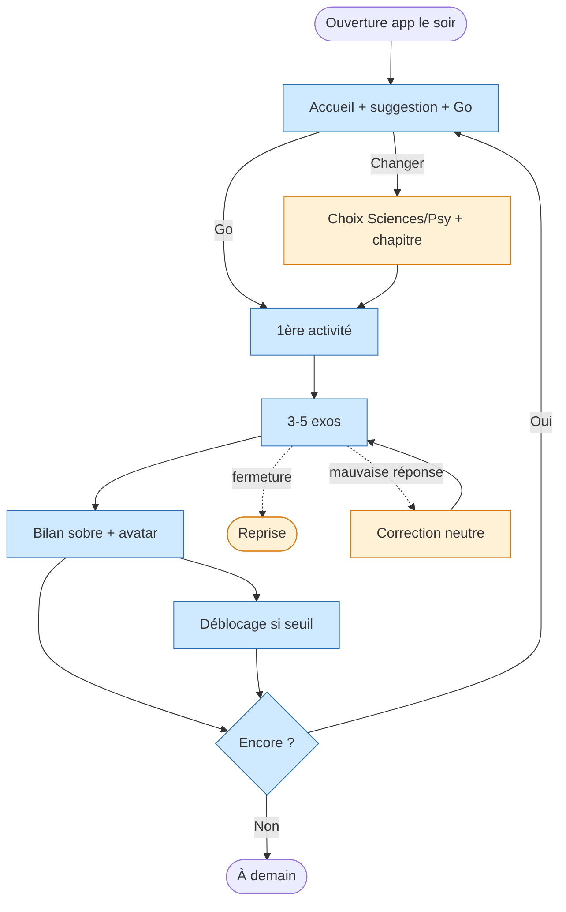

<!-- Copyright (C) 2026 Cyril Vrillaud - SPDX-License-Identifier: AGPL-3.0-only -->

# Parcours utilisateur : Soir-semaine-smartphone (J2)

> Parcours nominal le plus fréquent de M0 : Juju, fatiguée, ouvre l'app 15 min après les devoirs.
> **Périmètre** : M0 — critique. **Date** : 2026-05-13.

## Contexte et déclencheur

Soir de semaine, ~21 h. Juju a fini ses devoirs, énergie basse, smartphone en main (lit ou canapé). Attention courte, motivation fragile, tolérance à la friction nulle. Elle ouvre l'app par habitude ou impulsion.

## Objectif du parcours

Session productive de **15 min max** sans décision coûteuse : démarrage en 1 tap (suggestion + bouton Go), enchaînement de 3-5 micro-exercices (flashcards ou QCM courts), sortie sans culpabilité. Sentiment visé : « j'ai avancé, j'ai aimé, je reviendrai demain ».

## Pré-conditions

- [ ] Onboarding (J1) complété
- [ ] ≥ 1 chapitre maths + 1 physique-chimie disponibles avec flashcards et QCM courts
- [ ] Historique suffisant pour suggestion contextuelle (ou suggestion par défaut intégrée)
- [ ] Avatar avec état courant et état suivant identifiables

## Scénario nominal

**1. Ouverture** — Juju lance l'app. Le système affiche : avatar (état courant), suggestion d'activité en 1 ligne (ex. « Poursuis Géométrie : 4 flashcards »), bouton **Go**. → *Soulagée* — pas de menu, pas de catalogue.

**2. Démarrage** — Juju tape Go. Le système lance immédiatement la 1ère micro-activité. Pas d'écran intermédiaire. → *Engagée* — friction nulle, 1 tap.

**3. Enchaînement 3-5 micro-exercices** — Flashcards à retourner ou QCM avec sélection. Quelques secondes à 1-2 min par exo. Indicateur de progression discret (« 2/4 »), aucune notation /20. → *En flow* — rythme court, sans interruption.

**4. Fin de mini-session** — Bilan ultra-sobre : nombre d'exos faits, avatar qui marque une progression (animation légère si seuil atteint), proposition d'enchaîner ou s'arrêter. → *Satisfaite* — l'avatar a réagi, elle peut partir tranquille.

**5. Poursuivre ou arrêter** — Juju choisit « Encore une session courte » ou « Bonne nuit ». Si continue → retour étape 2 (nouvelle suggestion). Si arrête → accueil + message neutre (« À demain »), **sans relance ni notification**. → *Maître de son temps*.

**6. Déblocage éventuel** (non systématique) — Si seuil atteint, écran sobre de déblocage (« Nouveau chapitre disponible : Mécanique »). Pas de modale agressive. → *Récompensée*.

## Scénarios alternatifs

**Alt 1 — Juju refuse la suggestion** (étape 1) : active « Changer », choix simple à 2 niveaux (Sciences vs Psy → chapitre), puis retour au nominal étape 2.

**Alt 2 — Fermeture en cours de session** (étape 3) : les exos faits comptent dans l'historique. Prochaine ouverture : suggestion de reprendre, sans message culpabilisant.

**Alt 3 — Mauvaise réponse QCM** (étape 3) : correction neutre (bonne réponse + explication courte 1-3 lignes), question marquée pour réapparition (répétition espacée légère, optionnelle M0). Score de session jamais affiché /N.

**Alt 4 — 1er soir post-onboarding** (étape 1) : historique trop court → suggestion par défaut prédéfinie (flashcard maths du 1er chapitre).

## Flow diagram

## Expérience utilisateur

**Satisfaction** : bouton Go unique (friction nulle) · rythme court (attention fatiguée) · pas de score /N · autonomie de sortie sans relance.

**Pain points** : suggestion non pertinente → zappe à chaque ouverture (Haute) · mini-session > 3-5 min (Haute) · avatar invisible si seuil trop lointain (Moyenne) · QCM mal calibrés pour format court (Moyenne).

**Courbe émotionnelle** : curieuse/fatiguée → soulagée → engagée → en flow → satisfaite → maître de son temps.

## Post-conditions

- [ ] 3-5 micro-exercices effectués (au moins une mini-session)
- [ ] Historique mis à jour
- [ ] Avatar a progressé si seuil atteint
- [ ] Aucun message culpabilisant reçu
- [ ] Sortie sans friction ni relance

## Accessibilité

Boutons atteignables au pouce (tenu au lit) · fonctionnement muet · contraste élevé (mode sombre tardif) · chrono QCM paramétrable et indulgent · aucune notification push entre sessions.

## Wireframes

À créer en Design : `wf-accueil-home`, `wf-flashcard`, `wf-qcm-court`, `wf-fin-mini-session`, `wf-deblocage`, `wf-choix-rapide-pilier`.

## Notes complémentaires

- **Suggestion + Go** : retenu pour minimiser la décision quand l'énergie cognitive est faible.
- **Lien J1** : la flashcard d'échantillon de J1 alimente l'historique et nourrit la suggestion du lendemain.
- **Lien J3** : si Juju choisit Psy via alt 1, elle entre dans J3 la 1ère fois, puis les sessions psy sont suggérées en alternance sciences/psy.

## Traçabilité

| Dépendance | Référence |
|---|---|
| persona Juju | [Persona Juju](../personas/persona-juju-utilisatrice.md) |
| product brief — MVP M0 | [Product Brief](../product-brief.md) |
| vision — Pilier 3, Pilier 4 | [Vision produit](../../01-strategy/vision-produit.md) |
| OKRs — KR-3.1.2, KR-3.1.3 | [OKRs](../../01-strategy/okrs.md) |
| initiative I-3.1.3 | [Initiatives](../../01-strategy/initiatives.md) |
| J1 — onboarding | [J1](journey-premiere-utilisation.md) |
| J3 — premier contact psy | [J3](journey-decouverte-psychotechniques.md) |
| J4 — session longue (M1) | [J4](journey-week-end-immersion.md) |
