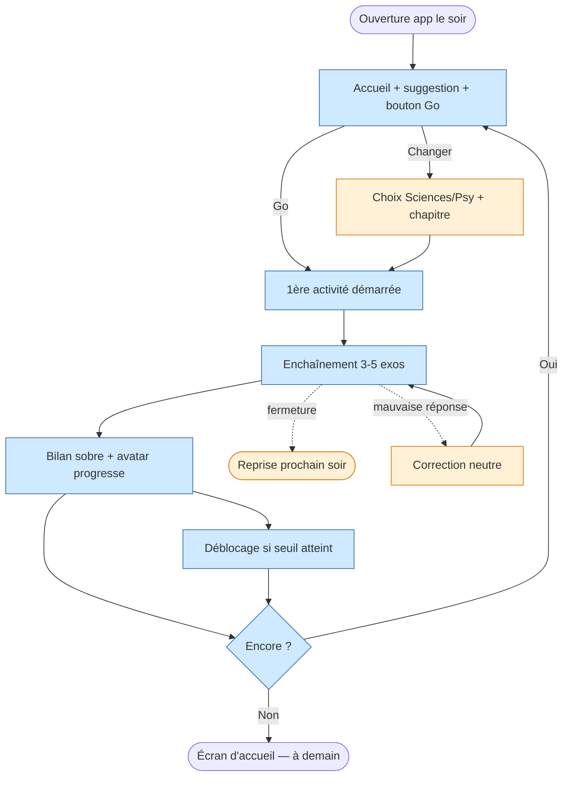
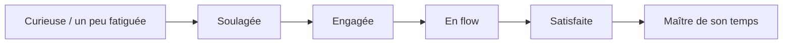

<!-- Copyright (C) 2026 Cyril Vrillaud - SPDX-License-Identifier: AGPL-3.0-only -->

# Parcours utilisateur : Soir-semaine-smartphone (J2)

> Parcours nominal le plus fréquent de M0 : Juju, fatiguée, ouvre l'app sur son smartphone 15 min après les devoirs. C'est le mode pour lequel le produit est calibré en priorité.
>
> **Périmètre** : M0 — critique. **Date** : 2026-05-13.

## Contexte et déclencheur

### Situation initiale

Soir de semaine, environ 21 h. Juju a fini ses devoirs scolaires et n'a plus l'énergie de se remettre sur l'ordinateur. Elle est dans son lit ou sur le canapé, smartphone en main. Elle pense à sa préparation pilote, ou se souvient simplement que l'application existe.

État cognitif : attention courte, motivation présente mais fragile, tolérance à la friction quasi nulle.

### Déclencheur

Juju ouvre l'application sur son smartphone (par habitude ou impulsion).

## Persona concernée

**Persona principale** : Juju — [Fiche persona](../personas/persona-juju-utilisatrice.md)
**Personas secondaires** : aucune.

## Objectif du parcours

Permettre à Juju d'effectuer une session productive de **15 min maximum** sans avoir à prendre de décision coûteuse :

- Démarrage sur un bouton unique (« go »), suggestion intelligente du système qu'elle peut accepter ou changer.
- Enchaînement fluide de 3-5 micro-exercices (flashcards ou QCM courts chronométrés).
- Sortie sans culpabilité quand le temps est écoulé ou quand elle ferme.

Sentiment recherché : « j'ai avancé, j'ai aimé, je reviendrai demain ».

## Pré-conditions

- [ ] L'onboarding (J1) a déjà été complété au moins une fois
- [ ] Au moins 1 chapitre maths et 1 chapitre physique-chimie sont disponibles avec contenu flashcard et QCM court
- [ ] L'historique d'usage est suffisant pour qu'une suggestion contextuelle soit possible (ou bien la 1ère suggestion par défaut est intégrée au prototype)
- [ ] L'avatar a un état courant et un état suivant identifiables

## Scénario nominal

### Étape 1 : Ouverture de l'application

**Action** : Juju lance l'application depuis son smartphone.
**Système** : Affiche l'écran d'accueil : avatar dans son état courant, une suggestion d'activité formulée en une ligne (par exemple : « Poursuis Géométrie : 4 flashcards », ou « Défi rapide : QCM logique 5 questions »), et un bouton **« Go »**.
**Émotion** : Soulagée — pas de menu, pas de carrousel, pas de page de catalogue à explorer. Elle peut démarrer immédiatement.
**Touchpoint** : Écran d'accueil — zone *Home / Avatar et progression*.

### Étape 2 : Démarrage de la session via la suggestion

**Action** : Juju active le bouton « Go ».
**Système** : Démarre immédiatement la 1ère micro-activité de la suggestion (flashcard ou QCM court). Pas d'écran intermédiaire.
**Émotion** : Engagée — la friction est nulle, on est dans l'usage en 1 tap.
**Touchpoint** : Écran de la 1ère activité — zone *Session d'entraînement*.

### Étape 3 : Enchaînement de 3 à 5 micro-exercices

**Action** : Juju traverse les exercices (flashcard à retourner, ou QCM avec sélection d'une réponse). Quelques secondes à 1-2 min par exercice.
**Système** : Enchaîne sans saut visuel inutile. Affiche un indicateur de progression très discret au sein de la session (par exemple : « 2 / 4 »). Aucune notation cumulée /20, aucun score global stigmatisant.
**Émotion** : En flow — l'enchaînement est rythmé, court, sans interruption parasite.
**Touchpoint** : Écrans successifs de la session — zone *Session d'entraînement*.

### Étape 4 : Fin de la mini-session (côté contenu)

**Action** : Juju arrive au bout des 3-5 exercices proposés.
**Système** : Affiche un écran de bilan ultra-sobre : nombre d'exercices faits, avatar qui marque une progression (animation légère si seuil atteint), proposition d'enchaîner une 2e mini-session ou de s'arrêter.
**Émotion** : Satisfaite — quelque chose s'est passé, l'avatar a réagi, elle peut partir tranquille.
**Touchpoint** : Écran de fin de mini-session — zone *Avatar et progression*.

### Étape 5 : Décision de poursuivre ou de s'arrêter

**Action** : Juju choisit entre « Encore une session courte » et « Bonne nuit » (formulations à valider en Design).
**Système** : Si elle continue, retour à l'étape 2 avec une nouvelle suggestion (basée sur ce qui vient d'être fait). Si elle s'arrête, retour à l'écran d'accueil avec un message neutre et chaleureux (« À demain » ou équivalent), **sans relance ni notification programmée**.
**Émotion** : Maître de son temps — l'app respecte sa décision sans culpabilisation.
**Touchpoint** : Écran de fin de mini-session — zone *Avatar et progression* ou retour *Home*.

### Étape 6 : Déblocage éventuel (transverse, non systématique)

**Action** : Juju ferme l'application ou en lance une 2e mini-session.
**Système** : Si un seuil de déblocage est atteint (X sessions consécutives, ou Y chapitres traversés selon mécanique retenue en Design), affiche un écran sobre de déblocage (« Nouveau chapitre disponible : Mécanique ») avant la prochaine action. Pas de modale agressive, pas de fanfare disproportionnée.
**Émotion** : Récompensée — son investissement récurrent produit un résultat visible.
**Touchpoint** : Écran de déblocage — zone *Avatar et progression / Catalogue*.

## Scénarios alternatifs

### Scénario alternatif 1 : Juju refuse la suggestion et choisit elle-même

**Déclencheur** : La suggestion ne lui parle pas (elle n'a pas envie de maths ce soir, ou veut faire de la logique).
**Divergence à l'étape** : 1.
**Déroulement** :

1. Juju active un bouton « Changer » ou « Autre chose » (à valider en Design — à côté du bouton Go).
2. Le système propose un choix simple à 2 niveaux : Sciences vs Psy d'abord, puis option rapide (chapitre en cours, autre chapitre, QCM aléatoire). Aucun catalogue exhaustif n'est exposé.
3. Une fois choisi, retour au scénario nominal à l'étape 2.

### Scénario alternatif 2 : Juju quitte en cours de session

**Déclencheur** : Interruption (appel, distraction, fatigue).
**Divergence à l'étape** : 3 (en plein milieu des micro-exercices).
**Déroulement** :

1. Juju ferme l'application sans terminer.
2. Le système enregistre les exercices effectués (ils comptent dans l'historique et la progression).
3. À la prochaine ouverture, la suggestion peut proposer de **reprendre où elle s'était arrêtée**, sans message culpabilisant sur la session inachevée.

### Scénario alternatif 3 : Juju répond mal à un QCM

**Déclencheur** : Mauvaise réponse à une question du QCM court.
**Divergence à l'étape** : 3.
**Déroulement** :

1. Le système affiche la bonne réponse avec une explication courte (1-3 lignes), formulation neutre, sans mention de l'erreur en termes négatifs.
2. La question peut être marquée pour réapparition dans une session ultérieure (logique de répétition espacée légère, optionnelle en M0).
3. Le score de la session n'est pas affiché /N. Seule la fréquentation et la régularité comptent dans le suivi.

### Scénario alternatif 4 : Aucune suggestion pertinente disponible (1er soir post-onboarding)

**Déclencheur** : Juju ouvre l'app le lendemain de l'onboarding, l'historique est trop court pour personnaliser.
**Divergence à l'étape** : 1.
**Déroulement** :

1. Le système propose une suggestion par défaut prédéfinie (typiquement : la flashcard maths du chapitre par lequel commence le contenu).
2. Le reste du parcours est identique.

## Flow diagram

## Expérience utilisateur

### Points de satisfaction

1. **Le bouton « Go » unique** sur l'écran d'accueil — friction nulle, démarrage en 1 tap.
2. **Le rythme court** des micro-exercices — compatible avec l'attention fatiguée.
3. **L'absence de score /N global** — l'usage récurrent n'est jamais transformé en classement personnel anxiogène.
4. **L'autonomie de sortie** : pas de relance, pas de notification culpabilisante. « Bonne nuit » et c'est tout.

### Pain points

1. **Suggestion non pertinente** au point que Juju zappe à chaque ouverture — **Criticité** : Haute (mine la promesse « démarrage en 1 tap »).
2. **Sessions trop longues** : si la mini-session par défaut dépasse 3-5 min, Juju ne reviendra pas en mode fatigué — **Criticité** : Haute.
3. **Animation de progression d'avatar invisible** si seuil de déblocage trop lointain — **Criticité** : Moyenne (à calibrer en Design).
4. **QCM mal calibrés** (questions trop dures pour le format court) — **Criticité** : Moyenne.

### Courbe émotionnelle

## Post-conditions

- [ ] Juju a effectué 3 à 5 micro-exercices (au moins une mini-session)
- [ ] L'historique a enregistré la session (compteur du KR-régularité)
- [ ] L'avatar a progressé visiblement si seuil atteint
- [ ] Juju n'a reçu aucun message culpabilisant à aucun moment
- [ ] Juju peut quitter sans friction et sans relance différée

## Touchpoints (Points de contact)

| Étape | Touchpoint | Type | Zone fonctionnelle |
|---|---|---|---|
| 1 | Écran d'accueil (avatar + suggestion + Go) | Interface smartphone | Home / Avatar et progression |
| 2 | Écran de 1ère activité | Interface smartphone | Session d'entraînement |
| 3 | Écrans successifs flashcards / QCM | Interface smartphone | Session d'entraînement |
| 4 | Écran de bilan de mini-session | Interface smartphone | Avatar et progression |
| 5 | Choix continuer / arrêter | Interface smartphone | Home |
| 6 | Écran de déblocage (si applicable) | Interface smartphone | Avatar et progression / Catalogue |

## Considérations d'accessibilité

### Recommandations

- **Tailles tactiles confortables** : les boutons « Go », « Changer », « Bonne nuit » doivent être atteignables d'une main au pouce, sur smartphone tenu en lit.
- **Pas de dépendance audio** : tout doit fonctionner muet (Juju peut être au lit, sans casque).
- **Contraste élevé** pour les écrans utilisés en mode sombre tardif.
- **Pas d'interaction temporelle agressive** : le chronomètre des QCM courts doit rester paramétrable et indulgent (M0).
- **Aucune notification push intempestive** entre les sessions — le pilote de la régularité est la suggestion contextuelle à l'ouverture, pas un nudge externe.

## Wireframes associés

À créer en phase Design. Écrans pressentis : `wf-accueil-home`, `wf-flashcard`, `wf-qcm-court`, `wf-fin-mini-session`, `wf-deblocage`, `wf-choix-rapide-pilier`.

## Notes complémentaires

- **Choix de la mécanique de démarrage (suggestion + Go)** : retenu pour minimiser la décision à un moment où l'énergie cognitive est faible. C'est la mécanique qui porte le mieux la promesse « 15 min utiles, sans friction ».
- **Lien fort avec J1** : la suggestion de la 1ère session post-onboarding doit être prévisible (la flashcard d'échantillon de J1 alimente l'historique et nourrit la suggestion du lendemain).
- **Lien fort avec J3** : si Juju veut s'aventurer sur le pilier psy, le scénario alternatif 1 mène à J3 sur sa 1ère exécution. Les sessions psy suivantes peuvent ensuite être suggérées comme alternatives sciences/psy.

## Traçabilité

| Dépendance | Référence |
|---|---|
| persona Juju (contextes soir semaine, fatigue, profil gameuse) | [Persona Juju](../personas/persona-juju-utilisatrice.md) |
| product brief — MVP M0 (smartphone uniquement, formats courts) | [Product Brief](../product-brief.md) |
| vision produit — pilier 3 (UX bienveillante), pilier 4 (engagement par le jeu) | [Vision produit](../../01-strategy/vision-produit.md) |
| OKRs — KR-3.1.2 (mode session courte téléphone), KR-3.1.3 (suivi non-anxiogène) | [OKRs](../../01-strategy/okrs.md) |
| initiative I-3.1.3 (UX session courte) | [Initiatives](../../01-strategy/initiatives.md) |
| journey amont — onboarding | [J1 — première utilisation](journey-premiere-utilisation.md) |
| journey adjacent — premier contact psy | [J3 — découverte-psychotechniques](journey-decouverte-psychotechniques.md) |
| journey futur — session longue (M1) | [J4 — week-end-immersion](journey-week-end-immersion.md) |
