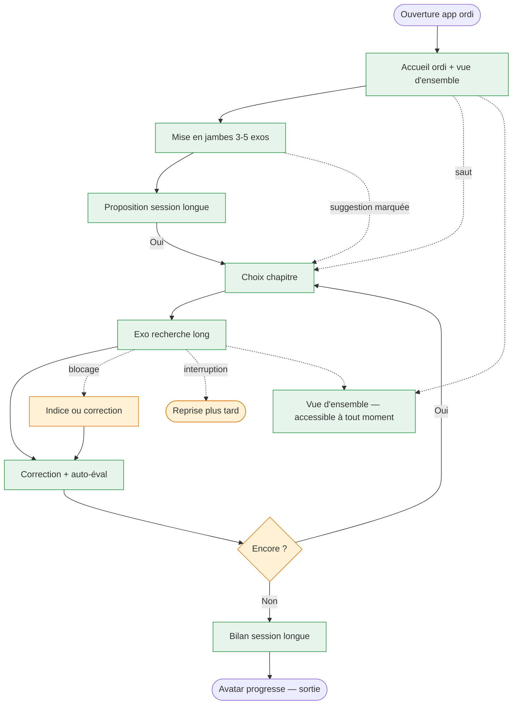

<!-- Copyright (C) 2026 Cyril Vrillaud - SPDX-License-Identifier: AGPL-3.0-only -->

# Parcours utilisateur : Week-end-immersion (J4)

> **⚠️ Journey M1 anticipé — hors périmètre M0.** Session longue sur ordinateur le week-end. Formalisé dès Discovery pour cadrer le contraste avec J2, nourrir wireframes/architecture en Design, et arbitrer la stack (responsive / cross-device).
> **Périmètre** : M1 — anticipation. **Date** : 2026-05-13.

## Contexte et déclencheur

Week-end, plage libre 30 min → plusieurs heures. Juju à son bureau ou canapé avec ordinateur portable. Attention longue, motivation forte, tolérance à la complexité élevée. Elle a déjà utilisé l'app en smartphone (J2) et veut creuser un sujet. Elle ouvre l'app sur ordi.

## Objectif du parcours

Session immersive 30 min → heures : (1) mise en jambes courte (continuité avec J2), (2) exercices de recherche longs (10-30 min) sur un chapitre au choix, (3) vue d'ensemble de la progression sur grand écran, (4) sortie sans culpabilité.

## Pré-conditions

- [ ] Stack supporte un usage ordi (web responsive, PWA, ou desktop)
- [ ] Continuité multi-appareil opérationnelle (session ordi voit historique smartphone)
- [ ] Contenu M1 livré : couverture intégrale BO 1ère + exercices de recherche longs
- [ ] J1, J2, J3 parcourus au moins une fois sur smartphone (M0 acquis)

## Scénario nominal

**1. Ouverture sur ordi** — Même grammaire d'accueil que smartphone (avatar, suggestion + Go) avec espace visuel supplémentaire : avancement par chapitre, historique, avatar en grand. Reconnaît le contexte ordi (« Session week-end ? On peut creuser un sujet »). → *Motivée*.

**2. Mise en jambes** — 3-5 exos courts (flashcards ou QCM rapide), même registre que J2 mais en plus grand. → *En flow* — terrain familier.

**3. Transition session longue** — Bilan sobre + proposition week-end : « Tu veux creuser un sujet à fond ? 30 min à 1 h sur un chapitre maths ou physique. » Liste des chapitres avec indication exercices de recherche longs disponibles. → *Intriguée*.

**4. Choix du chapitre** — Fiche chapitre version « immersion » : mise en perspective (1 paragraphe) + exercices longs + liens vidéo curés (Yvan Monka / Pierre Olivier — M2) si disponibles. → *Engagée*.

**5. Exercice de recherche long** — Énoncé étoffé, raisonnement écrit, plusieurs sous-questions. Format pleine largeur, zone de notes étendue, navigation entre sous-questions, mise en pause possible. Pas de chrono par défaut. → *Concentrée*.

**6. Correction détaillée + auto-évaluation** — Correction structurée (raisonnement complet, étapes, attendus). Auto-évaluation légère : « J'ai compris l'essentiel / J'ai bloqué / À refaire plus tard ». Pas de notation imposée. → *Éclairée*.

**7. Vue d'ensemble** — Accessible à tout moment. Tableau de bord sobre : avatar, chapitres parcourus, déblocages, séries de jours (sans pression sur les ruptures). **Aucun graphique anxiogène, aucune note /N.** → *Récompensée*.

**8. Sortie volontaire** — Bilan session longue (temps, exos longs, chapitres). Avatar marque une progression marquée (sessions longues comptent davantage — calibrage à valider). Pas de notification de relance. → *Accomplie*.

## Scénarios alternatifs

**Alt 1 — Saut mise en jambes** (étape 2) : Juju navigue directement vers un chapitre. Le système n'insiste pas → étape 4.

**Alt 2 — Blocage sur exo long** (étape 5) : « J'ai besoin d'un coup de pouce » → indice progressif (optionnel M1) ou correction directe. Pas de jugement. Marquage « à refaire plus tard » proposé.

**Alt 3 — Interruption** (étape 5-6) : exercice mis en pause (état sauvegardé). Prochaine ouverture : suggestion de reprise. Si pas repris, exo reste accessible sans pression.

**Alt 4 — Continuité depuis smartphone** (étape 1) : Juju a marqué un chapitre « à creuser le week-end » en J2. L'ordi propose directement ce chapitre → étape 4-5.

## Flow diagram

## Expérience utilisateur

**Satisfaction** : mise en jambes (cohérence J2) · exercices de recherche longs (profondeur) · auto-évaluation libre · vue d'ensemble non-anxiogène · continuité smartphone→ordi.

**Pain points** : exos longs mal calibrés (Haute) · manque de continuité multi-appareil (Haute) · vue d'ensemble anxiogène (Haute — trahit Pilier 3) · mise en jambes obligatoire (Moyenne, cf. alt 1) · stack inadaptée au format long (Bloquante côté Design).

**Courbe émotionnelle** : motivée → en flow → intriguée → engagée → concentrée → éclairée → récompensée → accomplie.

## Post-conditions

- [ ] ≥ 1 exercice de recherche long effectué avec correction
- [ ] Vue d'ensemble consultée
- [ ] Historique enregistre la session longue
- [ ] Avatar progression sensible
- [ ] Exercices en pause reprenables (smartphone ou ordi)

## Accessibilité

Exploiter la largeur écran (énoncés, corrections) · ergonomie clavier (raccourcis navigation sous-questions) · sauvegarde automatique (pas de perte de 20 min) · vue d'ensemble non-anxiogène · mode sombre pour sessions tardives.

## Wireframes

À créer en Design (confirmer nécessité set ordi séparé) : `wf-accueil-ordi`, `wf-fiche-chapitre-immersion`, `wf-exo-recherche-long`, `wf-correction-detaillee-autoeval`, `wf-vue-densemble-ordi`, `wf-fin-session-longue`.

## Notes complémentaires

- **Statut M1 anticipé** : formalisé pour orienter (1) la décision de stack (I-T.1) et (2) les wireframes/architecture en Design (continuité multi-appareil, format long).
- **Mise en jambes avant le long** : rapproche J4 de J2 en début de séance, différencie par les exos longs en cœur de séance.
- **Continuité multi-appareil** : argument fort pour stack web (responsive ou PWA) vs app native fragmentée — à acter en ADR.
- **Calibrage exos longs** : à produire en M1. Discovery cadre les attentes (10-30 min, raisonnement écrit, sous-questions, correction structurée).

## Traçabilité

| Dépendance | Référence |
|---|---|
| persona Juju (contexte week-end ordi) | [Persona Juju](../personas/persona-juju-utilisatrice.md) |
| product brief — Vague 1 (M1) | [Product Brief](../product-brief.md) |
| vision — Pilier 3, Pilier 4 | [Vision produit](../../01-strategy/vision-produit.md) |
| OKRs — KR-3.1.2 | [OKRs](../../01-strategy/okrs.md) |
| initiatives I-3.1.4, I-T.1 | [Initiatives](../../01-strategy/initiatives.md) |
| J2 — usage smartphone | [J2](journey-soir-semaine-smartphone.md) |
| J3 — premier contact psy | [J3](journey-decouverte-psychotechniques.md) |
