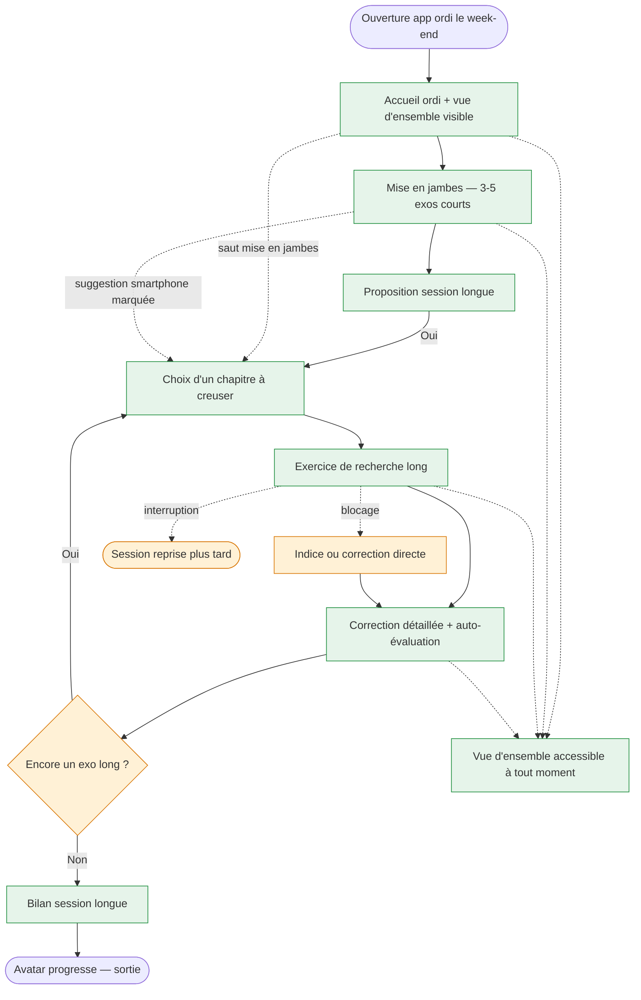
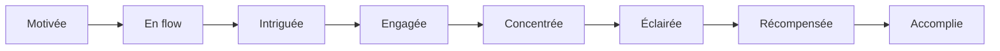

<!-- Copyright (C) 2026 Cyril Vrillaud - SPDX-License-Identifier: AGPL-3.0-only -->

# Parcours utilisateur : Week-end-immersion (J4)

> **⚠️ Journey M1 anticipé — hors périmètre M0.**
>
> Session longue sur ordinateur le week-end, motivation haute, attention disponible. Formalisé dès la phase Discovery pour cadrer le contraste avec le mode session courte de J2, nourrir les wireframes et architecture en phase Design, et arbitrer la stack (responsive / cross-device / continuité multi-appareil).
>
> **Périmètre** : M1 — anticipation. **Date** : 2026-05-13.

## Contexte et déclencheur

### Situation initiale

Samedi ou dimanche, plage libre de 30 min à plusieurs heures. Juju est à son bureau ou sur le canapé avec son ordinateur portable, dans un état attentif et motivé. Elle a déjà utilisé l'app en session courte sur smartphone plusieurs fois en semaine (J2) et a envie de creuser un sujet plus en profondeur.

État cognitif : attention longue, motivation forte, tolérance à la complexité élevée.

### Déclencheur

Juju ouvre l'application sur son ordinateur (URL ou app desktop selon stack tranchée en Design — Pré-condition I-T.1).

## Persona concernée

**Persona principale** : Juju — [Fiche persona](../personas/persona-juju-utilisatrice.md)
**Personas secondaires** : aucune.

## Objectif du parcours

Permettre à Juju d'investir 30 min à plusieurs heures dans une session immersive :

1. **Démarrer en douceur** par un enchaînement court de quelques exercices familiers (mise en jambes / continuité avec le rythme smartphone), avant de basculer vers le contenu long.
2. **Creuser un sujet** via des exercices de recherche longs (10-30 min) sur un chapitre maths ou physique-chimie au choix.
3. **Voir l'ensemble de sa progression** sur grand écran (continuité avec le smartphone, avatar, déblocages, chapitres parcourus).
4. **Sortir quand elle le décide**, sans culpabilité, comme en J2.

## Pré-conditions

- [ ] La stack tranchée en Design supporte un usage ordinateur (web responsive grand écran, PWA, ou application desktop)
- [ ] La continuité multi-appareil est opérationnelle : la session ordi voit l'historique des sessions smartphone (suggestion contextuelle, avatar, déblocages)
- [ ] Le contenu de M1 est livré : couverture intégrale BO 1ère + exercices de recherche longs définis et déposés
- [ ] J1, J2, J3 ont été parcourus au moins une fois sur smartphone (M0 acquis avant d'ouvrir M1)

## Scénario nominal

### Étape 1 : Ouverture de l'application sur ordinateur

**Action** : Juju lance l'application depuis son ordinateur.
**Système** : Affiche l'écran d'accueil version ordi : même grammaire d'accueil que sur smartphone (avatar, suggestion + Go) mais avec un espace visuel supplémentaire qui rend visibles l'avancement par chapitre, l'historique des sessions, l'avatar dans un format plus grand. Reconnaît implicitement que c'est un usage ordi (par exemple : « Session week-end ? On peut creuser un sujet aujourd'hui »).
**Émotion** : Motivée — elle voit son terrain de jeu plus large, ses progrès matérialisés.
**Touchpoint** : Écran d'accueil ordi — zone *Home / Avatar et progression / Vue d'ensemble*.

### Étape 2 : Mise en jambes — enchaînement d'exos courts

**Action** : Juju démarre par un enchaînement court de 3-5 exercices courts (flashcards ou QCM rapide), même registre que J2.
**Système** : Démarre la mini-session courte comme en J2 (suggestion + Go), affichée en plus grand mais avec la même fluidité. Permet à Juju d'entrer dans le rythme sans saut.
**Émotion** : En flow — elle retrouve un terrain familier avant de plonger dans le long.
**Touchpoint** : Écrans de session courte adaptés au grand écran — zone *Session d'entraînement*.

### Étape 3 : Transition vers la session longue

**Action** : Juju arrive au bout de la mini-session courte.
**Système** : Affiche un bilan sobre (comme en J2) **plus** une proposition spécifique au week-end : « Tu veux creuser un sujet à fond ? On peut prendre 30 min à 1 h sur un chapitre maths ou physique. » Liste les chapitres disponibles, avec une indication discrète de ceux qui ont des **exercices de recherche longs** disponibles.
**Émotion** : Intriguée — la proposition est ciblée pour son contexte (temps disponible, état d'esprit).
**Touchpoint** : Écran de transition session courte → longue — zone *Catalogue / sciences*.

### Étape 4 : Choix du chapitre à creuser

**Action** : Juju choisit un chapitre.
**Système** : Affiche la fiche du chapitre version « immersion » : une mise en perspective courte (1 paragraphe) + les exercices de recherche longs proposés + les ressources externes curées (Yvan Monka, Pierre Olivier — M2) si disponibles.
**Émotion** : Engagée — elle a un terrain de travail clair.
**Touchpoint** : Écran fiche chapitre version immersion — zone *Catalogue / sciences*.

### Étape 5 : Exercice de recherche long

**Action** : Juju démarre un exercice de recherche long (énoncé étoffé, demande de raisonnement écrit, plusieurs sous-questions).
**Système** : Affiche un format adapté au grand écran : énoncé pleine largeur, zone de prise de notes ou de réponse étendue, navigation entre sous-questions, possibilité de mettre en pause. Pas de chronomètre par défaut sur ces exercices.
**Émotion** : Concentrée — elle peut prendre le temps qu'il faut.
**Touchpoint** : Écran exercice de recherche long — zone *Session d'entraînement / longue*.

### Étape 6 : Correction détaillée et auto-évaluation

**Action** : Juju termine ou met en pause l'exercice de recherche, demande la correction.
**Système** : Affiche une correction structurée et détaillée (raisonnement complet, étapes intermédiaires, attendus pédagogiques). Propose à Juju de **s'auto-évaluer** sur ce qu'elle a réussi (mécanisme léger : « J'ai compris l'essentiel », « J'ai bloqué sur telle étape », « À refaire plus tard »). Pas de notation imposée par le système.
**Émotion** : Éclairée — elle peut comparer son raisonnement à la correction et savoir où elle en est.
**Touchpoint** : Écran correction détaillée + auto-évaluation — zone *Session d'entraînement / longue*.

### Étape 7 : Vue d'ensemble de la progression

**Action** : Juju peut, à tout moment de la session longue, basculer sur la vue d'ensemble.
**Système** : Affiche un tableau de bord personnel sobre : avatar dans son état courant, chapitres parcourus (avec niveau de profondeur), déblocages obtenus, séries de jours consécutifs (sans pression sur les ruptures). **Aucun graphique anxiogène, aucune note /N globale.**
**Émotion** : Récompensée — l'investissement durable est rendu visible et tangible sur grand écran.
**Touchpoint** : Écran tableau de bord personnel — zone *Avatar et progression*.

### Étape 8 : Sortie volontaire

**Action** : Juju décide de s'arrêter (fin de plage horaire, autre activité, fatigue).
**Système** : Bilan sobre de la session longue (temps passé, exercices longs effectués, chapitres touchés). L'avatar marque une progression marquée (les sessions longues comptent davantage que les courtes côté avatar — calibrage à valider). Pas de notification de relance, pas de prochaine séance suggérée par mail/notif.
**Émotion** : Accomplie — sentiment d'avoir réellement avancé sur un sujet.
**Touchpoint** : Écran de fin de session longue — zone *Avatar et progression*.

## Scénarios alternatifs

### Scénario alternatif 1 : Juju saute la mise en jambes

**Déclencheur** : Elle vient pour un exercice de recherche long précis, identifié à l'avance.
**Divergence à l'étape** : 2.
**Déroulement** :

1. Juju ignore la mini-session courte proposée et navigue directement vers le pilier Sciences puis un chapitre.
2. Le système n'insiste pas, l'amène à l'étape 4.
3. Le reste du parcours est identique.

### Scénario alternatif 2 : Juju bloque sur l'exercice de recherche

**Déclencheur** : Difficulté manifeste, énoncé qui dépasse son niveau.
**Divergence à l'étape** : 5.
**Déroulement** :

1. Juju active « J'ai besoin d'un coup de pouce » ou « Voir la correction tout de suite ».
2. Le système affiche soit un **indice progressif** (cf. mécanique à définir en Design, optionnelle M1), soit directement la correction.
3. Pas de jugement de valeur sur l'abandon. Le marquage « à refaire plus tard » est offert.

### Scénario alternatif 3 : Session longue interrompue

**Déclencheur** : Imprévu (sortie, repas, appel), Juju doit s'arrêter en plein exercice de recherche.
**Divergence à l'étape** : 5 ou 6.
**Déroulement** :

1. L'exercice peut être mis en pause (l'état est sauvegardé).
2. À la prochaine ouverture (smartphone le soir ou ordi le lendemain), une suggestion explicite propose de reprendre.
3. Si Juju ne reprend pas, l'exercice reste accessible sans pression de réouverture.

### Scénario alternatif 4 : Continuité depuis smartphone

**Déclencheur** : Juju a vu en J2 (smartphone) une suggestion « Tu veux creuser ce chapitre le week-end ? » et l'a marqué pour plus tard.
**Divergence à l'étape** : 1.
**Déroulement** :

1. À l'ouverture ordi, le système propose directement ce chapitre marqué, sans demander de mise en jambes.
2. Juju enchaîne vers l'étape 4 ou 5 directement.
3. Confirme la valeur de la continuité multi-appareil — argument structurant pour la stack en Design.

## Flow diagram

## Expérience utilisateur

### Points de satisfaction

1. **La mise en jambes courte avant de plonger** — confirme que la grammaire d'usage est cohérente entre smartphone et ordi, pas deux outils disjoints.
2. **Les exercices de recherche longs** — répondent au besoin de profondeur exprimé par Juju pour les week-ends concentrés.
3. **L'auto-évaluation libre** — laisse à Juju la maîtrise de son ressenti sans imposer une notation.
4. **La vue d'ensemble accessible à tout moment** — rend visible le travail accumulé sur plusieurs semaines sans graphiques anxiogènes.
5. **La continuité smartphone → ordi** — exclusive au mode immersion, donne un sens fort au double usage.

### Pain points

1. **Exercices de recherche mal calibrés** (trop durs ou trop faciles) — **Criticité** : Haute (le format long ne pardonne pas les défauts de contenu).
2. **Manque de continuité depuis le smartphone** — **Criticité** : Haute (casse l'attrait du mode immersion week-end).
3. **Vue d'ensemble trop chargée ou anxiogène** — **Criticité** : Haute (toute dérive vers un dashboard de surveillance trahit le pilier 3).
4. **Mise en jambes obligatoire et frustrante** quand Juju vient pour un exo long précis — **Criticité** : Moyenne (à mitiger par le scénario alternatif 1).
5. **Stack inadaptée** au format long (typographie pleine page, zone de prise de notes ergonomique, navigation entre sous-questions) — **Criticité** : Bloquante côté Design.

### Courbe émotionnelle

## Post-conditions

- [ ] Juju a effectué au moins 1 exercice de recherche long et obtenu sa correction
- [ ] Juju a vu sa vue d'ensemble de progression (avatar, chapitres, déblocages)
- [ ] L'historique a enregistré le temps passé en session longue (alimente le KR « profondeur d'usage »)
- [ ] L'avatar a marqué une progression sensible (calibrage à valider)
- [ ] Juju peut reprendre les exercices laissés en pause à la prochaine session (smartphone ou ordi)

## Touchpoints (Points de contact)

| Étape | Touchpoint | Type | Zone fonctionnelle |
|---|---|---|---|
| 1 | Écran d'accueil ordi avec vue d'ensemble | Interface ordinateur | Home / Vue d'ensemble |
| 2 | Écrans de mini-session courte (ordi) | Interface ordinateur | Session d'entraînement |
| 3 | Écran de transition court → long | Interface ordinateur | Catalogue / sciences |
| 4 | Écran fiche chapitre version immersion | Interface ordinateur | Catalogue / sciences |
| 5 | Écran exercice de recherche long | Interface ordinateur | Session d'entraînement / longue |
| 6 | Écran correction détaillée + auto-évaluation | Interface ordinateur | Session d'entraînement / longue |
| 7 | Écran tableau de bord personnel | Interface ordinateur | Avatar et progression |
| 8 | Écran de fin de session longue | Interface ordinateur | Avatar et progression |

## Considérations d'accessibilité

### Recommandations

- **Lisibilité grand écran** : éviter les colonnes étroites maladroites, exploiter la largeur disponible pour les énoncés longs et les corrections détaillées.
- **Ergonomie clavier** : la session ordi doit pouvoir se traverser au clavier (raccourcis pour passer à la sous-question suivante, valider une réponse, etc.) — pas seulement à la souris.
- **Sauvegarde automatique** des saisies sur les exercices de recherche : Juju ne doit jamais perdre 20 min de réflexion à cause d'une fermeture d'onglet accidentelle.
- **Vue d'ensemble strictement non-anxiogène** : pas de graphique de courbes, pas de classement implicite, pas de mise en évidence des chapitres « en retard » (formulation interdite).
- **Choix explicite de mode sombre** pour les sessions tardives.

## Wireframes associés

À créer en phase Design (et confirmer la nécessité d'un set ordi séparé du set smartphone). Écrans pressentis : `wf-accueil-ordi`, `wf-fiche-chapitre-immersion`, `wf-exo-recherche-long`, `wf-correction-detaillee-autoeval`, `wf-vue-densemble-ordi`, `wf-fin-session-longue`.

## Notes complémentaires

- **Statut « M1 anticipé » assumé** : ce journey n'est pas livré en M0 mais il est formalisé maintenant pour deux raisons. (1) Il oriente la **décision de stack** (I-T.1) : choisir une stack qui rend ce journey raisonnablement atteignable en M1 sans refonte ; (2) Il cadre les **wireframes** et l'architecture en Design en explicitant les besoins de continuité multi-appareil et de format long.
- **Mise en jambes courte avant le long** : retenu sur la base de la réponse libre du porteur (« un enchaînement d'exercice court pour commencer »). Ce choix rapproche J4 de J2 en début de séance et différencie le cœur de l'expérience (les exos longs) en milieu/fin de séance.
- **Continuité multi-appareil** : argument fort pour une stack web (responsive ou PWA) plutôt qu'app native fragmentée. À acter en ADR.
- **Calibrage des exercices longs** : le contenu reste à produire en M1 ; Discovery se contente de cadrer les attentes (10-30 min par exo, raisonnement écrit, plusieurs sous-questions, correction structurée).
- **Lien avec J2** : la suggestion smartphone « tu veux creuser ce chapitre le week-end ? » crée un pont explicite entre les deux journeys.

## Traçabilité

| Dépendance | Référence |
|---|---|
| persona Juju (contexte week-end ordi, profil gameuse) | [Persona Juju](../personas/persona-juju-utilisatrice.md) |
| product brief — Vague 1 (M1) : couverture intégrale + mode ordi + session longue | [Product Brief](../product-brief.md) |
| vision produit — pilier 3 (UX bienveillante), pilier 4 (engagement par le jeu) | [Vision produit](../../01-strategy/vision-produit.md) |
| OKRs — KR-3.1.2 (mode session longue ordi) | [OKRs](../../01-strategy/okrs.md) |
| initiative I-3.1.4 (UX session longue ordi) | [Initiatives](../../01-strategy/initiatives.md) |
| initiative transverse I-T.1 (stack, continuité multi-appareil) | [Initiatives](../../01-strategy/initiatives.md) |
| journey amont — usage smartphone récurrent | [J2 — soir-semaine-smartphone](journey-soir-semaine-smartphone.md) |
| journey adjacent — premier contact psy | [J3 — découverte-psychotechniques](journey-decouverte-psychotechniques.md) |
