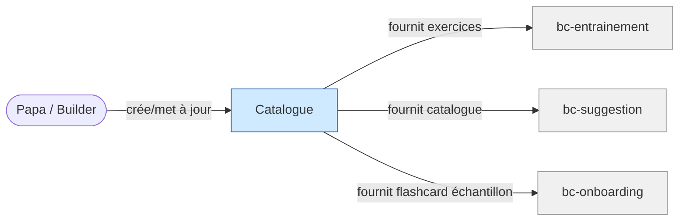

# Contexte métier : Contenu

> Catalogue pédagogique — la matière première de l'entraînement.

## Vue d'ensemble

**Nom** : bc-contenu
**Catégorie** : Core — cœur de valeur, ce que Juju consomme au quotidien.

**Responsabilité** : Organiser et fournir le catalogue pédagogique (piliers, chapitres, formats, exercices, fiches méthode, corrections).

### Périmètre

**Dans le scope** :

- Structure du catalogue : piliers → chapitres → formats → exercices
- Contenu des exercices : énoncés, choix QCM, faces flashcard, corrections expliquées
- Fiches méthode psychotechniques
- Métadonnées de contenu : programme BO, typologies psy, niveau de difficulté

**Hors scope** :

- Exécution des exercices (→ bc-entrainement)
- Verrouillage/déblocage des chapitres (→ bc-progression)
- Recommandation de contenu (→ bc-suggestion)

## Diagramme de flux

## Modèles

| Modèle | Rôle | Champs clés |
|---|---|---|
| [Pilier](models/model-pilier.md) | Aggregate root | id, nom, description, chapitres[] |
| [Chapitre](models/model-chapitre.md) | Entity | id, pilier_id, nom, matiere, formats_disponibles[], etat_initial |
| [Exercice](models/model-exercice.md) | Entity | id, chapitre_id, format (flashcard/qcm), enonce, correction |
| [FicheMethode](models/model-fiche-methode.md) | Entity | id, chapitre_id, type_psy, cest_quoi, ce_que_ca_evalue[], comment_aborder[] |

## Événements émis

| Événement | Description | Consommateurs |
|---|---|---|
| `contenu_mis_a_jour` | Papa a ajouté/modifié des exercices ou chapitres (authoring) | bc-suggestion (recalcul si nécessaire) |

## Événements consommés

Aucun — le contenu est la source de vérité, il ne réagit pas aux autres BC.

## Règles métier

1. **Un pilier contient au moins un chapitre** : pas de pilier vide.
2. **Chaque chapitre scientifique a ≥ 2 formats** (M0 : flashcard + QCM chrono).
3. **Chaque exercice a une correction expliquée** : la correction détaille le raisonnement, pas seulement la bonne réponse.
4. **Fiche méthode lisible en < 3 min smartphone** : 3 sections courtes (*C'est quoi ?*, *Ce que ça évalue*, *Comment l'aborder*).
5. **Formulations alignées sur la charte de ton** : aucune correction ne contient de vocabulaire négatif.
6. **Périmètre M0** : 3 chapitres maths + 3 physique-chimie + 2 types psy (logique, calcul mental).

## Interactions avec d'autres contextes

### bc-entrainement

- **Relation** : bc-contenu **fournit** les exercices et corrections à bc-entrainement
- **Direction** : Contenu → Entrainement (lecture seule)

### bc-suggestion

- **Relation** : bc-contenu **fournit** le catalogue (chapitres disponibles, formats) à bc-suggestion
- **Direction** : Contenu → Suggestion (lecture seule)

### bc-onboarding

- **Relation** : bc-contenu **fournit** la flashcard d'échantillon et la liste des piliers
- **Direction** : Contenu → Onboarding (lecture seule)

## Traçabilité

| Dépendance | Référence |
|---|---|
| context-map | [Context Map](context-map.md) |
| exigences contenu | [req-contenu](../0-requirements/fonctionnelles/req-contenu.md) |
| exigences session (formats) | [req-session](../0-requirements/fonctionnelles/req-session.md) |
| journeys J2, J3 | [J2](../../02-discovery/journeys/journey-soir-semaine-smartphone.md), [J3](../../02-discovery/journeys/journey-decouverte-psychotechniques.md) |
| langage ubiquitaire | [Langage ubiquitaire](ubiquitous-language.md) |
