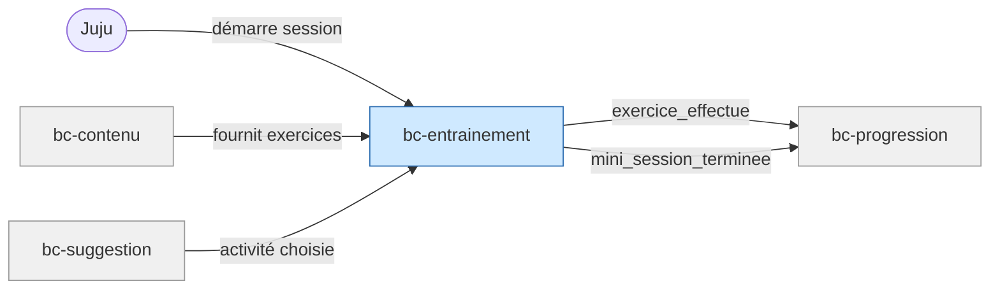

# Contexte métier : Entraînement

> Orchestration de l'usage quotidien — le cœur de l'expérience de Juju.

## Vue d'ensemble

**Nom** : bc-entrainement
**Catégorie** : Core — c'est ici que Juju passe 15 min chaque soir.

**Responsabilité** : Orchestrer l'exécution des sessions d'entraînement : mini-sessions, enchaînement d'exercices, modes chrono/sans chrono, bilans, corrections en contexte.

### Périmètre

**Dans le scope** :

- Cycle de vie des sessions (ouverture → mini-sessions → bilan → fermeture)
- Exécution des exercices : affichage, validation, retournement flashcard
- Modes chrono/sans chrono avec paramétrage
- Bilans de fin de mini-session (nombre d'exercices, sans score /N)
- Tolérance aux interruptions (exercices faits = comptabilisés)

**Hors scope** :

- Contenu des exercices et corrections (→ bc-contenu)
- Progression de l'avatar et déblocages (→ bc-progression)
- Choix de la prochaine activité (→ bc-suggestion)
- Parcours de première utilisation (→ bc-onboarding)

## Diagramme de flux

## Modèles

| Modèle | Rôle | Champs clés |
|---|---|---|
| [Session](models/model-session.md) | Aggregate root | id, device_id, debut, fin, etat, mini_sessions[] |
| [MiniSession](models/model-mini-session.md) | Entity | id, session_id, chapitre_id, format, mode_chrono, exercices[], etat |
| [ExerciceEnCours](models/model-exercice-en-cours.md) | Entity | id, exercice_id, reponse, est_correct, duree_reponse_ms, etat |

## Événements émis

| Événement | Description | Consommateurs |
|---|---|---|
| `exercice_effectue` | Juju a complété un exercice (réponse donnée ou flashcard retournée) | bc-progression |
| `mini_session_terminee` | 3-5 exercices enchaînés, bilan affiché | bc-progression |
| `session_interrompue` | Juju a fermé l'app en cours de mini-session | bc-progression (comptabiliser les exercices faits), bc-suggestion (proposer reprise) |

## Événements consommés

| Événement | Producteur | Réaction |
|---|---|---|
| `suggestion_acceptee` | bc-suggestion | Démarrer la mini-session avec le contenu suggéré |
| `premier_acces_psy` | bc-onboarding | Afficher le message d'accueil psy, recommander la logique |

## Règles métier

1. **Mini-session = 3 à 5 exercices enchaînés** sans écran intermédiaire parasite.
2. **Chaque exercice dure ≤ 2 minutes** : adapté à une attention fatiguée.
3. **Correction expliquée après chaque exercice** : raisonnement, pas seulement la bonne réponse.
4. **Mode sans chrono par défaut** (psy) : le chrono n'est proposé qu'après une séquence libre.
5. **Chrono paramétrable et discret** : pas de tic-tac, pas d'animation stressante, durée par défaut indulgente.
6. **Scoring non-stigmatisant** : le bilan mentionne le nombre d'exercices faits, jamais une note /N ni un pourcentage.
7. **Tolérance aux interruptions** : exercices faits comptent, prochaine ouverture sans reproche.
8. **Formulations exclusivement positives** : charte de ton appliquée à tous les feedback.
9. **Sortie sans relance** : choisir « Bonne nuit » → message neutre, pas de notification programmée.

## Interactions avec d'autres contextes

### bc-contenu

- **Relation** : bc-entrainement **consomme** les exercices, corrections et fiches méthode
- **Direction** : Contenu → Entrainement (lecture seule)

### bc-progression

- **Relation** : bc-entrainement **notifie** chaque exercice effectué et chaque mini-session terminée
- **Direction** : Entrainement → Progression
- **Événements échangés** : `exercice_effectue`, `mini_session_terminee`, `session_interrompue`

### bc-suggestion

- **Relation** : bc-suggestion **fournit** l'activité à démarrer. bc-entrainement démarre la mini-session
- **Direction** : Suggestion → Entrainement
- **Événements échangés** : `suggestion_acceptee`

### bc-onboarding

- **Relation** : bc-onboarding **notifie** le premier accès psy pour déclencher le guidage spécifique
- **Direction** : Onboarding → Entrainement
- **Événements échangés** : `premier_acces_psy`

## Traçabilité

| Dépendance | Référence |
|---|---|
| context-map | [Context Map](context-map.md) |
| journey J2 | [Soir semaine smartphone](../../02-discovery/journeys/journey-soir-semaine-smartphone.md) |
| journey J3 | [Découverte psychotechniques](../../02-discovery/journeys/journey-decouverte-psychotechniques.md) |
| exigences session | [req-session](../0-requirements/fonctionnelles/req-session.md) |
| langage ubiquitaire | [Langage ubiquitaire](ubiquitous-language.md) |
