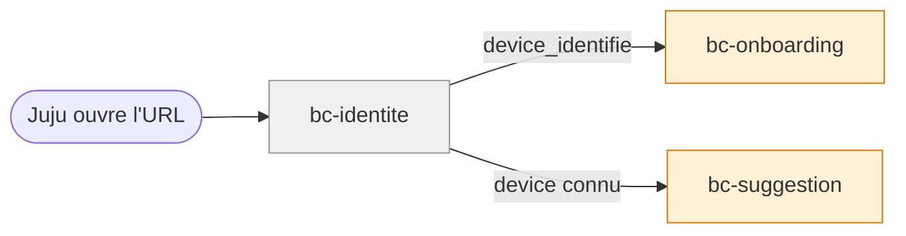

# Contexte métier : Identité

> Identification sans friction — device ID, pas de compte.

## Vue d'ensemble

**Nom** : bc-identite
**Catégorie** : Generic — fonctionnalité standard, interchangeable.

**Responsabilité** : Identifier le device de Juju (device ID) sans compte utilisateur, gérer l'accès initial par URL partagée.

### Périmètre

**Dans le scope** :

- Génération et stockage du device ID (localStorage, cookie sécurisé ou équivalent)
- Association device → utilisatrice à la première connexion
- Accès par URL partagée par Papa
- Refus des devices non identifiés (écran sobre, pas d'erreur technique)

**Hors scope** :

- Authentification classique (login, mot de passe, email) — **explicitement exclu**
- Données de progression (→ bc-progression)
- Contenu de l'app (→ bc-contenu)

## Diagramme de flux

## Modèles

| Modèle | Rôle | Champs clés |
|---|---|---|
| [DeviceID](models/model-device-id.md) | Value Object | valeur (UUID), date_creation, derniere_activite |

## Événements émis

| Événement | Description | Consommateurs |
|---|---|---|
| `device_identifie` | Device reconnu (existant) ou créé (nouveau) | bc-onboarding (vérifier si onboarding fait) |

## Événements consommés

Aucun.

## Règles métier

1. **Pas de compte utilisateur** : pas de login, pas de mot de passe, pas d'email.
2. **Device ID généré silencieusement** à la première ouverture via l'URL.
3. **Reconnaissance automatique** au retour : aucune action de l'utilisatrice.
4. **Device inconnu → écran sobre** : pas d'accès au contenu, pas d'erreur technique.
5. **RGPD** : aucune donnée personnelle transmise à des tiers, pas de trackers, pas de cookies tiers (ENF-SEC-004).

## Interactions avec d'autres contextes

### bc-onboarding

- **Relation** : bc-identite **notifie** l'identification du device
- **Direction** : Identite → Onboarding
- **Événements échangés** : `device_identifie`

## Traçabilité

| Dépendance | Référence |
|---|---|
| context-map | [Context Map](context-map.md) |
| exigences sécurité | [req-securite](../0-requirements/non-fonctionnelles/req-securite.md) |
| langage ubiquitaire | [Langage ubiquitaire](ubiquitous-language.md) |
