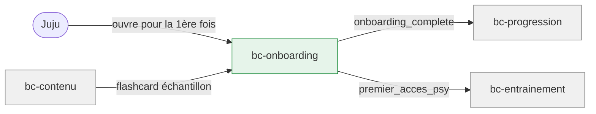

# Contexte métier : Onboarding

> Parcours de première utilisation et premiers contacts spéciaux.

## Vue d'ensemble

**Nom** : bc-onboarding
**Catégorie** : Supporting — nécessaire pour accrocher Juju dès la 1ère minute, mais pas le cœur de valeur récurrent.

**Responsabilité** : Gérer le parcours de bienvenue (J1), le premier contact avec le pilier psy (J3), et tout état « première fois » nécessitant un guidage spécifique.

### Périmètre

**Dans le scope** :

- Séquence d'onboarding : bienvenue, présentation des piliers, flashcard d'échantillon, progression avatar initiale
- État « onboarding complété » (oui/non/interrompu)
- Premier accès au pilier psy : message d'accueil spécifique, recommandation logique en premier
- Tolérance aux interruptions et au saut

**Hors scope** :

- Contenu de la flashcard d'échantillon (→ bc-contenu)
- Sessions d'entraînement récurrentes (→ bc-entrainement)
- Progression de l'avatar au-delà du premier état (→ bc-progression)

## Diagramme de flux

## Modèles

| Modèle | Rôle | Champs clés |
|---|---|---|
| [EtatOnboarding](models/model-etat-onboarding.md) | Value Object | device_id, etat (non_demarre/en_cours/complete/saute), premier_acces_psy_fait |

## Événements émis

| Événement | Description | Consommateurs |
|---|---|---|
| `onboarding_complete` | Juju a terminé (ou sauté) l'onboarding | bc-progression (première progression avatar) |
| `premier_acces_psy` | Juju accède au pilier Psychotechniques pour la 1ère fois | bc-entrainement (afficher message d'accueil psy, recommander logique) |

## Événements consommés

| Événement | Producteur | Réaction |
|---|---|---|
| `device_identifie` | bc-identite | Vérifier si l'onboarding a déjà été fait pour ce device |

## Règles métier

1. **Onboarding sauteable à tout moment** : un bouton « passer » est visible à chaque étape.
2. **Tolérance aux interruptions** : fermeture en cours d'onboarding → prochaine ouverture = accueil direct, sans reproche ni mention.
3. **Pas de message culpabilisant** : aucune référence à un onboarding abandonné.
4. **Flashcard maths comme 1er exercice** : terrain familier pour ancrer le dual-usage avant d'exposer au psy.
5. **Message d'accueil psy unique** : apparaît au 1er accès au pilier psy, pas au 2e.
6. **Logique recommandée en premier** (psy) : plus visuelle/intuitive que le calcul mental, fait moins peur.

## Interactions avec d'autres contextes

### bc-contenu

- **Relation** : bc-onboarding **consomme** la flashcard d'échantillon et la liste des piliers
- **Direction** : Contenu → Onboarding

### bc-progression

- **Relation** : bc-onboarding **notifie** la complétion pour déclencher la première progression avatar
- **Direction** : Onboarding → Progression
- **Événements échangés** : `onboarding_complete`

### bc-identite

- **Relation** : bc-onboarding **consomme** l'identification du device pour savoir si l'onboarding a été fait
- **Direction** : Identite → Onboarding
- **Événements échangés** : `device_identifie`

## Traçabilité

| Dépendance | Référence |
|---|---|
| context-map | [Context Map](context-map.md) |
| journey J1 | [Première utilisation](../../02-discovery/journeys/journey-premiere-utilisation.md) |
| journey J3 (premier contact psy) | [Découverte psychotechniques](../../02-discovery/journeys/journey-decouverte-psychotechniques.md) |
| exigences accueil | [req-accueil](../0-requirements/fonctionnelles/req-accueil.md) |
| exigences contenu (REQ-CONTENU-007) | [req-contenu](../0-requirements/fonctionnelles/req-contenu.md) |
| langage ubiquitaire | [Langage ubiquitaire](ubiquitous-language.md) |
