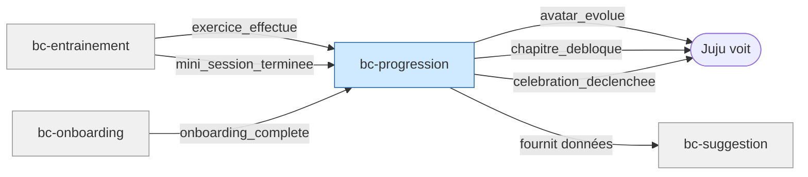

# Contexte métier : Progression

> Ce qui maintient l'engagement — l'avatar, les déblocages, les célébrations.

## Vue d'ensemble

**Nom** : bc-progression
**Catégorie** : Core — différenciateur clé aligné avec le profil gameuse de Juju (Pilier 4).

**Responsabilité** : Tracer l'avancement de Juju (effort, pas score), gérer l'avatar progressif, déclencher les déblocages de contenu et les célébrations.

### Périmètre

**Dans le scope** :

- Compteurs d'effort : exercices effectués, mini-sessions terminées, chapitres parcourus
- État de l'avatar (stade 1 → 2 → 3 → 4) et seuils de transition
- Verrouillage/déblocage des chapitres
- Célébrations (animations + messages positifs)
- Avancement par chapitre (en cours, terminé)
- Application de la règle d'or sur le suivi (absence jamais mentionnée)

**Hors scope** :

- Exécution des exercices (→ bc-entrainement)
- Choix de la prochaine activité (→ bc-suggestion)
- Contenu verrouillé/débloqué (→ bc-contenu fournit le catalogue, bc-progression gère l'état de verrouillage)

## Diagramme de flux

## Modèles

| Modèle | Rôle | Champs clés |
|---|---|---|
| [ProfilProgression](models/model-profil-progression.md) | Aggregate root | device_id, avatar, compteurs effort, chapitres[] |
| [Avatar](models/model-avatar.md) | Entity | stade (1-4), seuils (effort → stade) |
| [EtatChapitre](models/model-etat-chapitre.md) | Value Object | chapitre_id, etat (verrouillé/débloqué/en_cours/terminé), exercices_effectues |

## Événements émis

| Événement | Description | Consommateurs |
|---|---|---|
| `avatar_evolue` | L'avatar passe au stade suivant | UI (animation + message) |
| `chapitre_debloque` | Un chapitre verrouillé devient accessible | UI (célébration), bc-suggestion (enrichir les options) |
| `celebration_declenchee` | Un moment de progression mérite une célébration sobre | UI (animation 2-3 secondes) |

## Événements consommés

| Événement | Producteur | Réaction |
|---|---|---|
| `exercice_effectue` | bc-entrainement | Incrémenter compteur effort, vérifier seuils avatar/déblocage |
| `mini_session_terminee` | bc-entrainement | Incrémenter compteur mini-sessions, vérifier seuils |
| `session_interrompue` | bc-entrainement | Comptabiliser les exercices faits (pas de pénalité) |
| `onboarding_complete` | bc-onboarding | Enregistrer première progression avatar (stade initial) |

## Règles métier

1. **Progression basée sur l'effort, jamais sur le score** : 5 exercices avec 0 bonne réponse → même progression que 5 réponses justes.
2. **Avatar avec 3-4 états visuellement distincts** : chaque passage est perceptible et gratifiant.
3. **Seuil de déblocage atteignable en quelques sessions** : pas un objectif lointain qui décourage (ex : 3-5 mini-sessions).
4. **Contenus verrouillés visibles** mais marqués « à venir ».
5. **Absence jamais mentionnée** : aucun message relatif à une période sans session. Pas de « tu nous as manqué », « ta série est brisée ».
6. **Célébration sobre** : 2-3 secondes, pas de modale agressive, alignée charte de ton.
7. **Suivi non-anxiogène** : compteur sessions + avancement par chapitre. Aucun graphique de courbe, aucune note globale, aucun classement, aucun indicateur de « retard ».
8. **Pas de surveillance comportementale** : les données de progression ne sont jamais exposées en temps réel à Papa (cf. ENF-SEC-005).

## Interactions avec d'autres contextes

### bc-entrainement

- **Relation** : bc-progression **consomme** les événements d'effort de bc-entrainement
- **Direction** : Entrainement → Progression
- **Événements échangés** : `exercice_effectue`, `mini_session_terminee`, `session_interrompue`

### bc-onboarding

- **Relation** : bc-progression **consomme** la complétion de l'onboarding
- **Direction** : Onboarding → Progression
- **Événements échangés** : `onboarding_complete`

### bc-suggestion

- **Relation** : bc-progression **fournit** les données d'avancement à bc-suggestion (chapitres parcourus, piliers visités, déblocages)
- **Direction** : Progression → Suggestion (lecture)

## Traçabilité

| Dépendance | Référence |
|---|---|
| context-map | [Context Map](context-map.md) |
| journey J1 (première progression) | [Première utilisation](../../02-discovery/journeys/journey-premiere-utilisation.md) |
| journey J2 (déblocages, bilan) | [Soir semaine smartphone](../../02-discovery/journeys/journey-soir-semaine-smartphone.md) |
| exigences avatar | [req-avatar](../0-requirements/fonctionnelles/req-avatar.md) |
| exigences sécurité (ENF-SEC-005) | [req-securite](../0-requirements/non-fonctionnelles/req-securite.md) |
| langage ubiquitaire | [Langage ubiquitaire](ubiquitous-language.md) |
