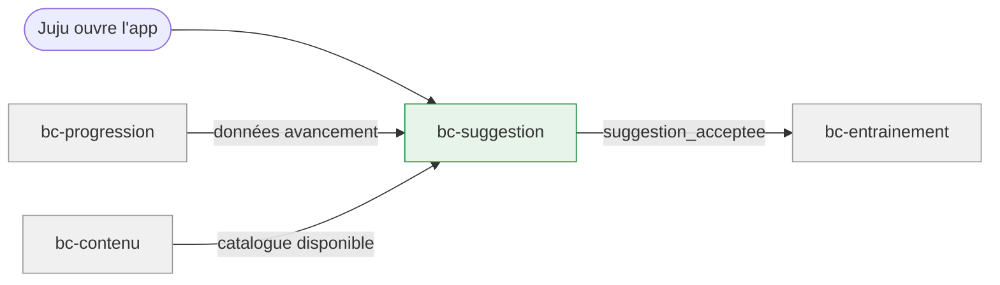

# Contexte métier : Suggestion

> Minimiser la décision quand l'énergie cognitive est faible — un tap et c'est parti.

## Vue d'ensemble

**Nom** : bc-suggestion
**Catégorie** : Supporting — nécessaire pour l'UX bienveillante (Pilier 3), mais pas le cœur de valeur.

**Responsabilité** : Recommander la prochaine activité à chaque ouverture de l'app, en tenant compte de la progression et du catalogue, pour permettre un démarrage en 1 tap.

### Périmètre

**Dans le scope** :

- Calcul de la suggestion contextuelle (chapitre + format + nombre d'exercices)
- Suggestion par défaut si progression insuffisante
- Alternance sciences/psy
- Proposition de reprise après interruption
- Choix alternatif (« Changer ») : pilier → chapitre

**Hors scope** :

- Données de progression (→ bc-progression, en lecture)
- Catalogue de contenu disponible (→ bc-contenu, en lecture)
- Exécution de la mini-session (→ bc-entrainement)

## Diagramme de flux

## Modèles

| Modèle | Rôle | Champs clés |
|---|---|---|
| [Suggestion](models/model-suggestion.md) | Value Object | chapitre_id, format, nombre_exercices, libelle, strategie (continuite/alternance/reprise/defaut) |

## Événements émis

| Événement | Description | Consommateurs |
|---|---|---|
| `suggestion_acceptee` | Juju tape Go sur la suggestion proposée | bc-entrainement (démarrer mini-session) |
| `suggestion_refusee` | Juju choisit « Changer » et sélectionne une autre activité | bc-entrainement (démarrer avec le choix manuel) |

## Événements consommés

| Événement | Producteur | Réaction |
|---|---|---|
| `chapitre_debloque` | bc-progression | Intégrer le nouveau chapitre dans le pool de suggestions |
| `session_interrompue` | bc-entrainement | Proposer la reprise du chapitre/format interrompu |

## Règles métier

1. **Suggestion en 1 ligne + bouton Go** visible sans scroll à chaque ouverture.
2. **Suggestion par défaut** si progression insuffisante : flashcard maths du 1er chapitre.
3. **Alternance piliers** : après 3 sessions sciences consécutives, proposer psy (et inversement).
4. **Reprise sans reproche** : si session interrompue, proposer la reprise sans mention de l'abandon.
5. **Choix alternatif en ≤ 2 taps** : pilier → chapitre — pas de catalogue exhaustif.
6. **Ne suggérer que du contenu débloqué** : respecter l'état de verrouillage de bc-progression.

## Interactions avec d'autres contextes

### bc-progression

- **Relation** : bc-suggestion **lit** les données d'avancement (dernière activité, chapitres parcourus, piliers visités, déblocages)
- **Direction** : Progression → Suggestion (lecture)

### bc-contenu

- **Relation** : bc-suggestion **lit** le catalogue (chapitres disponibles, formats)
- **Direction** : Contenu → Suggestion (lecture)

### bc-entrainement

- **Relation** : bc-suggestion **notifie** le choix de Juju pour démarrer la mini-session
- **Direction** : Suggestion → Entrainement
- **Événements échangés** : `suggestion_acceptee`, `suggestion_refusee`

## Traçabilité

| Dépendance | Référence |
|---|---|
| context-map | [Context Map](context-map.md) |
| journey J2 (suggestion + Go) | [Soir semaine smartphone](../../02-discovery/journeys/journey-soir-semaine-smartphone.md) |
| exigences suggestion | [req-suggest](../0-requirements/fonctionnelles/req-suggest.md) |
| langage ubiquitaire | [Langage ubiquitaire](ubiquitous-language.md) |
