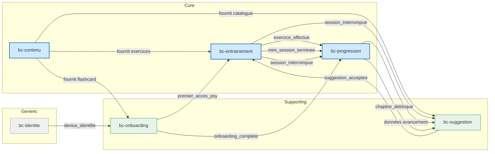
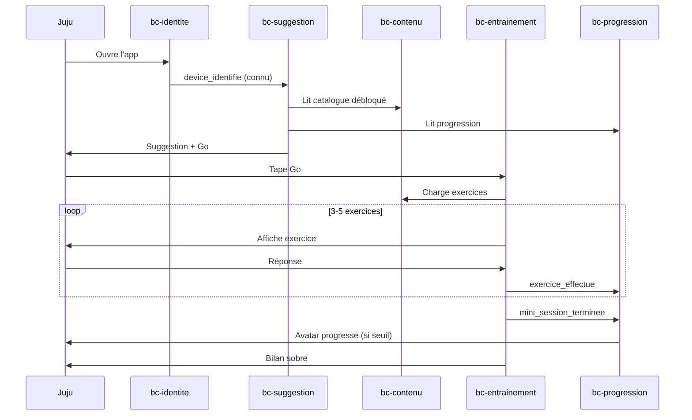
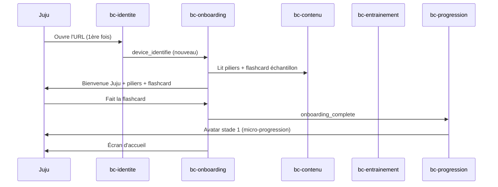
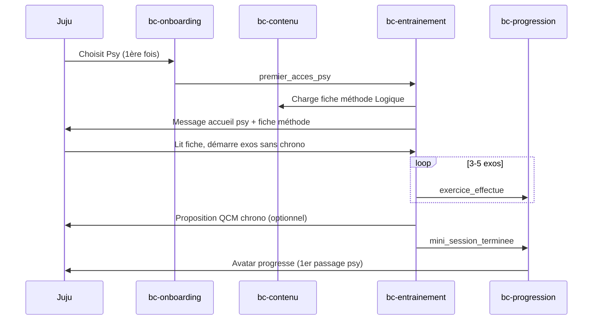

# Context Map — juju-aviatrice

> Cartographie des 6 bounded contexts et de leurs relations. Vue d'ensemble transverse — les détails vivent dans chaque [bc-*.md](.).
> **2026-05-18** — Thomas (Papa) avec Claude

## Diagramme du Context Map

## Relations entre Bounded Contexts

### bc-identite → bc-onboarding

| Caractéristique | Détail |
|---|---|
| **Type** | Open Host / Published Language |
| **Direction** | Identite (upstream) → Onboarding (downstream) |
| **Événements** | `device_identifie` |
| **Contrat** | L'identité publie un événement simple (device nouveau ou connu). Onboarding se conforme au format. |

### bc-contenu → bc-entrainement

| Caractéristique | Détail |
|---|---|
| **Type** | Customer / Supplier |
| **Direction** | Contenu (supplier/upstream) → Entrainement (customer/downstream) |
| **Événements** | Aucun — lecture directe |
| **Contrat** | Entrainement lit les exercices et corrections via le catalogue de Contenu. Contenu ne connaît pas Entrainement. |

### bc-contenu → bc-suggestion

| Caractéristique | Détail |
|---|---|
| **Type** | Customer / Supplier |
| **Direction** | Contenu (supplier) → Suggestion (customer) |
| **Événements** | `contenu_mis_a_jour` (optionnel — recalcul si nécessaire) |
| **Contrat** | Suggestion lit le catalogue (chapitres disponibles, formats) pour construire ses recommandations. |

### bc-contenu → bc-onboarding

| Caractéristique | Détail |
|---|---|
| **Type** | Customer / Supplier |
| **Direction** | Contenu (supplier) → Onboarding (customer) |
| **Événements** | Aucun — lecture directe |
| **Contrat** | Onboarding lit la flashcard d'échantillon et la liste des piliers. |

### bc-suggestion → bc-entrainement

| Caractéristique | Détail |
|---|---|
| **Type** | Customer / Supplier |
| **Direction** | Suggestion (supplier) → Entrainement (customer) |
| **Événements** | `suggestion_acceptee`, `suggestion_refusee` |
| **Contrat** | Suggestion calcule la recommandation, Entrainement démarre la mini-session avec le contenu choisi. |

### bc-onboarding → bc-entrainement

| Caractéristique | Détail |
|---|---|
| **Type** | Customer / Supplier |
| **Direction** | Onboarding (supplier) → Entrainement (customer) |
| **Événements** | `premier_acces_psy` |
| **Contrat** | Onboarding signale le premier accès au pilier psy. Entrainement affiche le message d'accueil psy et recommande la logique en premier. |

### bc-onboarding → bc-progression

| Caractéristique | Détail |
|---|---|
| **Type** | Customer / Supplier |
| **Direction** | Onboarding (supplier) → Progression (customer) |
| **Événements** | `onboarding_complete` |
| **Contrat** | Onboarding notifie la complétion (ou saut). Progression déclenche la première micro-progression de l'avatar. |

### bc-entrainement → bc-progression

| Caractéristique | Détail |
|---|---|
| **Type** | Customer / Supplier |
| **Direction** | Entrainement (supplier) → Progression (customer) |
| **Événements** | `exercice_effectue`, `mini_session_terminee`, `session_interrompue` |
| **Contrat** | Chaque exercice effectué et chaque mini-session terminée incrémentent les compteurs d'effort de Progression. L'interruption comptabilise les exercices faits sans pénalité. |

### bc-progression → bc-suggestion

| Caractéristique | Détail |
|---|---|
| **Type** | Customer / Supplier |
| **Direction** | Progression (supplier) → Suggestion (customer) |
| **Événements** | `chapitre_debloque` |
| **Contrat** | Suggestion lit les données d'avancement (chapitres parcourus, piliers visités, déblocages). Un déblocage enrichit le pool de suggestions. |

### bc-entrainement → bc-suggestion

| Caractéristique | Détail |
|---|---|
| **Type** | Customer / Supplier |
| **Direction** | Entrainement (supplier) → Suggestion (customer) |
| **Événements** | `session_interrompue` |
| **Contrat** | Suggestion utilise l'interruption pour proposer la reprise au prochain lancement (stratégie `reprise`). |

## Flux métier transverses

### Flux 1 — Soir-semaine-smartphone (J2)

Le flux nominal le plus fréquent : Juju ouvre l'app fatiguée, fait 3-5 exos en 15 min.

### Flux 2 — Première utilisation (J1)

Premier contact de Juju avec l'app.

### Flux 3 — Découverte psychotechniques (J3)

Premier accès au pilier Psy — rite de passage.

## Matrice des événements de domaine

| Événement | Producteur | Consommateurs | Impact |
|---|---|---|---|
| `device_identifie` | bc-identite | bc-onboarding | Vérifier si onboarding déjà fait |
| `contenu_mis_a_jour` | bc-contenu | bc-suggestion | Recalcul suggestions si catalogue évolue |
| `onboarding_complete` | bc-onboarding | bc-progression | Première micro-progression avatar |
| `premier_acces_psy` | bc-onboarding | bc-entrainement | Afficher accueil psy, recommander logique |
| `suggestion_acceptee` | bc-suggestion | bc-entrainement | Démarrer mini-session avec le contenu suggéré |
| `suggestion_refusee` | bc-suggestion | bc-entrainement | Démarrer avec le choix manuel |
| `exercice_effectue` | bc-entrainement | bc-progression | Incrémenter compteur, vérifier seuils avatar/déblocage |
| `mini_session_terminee` | bc-entrainement | bc-progression | Incrémenter compteur, vérifier seuils |
| `session_interrompue` | bc-entrainement | bc-progression, bc-suggestion | Comptabiliser exercices faits ; proposer reprise |
| `avatar_evolue` | bc-progression | UI | Animation + message de célébration |
| `chapitre_debloque` | bc-progression | UI, bc-suggestion | Célébration ; enrichir pool de suggestions |
| `celebration_declenchee` | bc-progression | UI | Animation sobre (2-3 sec) |

## Traçabilité

| Dépendance | Référence |
|---|---|
| bounded contexts | [bc-contenu](bc-contenu.md), [bc-entrainement](bc-entrainement.md), [bc-identite](bc-identite.md), [bc-onboarding](bc-onboarding.md), [bc-progression](bc-progression.md), [bc-suggestion](bc-suggestion.md) |
| modèles | [models/](models/) |
| langage ubiquitaire | [ubiquitous-language.md](ubiquitous-language.md) |
| journeys | [J1](../../02-discovery/journeys/journey-premiere-utilisation.md), [J2](../../02-discovery/journeys/journey-soir-semaine-smartphone.md), [J3](../../02-discovery/journeys/journey-decouverte-psychotechniques.md) |
| exigences | [0-requirements/](../0-requirements/) |
