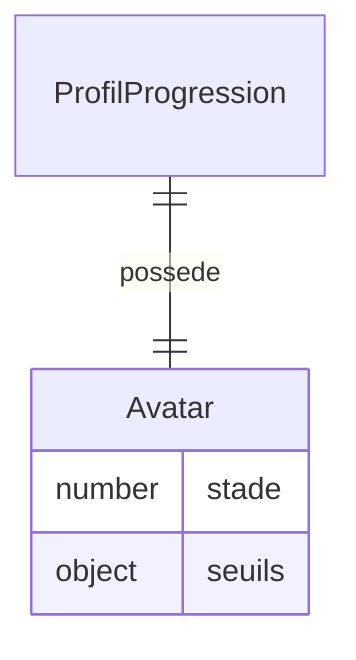

# Modèle : Avatar

## Description

Représentation visuelle de la progression de Juju. 3-4 états visuellement distincts en M0. La progression est basée sur l'effort (exercices traversés), jamais sur le score. Le passage d'un stade au suivant déclenche une célébration sobre.

## Contexte métier

[bc-progression](../bc-progression.md) — Core

## Structure

| Champ | Type | Obligatoire | Description |
|---|---|---|---|
| stade | number | Oui | Stade courant (1 à 4). 1 = initial, 4 = abouti M0 |
| seuils | object | Oui | Mapping stade → nombre d'exercices effectués requis pour y accéder |

### Seuils indicatifs M0

| Stade | Seuil (exercices effectués) | Description visuelle |
|---|---|---|
| 1 | 0 | État initial — avatar de base |
| 2 | 10 | Premiers progrès visibles |
| 3 | 30 | Avatar évolué |
| 4 | 60 | Avatar abouti M0 |

Les seuils exacts seront calibrés en phase Plan puis ajustés avec les retours de Juju.

## Relations

| Relation | Modèle cible | Cardinalité | Description |
|---|---|---|---|
| appartient_a | [ProfilProgression](model-profil-progression.md) | 1 | Un avatar est lié à un profil |



## Schéma JSON

```json
{
  "$schema": "https://json-schema.org/draft/2020-12/schema",
  "title": "Avatar",
  "description": "Représentation visuelle de la progression",
  "type": "object",
  "required": ["stade", "seuils"],
  "properties": {
    "stade": { "type": "integer", "minimum": 1, "maximum": 4 },
    "seuils": {
      "type": "object",
      "required": ["2", "3", "4"],
      "properties": {
        "2": { "type": "integer", "minimum": 1 },
        "3": { "type": "integer", "minimum": 1 },
        "4": { "type": "integer", "minimum": 1 }
      }
    }
  }
}
```

## Traçabilité

| Dépendance | Référence |
|---|---|
| bounded context | [bc-progression](../bc-progression.md) |
| langage ubiquitaire | [Avatar](../ubiquitous-language.md#a) |
| exigences REQ-AVATAR-001, REQ-AVATAR-002 | [req-avatar](../../0-requirements/fonctionnelles/req-avatar.md) |
| OKR KR-4.0.1, KR-4.1.1 | [OKRs](../../../01-strategy/okrs.md) |
