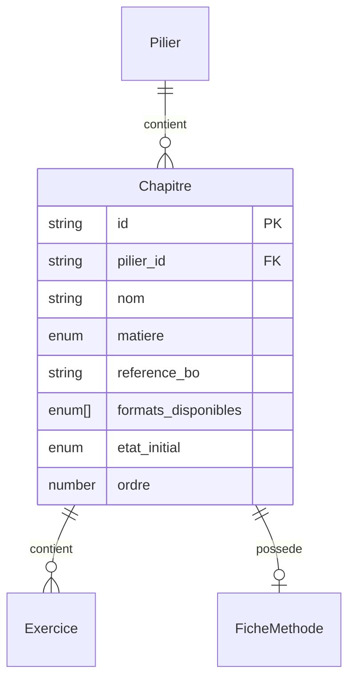

# Modèle : Chapitre

## Description

Unité de contenu au sein d'un pilier. Correspond à un chapitre du programme BO (Sciences) ou à un type de test (Psychotechniques). Contient les exercices dans différents formats. En M0 : 3 maths + 3 physique-chimie + 2 types psy.

## Contexte métier

[bc-contenu](../bc-contenu.md) — Core

## Structure

| Champ | Type | Obligatoire | Description |
|---|---|---|---|
| id | string | Oui | Identifiant unique (ex : `maths-geometrie-plan`, `psy-logique`) |
| pilier_id | string | Oui | Référence au pilier parent |
| nom | string | Oui | Libellé affiché (ex : « Géométrie dans le plan ») |
| matiere | enum | Oui | `maths` · `physique_chimie` · `logique` · `calcul_mental` |
| reference_bo | string | Non | Référence au programme BO (pilier Sciences uniquement) |
| formats_disponibles | enum[] | Oui | Formats actifs : `flashcard`, `qcm_chrono` (M0), `recherche` (M1) |
| etat_initial | enum | Oui | `debloque` ou `verrouille` — l'état d'accès au premier lancement |
| ordre | number | Oui | Position d'affichage dans le pilier |

## Relations

| Relation | Modèle cible | Cardinalité | Description |
|---|---|---|---|
| appartient_a | [Pilier](model-pilier.md) | 1 | Chaque chapitre appartient à un seul pilier |
| contient | [Exercice](model-exercice.md) | 1..n | Un chapitre contient au moins un exercice |
| possede | [FicheMethode](model-fiche-methode.md) | 0..1 | Un chapitre psy possède une fiche méthode (Sciences : aucune) |



## Schéma JSON

```json
{
  "$schema": "https://json-schema.org/draft/2020-12/schema",
  "title": "Chapitre",
  "description": "Unité de contenu au sein d'un pilier",
  "type": "object",
  "required": ["id", "pilier_id", "nom", "matiere", "formats_disponibles", "etat_initial", "ordre"],
  "properties": {
    "id": { "type": "string", "pattern": "^[a-z0-9-]+$" },
    "pilier_id": { "type": "string" },
    "nom": { "type": "string", "minLength": 1 },
    "matiere": { "type": "string", "enum": ["maths", "physique_chimie", "logique", "calcul_mental"] },
    "reference_bo": { "type": "string" },
    "formats_disponibles": {
      "type": "array",
      "items": { "type": "string", "enum": ["flashcard", "qcm_chrono", "recherche"] },
      "minItems": 1
    },
    "etat_initial": { "type": "string", "enum": ["debloque", "verrouille"] },
    "ordre": { "type": "integer", "minimum": 1 }
  }
}
```

## Traçabilité

| Dépendance | Référence |
|---|---|
| bounded context | [bc-contenu](../bc-contenu.md) |
| langage ubiquitaire | [Chapitre](../ubiquitous-language.md#c) |
| exigences REQ-CONTENU-002, REQ-CONTENU-003 | [req-contenu](../../0-requirements/fonctionnelles/req-contenu.md) |
