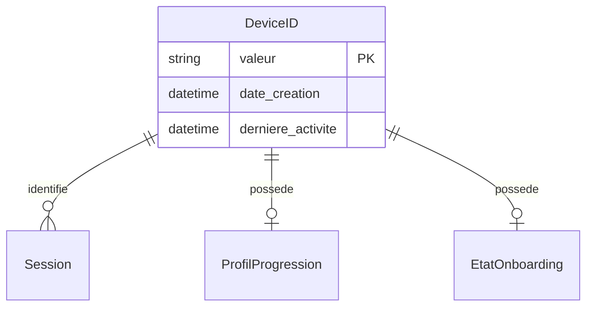

# Modèle : DeviceID

## Description

Identifiant unique lié au device de Juju, généré silencieusement à la première ouverture de l'app via l'URL partagée par Papa. Stocké localement (localStorage, cookie sécurisé ou équivalent selon la stack). Value Object du BC Identité — pas d'authentification classique.

## Contexte métier

[bc-identite](../bc-identite.md) — Generic

## Structure

| Champ | Type | Obligatoire | Description |
|---|---|---|---|
| valeur | string (UUID) | Oui | Identifiant unique du device |
| date_creation | datetime | Oui | Date de premier accès |
| derniere_activite | datetime | Oui | Date de dernière ouverture de l'app |

## Relations

| Relation | Modèle cible | Cardinalité | Description |
|---|---|---|---|
| identifie | [Session](model-session.md) | 0..n | Un device est lié à toutes les sessions de Juju |
| possede | [ProfilProgression](model-profil-progression.md) | 0..1 | Un device possède un profil de progression |
| possede | [EtatOnboarding](model-etat-onboarding.md) | 0..1 | Un device possède un état d'onboarding |



## Schéma JSON

```json
{
  "$schema": "https://json-schema.org/draft/2020-12/schema",
  "title": "DeviceID",
  "description": "Identifiant unique lié au device",
  "type": "object",
  "required": ["valeur", "date_creation", "derniere_activite"],
  "properties": {
    "valeur": { "type": "string", "format": "uuid" },
    "date_creation": { "type": "string", "format": "date-time" },
    "derniere_activite": { "type": "string", "format": "date-time" }
  }
}
```

## Traçabilité

| Dépendance | Référence |
|---|---|
| bounded context | [bc-identite](../bc-identite.md) |
| exigences ENF-SEC-001, ENF-SEC-002 | [req-securite](../../0-requirements/non-fonctionnelles/req-securite.md) |
