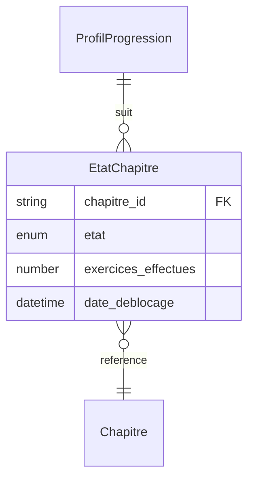

# Modèle : EtatChapitre

## Description

État d'un chapitre pour Juju : verrouillé, débloqué, en cours ou terminé. Value Object rattaché au ProfilProgression. Le passage de verrouillé à débloqué déclenche un déblocage (célébration). Le seuil de déblocage est atteignable en quelques sessions.

## Contexte métier

[bc-progression](../bc-progression.md) — Core

## Structure

| Champ | Type | Obligatoire | Description |
|---|---|---|---|
| chapitre_id | string | Oui | Référence au chapitre (bc-contenu) |
| etat | enum | Oui | `verrouille`, `debloque`, `en_cours`, `termine` |
| exercices_effectues | number | Oui | Nombre d'exercices effectués dans ce chapitre |
| date_deblocage | datetime | Non | Date à laquelle le chapitre a été débloqué |

## Relations

| Relation | Modèle cible | Cardinalité | Description |
|---|---|---|---|
| appartient_a | [ProfilProgression](model-profil-progression.md) | 1 | Chaque état de chapitre est lié à un profil |
| reference | [Chapitre](model-chapitre.md) | 1 | Référence au chapitre dans bc-contenu |



## Schéma JSON

```json
{
  "$schema": "https://json-schema.org/draft/2020-12/schema",
  "title": "EtatChapitre",
  "description": "État d'un chapitre pour l'utilisatrice",
  "type": "object",
  "required": ["chapitre_id", "etat", "exercices_effectues"],
  "properties": {
    "chapitre_id": { "type": "string" },
    "etat": { "type": "string", "enum": ["verrouille", "debloque", "en_cours", "termine"] },
    "exercices_effectues": { "type": "integer", "minimum": 0 },
    "date_deblocage": { "type": ["string", "null"], "format": "date-time" }
  }
}
```

## Traçabilité

| Dépendance | Référence |
|---|---|
| bounded context | [bc-progression](../bc-progression.md) |
| langage ubiquitaire | [Déblocage](../ubiquitous-language.md#d) |
| exigences REQ-AVATAR-003 | [req-avatar](../../0-requirements/fonctionnelles/req-avatar.md) |
