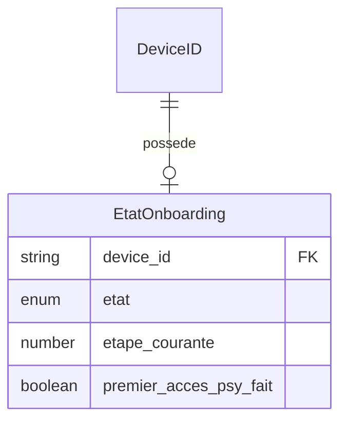

# Modèle : EtatOnboarding

## Description

État du parcours de bienvenue et des « premières fois » de Juju. Value Object — pas de cycle de vie propre, rattaché au device. Trace si l'onboarding a été fait et si le premier accès au pilier psy a eu lieu.

## Contexte métier

[bc-onboarding](../bc-onboarding.md) — Supporting

## Structure

| Champ | Type | Obligatoire | Description |
|---|---|---|---|
| device_id | string | Oui | Référence au device |
| etat | enum | Oui | `non_demarre`, `en_cours`, `complete`, `saute` |
| etape_courante | number | Non | Numéro de l'étape atteinte (null si complété ou sauté) |
| premier_acces_psy_fait | boolean | Oui | `true` si Juju a déjà accédé au pilier Psy (message d'accueil affiché) |

## Relations

| Relation | Modèle cible | Cardinalité | Description |
|---|---|---|---|
| lie_a | [DeviceID](model-device-id.md) | 1 | Chaque état d'onboarding est lié à un device |



## Schéma JSON

```json
{
  "$schema": "https://json-schema.org/draft/2020-12/schema",
  "title": "EtatOnboarding",
  "description": "État du parcours de bienvenue",
  "type": "object",
  "required": ["device_id", "etat", "premier_acces_psy_fait"],
  "properties": {
    "device_id": { "type": "string" },
    "etat": { "type": "string", "enum": ["non_demarre", "en_cours", "complete", "saute"] },
    "etape_courante": { "type": ["integer", "null"], "minimum": 1 },
    "premier_acces_psy_fait": { "type": "boolean", "default": false }
  }
}
```

## Traçabilité

| Dépendance | Référence |
|---|---|
| bounded context | [bc-onboarding](../bc-onboarding.md) |
| langage ubiquitaire | [Onboarding](../ubiquitous-language.md#o) |
| exigences REQ-ACCUEIL-004, REQ-ACCUEIL-005 | [req-accueil](../../0-requirements/fonctionnelles/req-accueil.md) |
| exigence REQ-CONTENU-007 | [req-contenu](../../0-requirements/fonctionnelles/req-contenu.md) |
| journey J1 | [Première utilisation](../../../02-discovery/journeys/journey-premiere-utilisation.md) |
