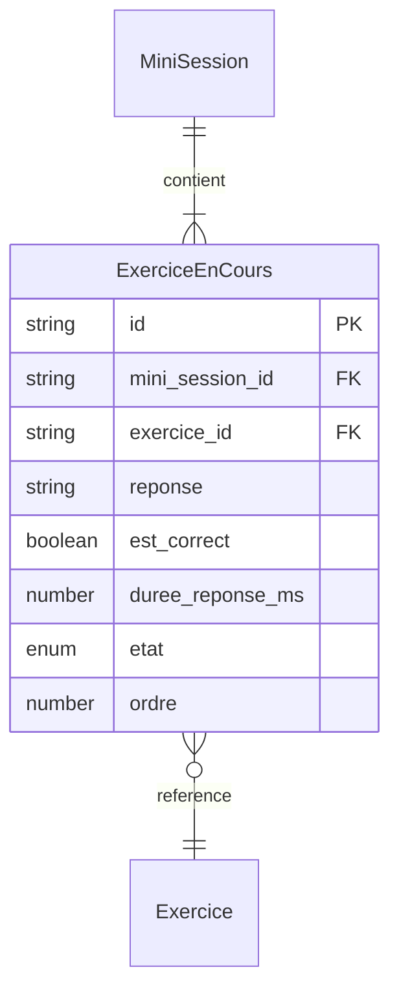

# Modèle : ExerciceEnCours

## Description

Instance d'un exercice pendant son exécution au sein d'une mini-session. Porte la réponse donnée, le temps de réponse et l'état de complétion. Lié à un Exercice (bc-contenu) pour le contenu, mais appartient au BC Entraînement pour le cycle de vie.

## Contexte métier

[bc-entrainement](../bc-entrainement.md) — Core

## Structure

| Champ | Type | Obligatoire | Description |
|---|---|---|---|
| id | string | Oui | Identifiant unique de l'instance |
| mini_session_id | string | Oui | Référence à la mini-session parente |
| exercice_id | string | Oui | Référence à l'exercice source (bc-contenu) |
| reponse | string | Non | Réponse sélectionnée (QCM) ou null (flashcard — auto-éval mentale) |
| est_correct | boolean | Non | Résultat de la réponse (QCM). Null pour les flashcards |
| duree_reponse_ms | number | Non | Temps de réponse en millisecondes |
| etat | enum | Oui | `en_attente`, `complete`, `saute` |
| ordre | number | Oui | Position dans la mini-session |

## Relations

| Relation | Modèle cible | Cardinalité | Description |
|---|---|---|---|
| appartient_a | [MiniSession](model-mini-session.md) | 1 | Chaque instance vit dans une mini-session |
| reference | [Exercice](model-exercice.md) | 1 | Lien vers le contenu de l'exercice (BC Contenu) |



## Schéma JSON

```json
{
  "$schema": "https://json-schema.org/draft/2020-12/schema",
  "title": "ExerciceEnCours",
  "description": "Instance d'un exercice pendant l'exécution",
  "type": "object",
  "required": ["id", "mini_session_id", "exercice_id", "etat", "ordre"],
  "properties": {
    "id": { "type": "string" },
    "mini_session_id": { "type": "string" },
    "exercice_id": { "type": "string" },
    "reponse": { "type": ["string", "null"] },
    "est_correct": { "type": ["boolean", "null"] },
    "duree_reponse_ms": { "type": ["integer", "null"], "minimum": 0 },
    "etat": { "type": "string", "enum": ["en_attente", "complete", "saute"] },
    "ordre": { "type": "integer", "minimum": 1 }
  }
}
```

## Traçabilité

| Dépendance | Référence |
|---|---|
| bounded context | [bc-entrainement](../bc-entrainement.md) |
| langage ubiquitaire | [Exercice](../ubiquitous-language.md#e) |
| exigences REQ-SESSION-002, REQ-SESSION-003, REQ-SESSION-006 | [req-session](../../0-requirements/fonctionnelles/req-session.md) |
| modèle source (bc-contenu) | [Exercice](model-exercice.md) |
