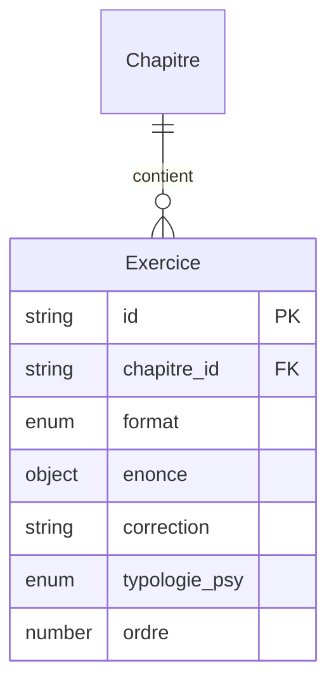

# Modèle : Exercice

## Description

Unité atomique de pratique : flashcard, question QCM ou exercice psy. Dure quelques secondes à 2 minutes. Chaque exercice est accompagné d'une correction expliquée détaillant le raisonnement.

## Contexte métier

[bc-contenu](../bc-contenu.md) — Core

## Structure

| Champ | Type | Obligatoire | Description |
|---|---|---|---|
| id | string | Oui | Identifiant unique |
| chapitre_id | string | Oui | Référence au chapitre parent |
| format | enum | Oui | `flashcard` ou `qcm` |
| enonce | object | Oui | Contenu de la question (structure dépend du format, cf. sous-schémas) |
| correction | string | Oui | Explication du raisonnement attendu (charte de ton, jamais « faux » / « raté ») |
| typologie_psy | enum | Non | Pour le pilier Psy : `serie`, `analogie`, `syllogisme`, `deductif` (logique) ou `null` |
| ordre | number | Oui | Position dans le chapitre |

### Sous-structure `enonce` — Flashcard

| Champ | Type | Description |
|---|---|---|
| face_question | string | Texte de la question (formule, concept, définition) |
| face_reponse | string | Texte de la réponse à retourner |

### Sous-structure `enonce` — QCM

| Champ | Type | Description |
|---|---|---|
| question | string | Texte de la question |
| choix | object[] | Liste de 3 à 5 choix (`libelle`, `est_correct`) |

## Relations

| Relation | Modèle cible | Cardinalité | Description |
|---|---|---|---|
| appartient_a | [Chapitre](model-chapitre.md) | 1 | Chaque exercice appartient à un chapitre |
| instancie_en | [ExerciceEnCours](model-exercice-en-cours.md) | 0..n | Un exercice peut être instancié dans plusieurs sessions |



## Schéma JSON

```json
{
  "$schema": "https://json-schema.org/draft/2020-12/schema",
  "title": "Exercice",
  "description": "Unité atomique de pratique",
  "type": "object",
  "required": ["id", "chapitre_id", "format", "enonce", "correction", "ordre"],
  "properties": {
    "id": { "type": "string" },
    "chapitre_id": { "type": "string" },
    "format": { "type": "string", "enum": ["flashcard", "qcm"] },
    "enonce": {
      "oneOf": [
        {
          "type": "object",
          "required": ["face_question", "face_reponse"],
          "properties": {
            "face_question": { "type": "string" },
            "face_reponse": { "type": "string" }
          }
        },
        {
          "type": "object",
          "required": ["question", "choix"],
          "properties": {
            "question": { "type": "string" },
            "choix": {
              "type": "array",
              "items": {
                "type": "object",
                "required": ["libelle", "est_correct"],
                "properties": {
                  "libelle": { "type": "string" },
                  "est_correct": { "type": "boolean" }
                }
              },
              "minItems": 3,
              "maxItems": 5
            }
          }
        }
      ]
    },
    "correction": { "type": "string", "minLength": 1 },
    "typologie_psy": { "type": "string", "enum": ["serie", "analogie", "syllogisme", "deductif"] },
    "ordre": { "type": "integer", "minimum": 1 }
  }
}
```

## Traçabilité

| Dépendance | Référence |
|---|---|
| bounded context | [bc-contenu](../bc-contenu.md) |
| langage ubiquitaire | [Exercice](../ubiquitous-language.md#e), [Flashcard](../ubiquitous-language.md#f), [QCM](../ubiquitous-language.md#q) |
| exigences REQ-SESSION-002, REQ-SESSION-003, REQ-SESSION-006 | [req-session](../../0-requirements/fonctionnelles/req-session.md) |
| exigences REQ-CONTENU-005 | [req-contenu](../../0-requirements/fonctionnelles/req-contenu.md) |
