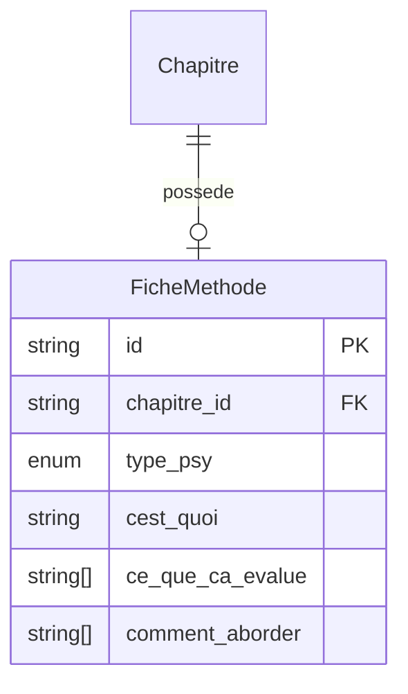

# Modèle : FicheMethode

## Description

Guide pédagogique court pour un type de test psychotechnique. Structure en 3 sections : *C'est quoi ?*, *Ce que ça évalue*, *Comment l'aborder*. Lisible en < 3 min sur smartphone. Ton aligné sur la charte de bienveillance.

## Contexte métier

[bc-contenu](../bc-contenu.md) — Core

## Structure

| Champ | Type | Obligatoire | Description |
|---|---|---|---|
| id | string | Oui | Identifiant unique |
| chapitre_id | string | Oui | Référence au chapitre psy parent |
| type_psy | enum | Oui | `logique` ou `calcul_mental` |
| cest_quoi | string | Oui | Paragraphe explicatif court |
| ce_que_ca_evalue | string[] | Oui | 3 à 5 puces |
| comment_aborder | string[] | Oui | 3 à 5 conseils concrets |

## Relations

| Relation | Modèle cible | Cardinalité | Description |
|---|---|---|---|
| appartient_a | [Chapitre](model-chapitre.md) | 1 | Chaque fiche est liée à un chapitre psy |



## Schéma JSON

```json
{
  "$schema": "https://json-schema.org/draft/2020-12/schema",
  "title": "FicheMethode",
  "description": "Guide pédagogique court pour un type de test psychotechnique",
  "type": "object",
  "required": ["id", "chapitre_id", "type_psy", "cest_quoi", "ce_que_ca_evalue", "comment_aborder"],
  "properties": {
    "id": { "type": "string" },
    "chapitre_id": { "type": "string" },
    "type_psy": { "type": "string", "enum": ["logique", "calcul_mental"] },
    "cest_quoi": { "type": "string", "minLength": 1 },
    "ce_que_ca_evalue": {
      "type": "array",
      "items": { "type": "string" },
      "minItems": 3,
      "maxItems": 5
    },
    "comment_aborder": {
      "type": "array",
      "items": { "type": "string" },
      "minItems": 3,
      "maxItems": 5
    }
  }
}
```

## Traçabilité

| Dépendance | Référence |
|---|---|
| bounded context | [bc-contenu](../bc-contenu.md) |
| langage ubiquitaire | [Fiche méthode](../ubiquitous-language.md#f) |
| exigence REQ-CONTENU-004 | [req-contenu](../../0-requirements/fonctionnelles/req-contenu.md) |
| journey J3 (étape 2) | [Découverte psychotechniques](../../../02-discovery/journeys/journey-decouverte-psychotechniques.md) |
