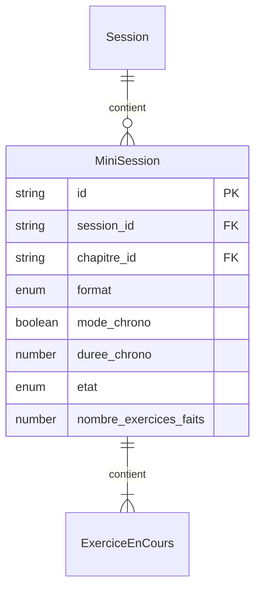

# Modèle : MiniSession

## Description

Séquence de 3 à 5 exercices enchaînés sans interruption visuelle. Unité de base de l'entraînement quotidien. Se termine par un bilan sobre (nombre d'exercices faits, pas de note /N). Plusieurs mini-sessions peuvent s'enchaîner dans une même session.

## Contexte métier

[bc-entrainement](../bc-entrainement.md) — Core

## Structure

| Champ | Type | Obligatoire | Description |
|---|---|---|---|
| id | string | Oui | Identifiant unique |
| session_id | string | Oui | Référence à la session parente |
| chapitre_id | string | Oui | Chapitre ciblé pour cette mini-session |
| format | enum | Oui | `flashcard` ou `qcm` |
| mode_chrono | boolean | Oui | `true` si chronomètre actif |
| duree_chrono | number | Non | Durée en secondes si mode_chrono = true |
| exercices | ExerciceEnCours[] | Oui | Exercices de la mini-session (3-5) |
| etat | enum | Oui | `en_cours`, `terminee`, `interrompue` |
| nombre_exercices_faits | number | Oui | Compteur d'exercices complétés |

## Relations

| Relation | Modèle cible | Cardinalité | Description |
|---|---|---|---|
| appartient_a | [Session](model-session.md) | 1 | Chaque mini-session vit dans une session |
| contient | [ExerciceEnCours](model-exercice-en-cours.md) | 3..5 | Enchaînement de 3 à 5 exercices |



## Schéma JSON

```json
{
  "$schema": "https://json-schema.org/draft/2020-12/schema",
  "title": "MiniSession",
  "description": "Séquence de 3 à 5 exercices enchaînés",
  "type": "object",
  "required": ["id", "session_id", "chapitre_id", "format", "mode_chrono", "exercices", "etat", "nombre_exercices_faits"],
  "properties": {
    "id": { "type": "string" },
    "session_id": { "type": "string" },
    "chapitre_id": { "type": "string" },
    "format": { "type": "string", "enum": ["flashcard", "qcm"] },
    "mode_chrono": { "type": "boolean" },
    "duree_chrono": { "type": ["integer", "null"], "minimum": 1 },
    "exercices": {
      "type": "array",
      "items": { "$ref": "exercice-en-cours.json" },
      "minItems": 3,
      "maxItems": 5
    },
    "etat": { "type": "string", "enum": ["en_cours", "terminee", "interrompue"] },
    "nombre_exercices_faits": { "type": "integer", "minimum": 0 }
  }
}
```

## Traçabilité

| Dépendance | Référence |
|---|---|
| bounded context | [bc-entrainement](../bc-entrainement.md) |
| langage ubiquitaire | [Mini-session](../ubiquitous-language.md#m) |
| exigence REQ-SESSION-001 | [req-session](../../0-requirements/fonctionnelles/req-session.md) |
