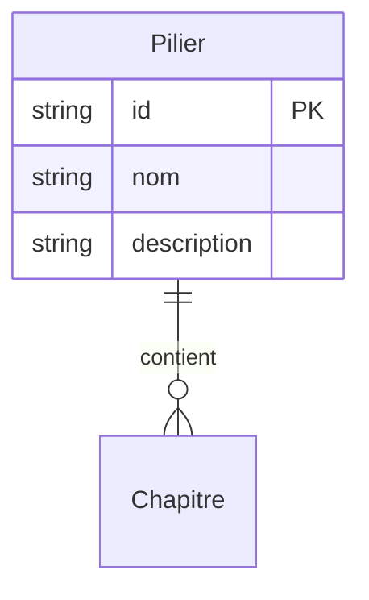

# Modèle : Pilier

## Description

Catégorie de contenu de premier niveau. Deux instances en M0 : Sciences (maths + physique-chimie 1ère) et Psychotechniques (logique + calcul mental). Aggregate root du BC Contenu.

## Contexte métier

[bc-contenu](../bc-contenu.md) — Core

## Structure

| Champ | Type | Obligatoire | Description |
|---|---|---|---|
| id | string | Oui | Identifiant unique du pilier (ex : `sciences`, `psychotechniques`) |
| nom | string | Oui | Libellé affiché (« Sciences », « Psychotechniques ») |
| description | string | Oui | Phrase courte pour l'onboarding et le catalogue |
| chapitres | Chapitre[] | Oui | Liste ordonnée des chapitres du pilier (≥ 1) |

## Relations

| Relation | Modèle cible | Cardinalité | Description |
|---|---|---|---|
| contient | [Chapitre](model-chapitre.md) | 1..n | Un pilier contient au moins un chapitre |



## Schéma JSON

```json
{
  "$schema": "https://json-schema.org/draft/2020-12/schema",
  "title": "Pilier",
  "description": "Catégorie de contenu de premier niveau",
  "type": "object",
  "required": ["id", "nom", "description", "chapitres"],
  "properties": {
    "id": { "type": "string", "pattern": "^[a-z_]+$" },
    "nom": { "type": "string", "minLength": 1 },
    "description": { "type": "string", "minLength": 1 },
    "chapitres": {
      "type": "array",
      "items": { "$ref": "chapitre.json" },
      "minItems": 1
    }
  }
}
```

## Traçabilité

| Dépendance | Référence |
|---|---|
| bounded context | [bc-contenu](../bc-contenu.md) |
| langage ubiquitaire | [Pilier](../ubiquitous-language.md#p) |
| exigence REQ-CONTENU-001 | [req-contenu](../../0-requirements/fonctionnelles/req-contenu.md) |
