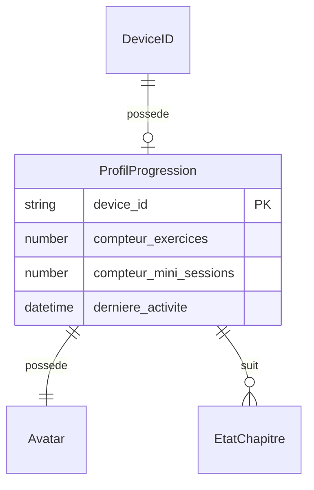

# Modèle : ProfilProgression

## Description

État global d'avancement de Juju. Aggregate root du BC Progression. Centralise les compteurs d'effort (jamais de score), l'état de l'avatar, les chapitres parcourus et les déblocages obtenus. Alimente le moteur de suggestion et le suivi affiché.

## Contexte métier

[bc-progression](../bc-progression.md) — Core

## Structure

| Champ | Type | Obligatoire | Description |
|---|---|---|---|
| device_id | string | Oui | Référence au device (identifiant unique du profil) |
| avatar | Avatar | Oui | État de l'avatar progressif |
| compteur_exercices | number | Oui | Nombre total d'exercices effectués (effort, pas score) |
| compteur_mini_sessions | number | Oui | Nombre total de mini-sessions terminées |
| chapitres | EtatChapitre[] | Oui | État de chaque chapitre pour Juju |
| derniere_activite | datetime | Non | Date de la dernière mini-session terminée |

## Relations

| Relation | Modèle cible | Cardinalité | Description |
|---|---|---|---|
| possede | [Avatar](model-avatar.md) | 1 | Un profil a un avatar |
| suit | [EtatChapitre](model-etat-chapitre.md) | 0..n | Un profil suit l'état de chaque chapitre |
| lie_a | [DeviceID](model-device-id.md) | 1 | Un profil est lié à un device |



## Schéma JSON

```json
{
  "$schema": "https://json-schema.org/draft/2020-12/schema",
  "title": "ProfilProgression",
  "description": "État global d'avancement de Juju",
  "type": "object",
  "required": ["device_id", "avatar", "compteur_exercices", "compteur_mini_sessions", "chapitres"],
  "properties": {
    "device_id": { "type": "string" },
    "avatar": { "$ref": "avatar.json" },
    "compteur_exercices": { "type": "integer", "minimum": 0 },
    "compteur_mini_sessions": { "type": "integer", "minimum": 0 },
    "chapitres": {
      "type": "array",
      "items": { "$ref": "etat-chapitre.json" }
    },
    "derniere_activite": { "type": ["string", "null"], "format": "date-time" }
  }
}
```

## Traçabilité

| Dépendance | Référence |
|---|---|
| bounded context | [bc-progression](../bc-progression.md) |
| langage ubiquitaire | [Progression](../ubiquitous-language.md#p) |
| exigence REQ-AVATAR-002 (effort, pas score) | [req-avatar](../../0-requirements/fonctionnelles/req-avatar.md) |
| exigence REQ-AVATAR-004 (suivi non-anxiogène) | [req-avatar](../../0-requirements/fonctionnelles/req-avatar.md) |
| exigence ENF-SEC-005 (pas de surveillance) | [req-securite](../../0-requirements/non-fonctionnelles/req-securite.md) |
