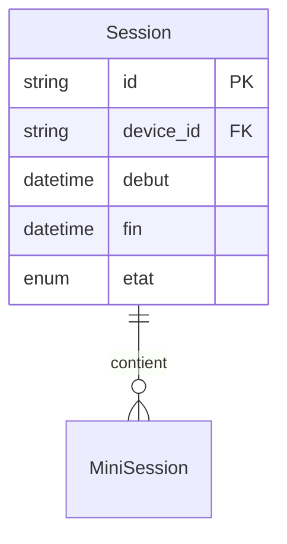

# Modèle : Session

## Description

Période d'usage continue de l'app, du lancement à la fermeture. Aggregate root du BC Entraînement. Contient une ou plusieurs mini-sessions. Deux modes prévus : session courte (~15 min, smartphone, M0) et session longue (30 min+, ordi, M1).

## Contexte métier

[bc-entrainement](../bc-entrainement.md) — Core

## Structure

| Champ | Type | Obligatoire | Description |
|---|---|---|---|
| id | string | Oui | Identifiant unique |
| device_id | string | Oui | Référence au device de Juju |
| debut | datetime | Oui | Horodatage d'ouverture |
| fin | datetime | Non | Horodatage de fermeture (null si en cours ou interrompue) |
| etat | enum | Oui | `en_cours`, `terminee`, `interrompue` |
| mini_sessions | MiniSession[] | Oui | Liste ordonnée des mini-sessions effectuées |

## Relations

| Relation | Modèle cible | Cardinalité | Description |
|---|---|---|---|
| contient | [MiniSession](model-mini-session.md) | 0..n | Une session contient 0+ mini-sessions (0 si fermeture immédiate) |
| identifie_par | [DeviceID](model-device-id.md) | 1 | Chaque session est liée à un device |



## Schéma JSON

```json
{
  "$schema": "https://json-schema.org/draft/2020-12/schema",
  "title": "Session",
  "description": "Période d'usage continue de l'app",
  "type": "object",
  "required": ["id", "device_id", "debut", "etat", "mini_sessions"],
  "properties": {
    "id": { "type": "string" },
    "device_id": { "type": "string" },
    "debut": { "type": "string", "format": "date-time" },
    "fin": { "type": ["string", "null"], "format": "date-time" },
    "etat": { "type": "string", "enum": ["en_cours", "terminee", "interrompue"] },
    "mini_sessions": {
      "type": "array",
      "items": { "$ref": "mini-session.json" }
    }
  }
}
```

## Traçabilité

| Dépendance | Référence |
|---|---|
| bounded context | [bc-entrainement](../bc-entrainement.md) |
| langage ubiquitaire | [Session](../ubiquitous-language.md#s) |
| exigence REQ-SESSION-008 | [req-session](../../0-requirements/fonctionnelles/req-session.md) |
| journey J2 | [Soir semaine smartphone](../../../02-discovery/journeys/journey-soir-semaine-smartphone.md) |
