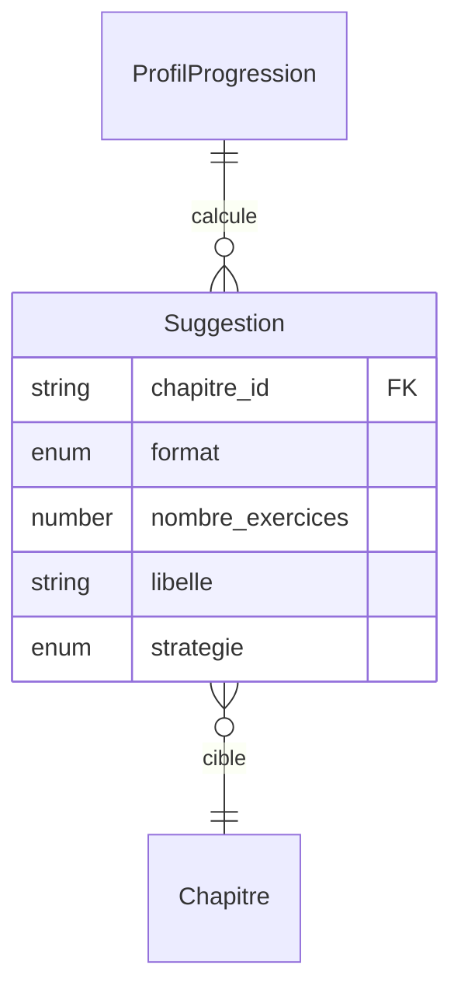

# Modèle : Suggestion

## Description

Recommandation contextuelle d'activité calculée à chaque ouverture de l'app. Value Object jetable — recalculé à chaque ouverture à partir de la progression et du catalogue. Affichée en 1 ligne + bouton Go pour un démarrage en 1 tap.

## Contexte métier

[bc-suggestion](../bc-suggestion.md) — Supporting

## Structure

| Champ | Type | Obligatoire | Description |
|---|---|---|---|
| chapitre_id | string | Oui | Chapitre recommandé |
| format | enum | Oui | `flashcard` ou `qcm` |
| nombre_exercices | number | Oui | Nombre d'exercices proposés (3-5) |
| libelle | string | Oui | Texte affiché (ex : « Poursuis Géométrie : 4 flashcards ») |
| strategie | enum | Oui | `continuite` · `alternance` · `reprise` · `defaut` |

### Stratégies de suggestion

| Stratégie | Déclencheur | Description |
|---|---|---|
| `continuite` | Chapitre en cours, historique suffisant | Poursuivre le dernier chapitre / format utilisé |
| `alternance` | ≥ 3 sessions consécutives sur un même pilier | Proposer l'autre pilier |
| `reprise` | Session précédente interrompue | Proposer le chapitre/format interrompu |
| `defaut` | Historique insuffisant (1ère ou 2e ouverture) | Flashcard maths du 1er chapitre |

## Relations

| Relation | Modèle cible | Cardinalité | Description |
|---|---|---|---|
| cible | [Chapitre](model-chapitre.md) | 1 | Chapitre recommandé (bc-contenu) |
| calculee_depuis | [ProfilProgression](model-profil-progression.md) | 1 | Données de progression utilisées pour le calcul |



## Schéma JSON

```json
{
  "$schema": "https://json-schema.org/draft/2020-12/schema",
  "title": "Suggestion",
  "description": "Recommandation contextuelle d'activité",
  "type": "object",
  "required": ["chapitre_id", "format", "nombre_exercices", "libelle", "strategie"],
  "properties": {
    "chapitre_id": { "type": "string" },
    "format": { "type": "string", "enum": ["flashcard", "qcm"] },
    "nombre_exercices": { "type": "integer", "minimum": 3, "maximum": 5 },
    "libelle": { "type": "string", "minLength": 1 },
    "strategie": { "type": "string", "enum": ["continuite", "alternance", "reprise", "defaut"] }
  }
}
```

## Traçabilité

| Dépendance | Référence |
|---|---|
| bounded context | [bc-suggestion](../bc-suggestion.md) |
| langage ubiquitaire | [Suggestion](../ubiquitous-language.md#s) |
| exigences REQ-SUGGEST-001 à REQ-SUGGEST-005 | [req-suggest](../../0-requirements/fonctionnelles/req-suggest.md) |
| journey J2 (suggestion + Go) | [Soir semaine smartphone](../../../02-discovery/journeys/journey-soir-semaine-smartphone.md) |
