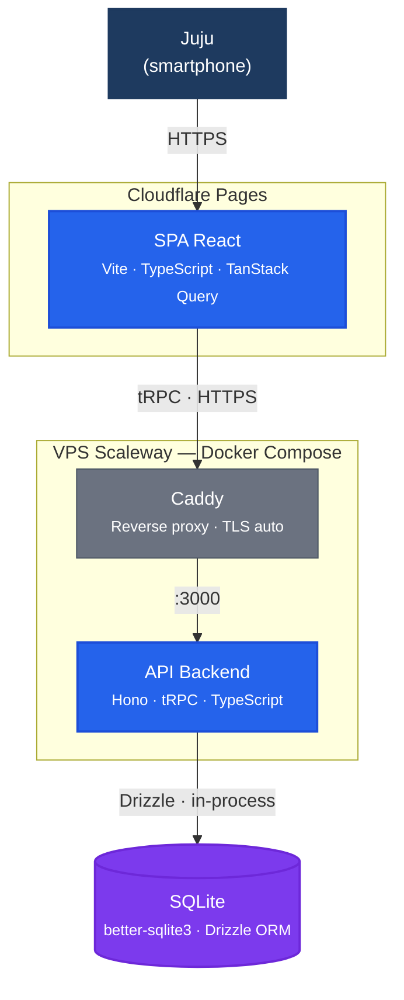

# C4 — Niveau 2 : Container Diagram

> Synthèse des ADR : quels containers, quelle stack, comment ils communiquent.

## Diagramme de containers

## Containers

| Container | Technologie | Rôle |
|---|---|---|
| **SPA React** | React + Vite + TypeScript + TanStack Query + Lucide | Interface utilisatrice. Feature-based (1 dossier/BC). Hébergée sur Cloudflare Pages (CDN) |
| **Caddy** | Caddy (reverse proxy) | Terminaison TLS (Let's Encrypt auto), proxy vers l'API. Container Docker sur le VPS |
| **API Backend** | Hono + tRPC + TypeScript + Node.js LTS | Monolithe API. Vertical slices (1 dossier/BC). Container Docker sur le VPS |
| **SQLite** | SQLite 3 + better-sqlite3 + Drizzle ORM | Base de données fichier, accès in-process (pas de container séparé). Volume Docker persistant |

## Modules backend (monolithe)

| Module | Bounded Context | Responsabilité |
|---|---|---|
| `identite/` | bc-identite | Device ID, jeton d'invitation, middleware auth |
| `contenu/` | bc-contenu | Catalogue pédagogique (piliers, chapitres, exercices, fiches méthode) |
| `entrainement/` | bc-entrainement | Sessions, mini-sessions, modes chrono/libre, bilans |
| `progression/` | bc-progression | Avatar, compteurs d'effort, déblocages, célébrations |
| `suggestion/` | bc-suggestion | Recommandation contextuelle, alternance, reprise |
| `onboarding/` | bc-onboarding | Parcours première utilisation, premier accès psy |

**Communication inter-modules** : appels de méthode in-process (ADR-002). Les événements de domaine (`exercice_effectue`, `mini_session_terminee`…) sont des appels synchrones entre services.

## Références

| Élément | Livrable |
|---|---|
| Stack applicative | [ADR-002](../adr/adr-002-stack-applicative.md) |
| Structure projet | [ADR-003](../adr/adr-003-structure-projet.md) |
| Base de données | [ADR-004](../adr/adr-004-base-de-donnees.md) |
| Authentification | [ADR-005](../adr/adr-005-authentification.md) |
| bc-identite | [bc-identite](../../1-domain/bc-identite.md) |
| bc-contenu | [bc-contenu](../../1-domain/bc-contenu.md) |
| bc-entrainement | [bc-entrainement](../../1-domain/bc-entrainement.md) |
| bc-progression | [bc-progression](../../1-domain/bc-progression.md) |
| bc-suggestion | [bc-suggestion](../../1-domain/bc-suggestion.md) |
| bc-onboarding | [bc-onboarding](../../1-domain/bc-onboarding.md) |

## Traçabilité

| Dépendance | Référence |
|---|---|
| c4-context | [C4 Context](c4-context.md) |
| bounded contexts | [context-map](../../1-domain/context-map.md) |
| ADR | [ADR](../adr/) |
| infrastructure | [infrastructure.md](../deployment/infrastructure.md) |
