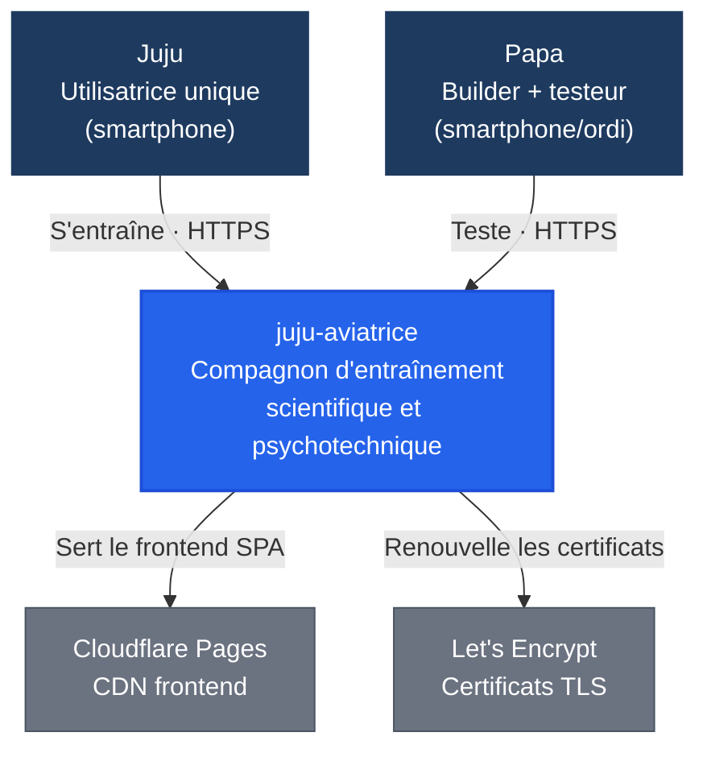

# C4 — Niveau 1 : Context Diagram

> juju-aviatrice vu de l'extérieur : une utilisatrice unique (Juju), un builder (Papa), aucun système métier externe.

## Diagramme de contexte

## Acteurs

| Acteur | Canal d'accès | Rôle | Persona |
|---|---|---|---|
| **Juju** | Web mobile (smartphone, navigateur) | Utilisatrice unique — s'entraîne en maths, physique et psychotechniques | [persona-juju](../../../02-discovery/personas/persona-juju-utilisatrice.md) |
| **Papa** | Web mobile + desktop (test, preview) | Builder, testeur E2E sur smartphone, pas d'accès aux données de Juju | [persona-papa](../../../02-discovery/personas/persona-papa-porteur.md) |

Pas d'accès API public, pas de CLI, pas d'intégration tierce.

## Systèmes externes

| Système | Usage | Protocole | Criticité | MVP |
|---|---|---|---|---|
| **Cloudflare Pages** | Hébergement frontend SPA (CDN mondial, gratuit) | HTTPS | SPOF frontend (si Cloudflare tombe, le frontend est inaccessible). Fallback : aucun — indisponibilité temporaire acceptée | Oui |
| **Let's Encrypt** | Certificats TLS pour l'API backend (via Caddy) | ACME | Non critique (renouvellement automatique, certificat valide 90 jours) | Oui |
| **Scaleway** | VPS hébergeant l'API et la BDD | — | SPOF backend (si le VPS tombe, l'API est inaccessible). Pas de fallback — indisponibilité temporaire acceptée | Oui |

Aucun système métier externe (pas de SSO, pas d'API tierce, pas de notification).

## Références

| Élément | Livrable |
|---|---|
| Juju | [persona-juju](../../../02-discovery/personas/persona-juju-utilisatrice.md) |
| Papa | [persona-papa](../../../02-discovery/personas/persona-papa-porteur.md) |
| Hébergement (Cloudflare + Scaleway) | [ADR-001](../adr/adr-001-cadrage-infrastructure.md) |
| Authentification (device ID) | [ADR-005](../adr/adr-005-authentification.md) |

## Traçabilité

| Dépendance | Référence |
|---|---|
| bounded contexts | [context-map](../../1-domain/context-map.md) |
| exigences non-fonctionnelles | [ENF](../../0-requirements/non-fonctionnelles/) |
| infrastructure | [infrastructure.md](../deployment/infrastructure.md) |
