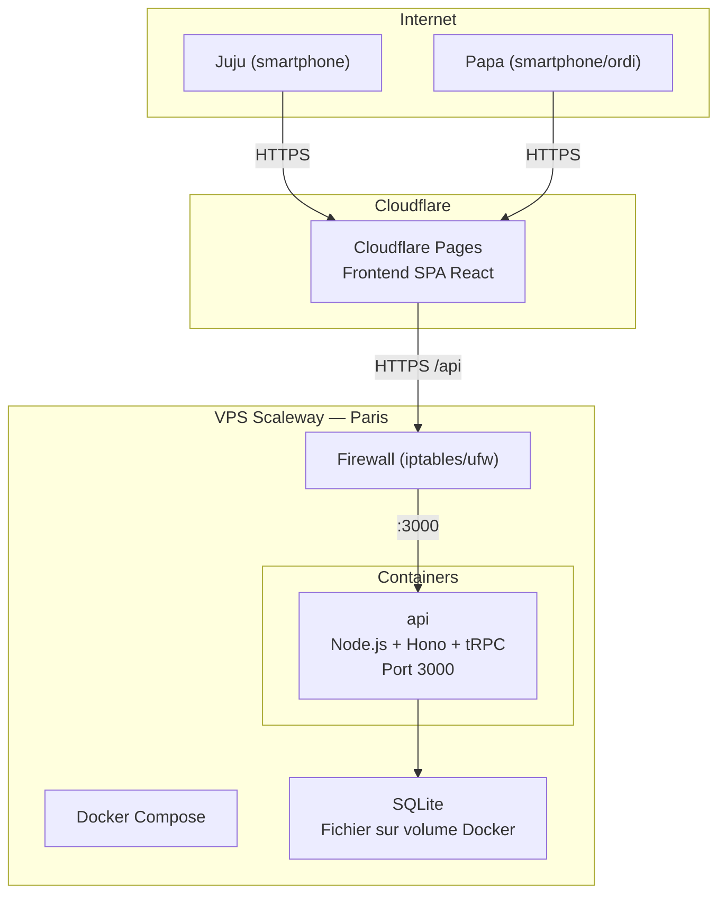
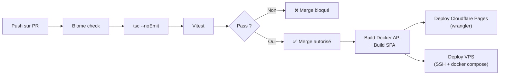

# Infrastructure — juju-aviatrice

> Document unique synthétique. Les décisions structurantes sont dans les ADR — ce document détaille la mise en œuvre technique.

## Diagramme réseau

## Firewall / groupes de sécurité

| Règle | Source | Port | Protocole | Cible |
|---|---|---|---|---|
| SSH | IP de Papa uniquement | 22 | TCP | VPS |
| API | Cloudflare IPs (ranges publiés) | 443 (reverse proxy) ou 3000 | TCP | Container API |
| Tout le reste | * | * | * | DROP |

L'API est exposée via un reverse proxy léger (Caddy ou Traefik) avec terminaison TLS automatique (Let's Encrypt). Seul Cloudflare accède à l'API en production.

## Dimensionnement par environnement

| Env | Compute | BDD | Frontend | Accès |
|---|---|---|---|---|
| **Dev local** | Docker Compose (OrbStack) : api + web | SQLite fichier local | Vite dev server (HMR) | `localhost:5173` + réseau local |
| **Preview** | VPS (même instance, branche preview) | SQLite séparé | Cloudflare Pages preview | URL temporaire Cloudflare |
| **Production** | VPS Scaleway DEV1-S (2 vCPU, 2 Go RAM, 20 Go SSD) | SQLite fichier en volume Docker | Cloudflare Pages | URL principale |

## Backup et restauration

| Donnée | Stratégie | RPO | RTO estimé |
|---|---|---|---|
| SQLite (progression, devices) | Script cron quotidien : copie du fichier `.sqlite` vers un stockage externe (Scaleway Object Storage gratuit ou rsync vers un autre emplacement) | 24h | < 15 min (restaurer le fichier + redémarrer) |
| Code source | Git (GitHub) | Temps réel | < 5 min (clone + deploy) |
| Frontend (build) | Cloudflare Pages (rebuild depuis Git) | Temps réel | < 5 min |

**En M0** : backup quotidien du fichier SQLite suffisant. Les données de progression de Juju ont de la valeur, mais la perte d'une journée est acceptable.

## DNS et certificats TLS

| Env | Domaine | Type | Certificat |
|---|---|---|---|
| Frontend (prod) | `juju.{domaine}.dev` (à choisir) | CNAME → Cloudflare Pages | Cloudflare (automatique, gratuit) |
| API (prod) | `api.juju.{domaine}.dev` | A → IP VPS Scaleway | Let's Encrypt via Caddy (renouvellement automatique) |
| Preview | `*.pages.dev` (auto Cloudflare) | — | Cloudflare |

**À décider** : le nom de domaine exact. Peut être un sous-domaine d'un domaine existant de Papa ou un domaine dédié.

## Pipeline CI/CD

| Stage | Outil | Déclencheur | Bloquant |
|---|---|---|---|
| Lint + format | Biome | Push sur PR | Oui |
| Type-check | `tsc --noEmit` | Push sur PR | Oui |
| Tests | Vitest | Push sur PR | Oui |
| Couverture | Vitest coverage | Push sur PR | Non (warning) |
| Build frontend | `pnpm build` (Vite) | Merge dans main | — |
| Deploy frontend | Cloudflare Pages (GitHub integration ou wrangler) | Merge dans main | — |
| Build API | Docker build multi-stage | Merge dans main | — |
| Deploy API | SSH → `docker compose pull && docker compose up -d` | Merge dans main | — |

### Stratégie de déploiement

| Paramètre | Valeur |
|---|---|
| **Stratégie** | Recreate (stop + start) — acceptable pour 1 utilisatrice, downtime < 30s |
| **Health check** | Endpoint `/health` sur l'API (200 OK si SQLite accessible) |
| **Rollback** | Manuel : `docker compose pull` de l'image précédente. Rapide (< 2 min) |

### Infrastructure as Code

| Paramètre | Valeur |
|---|---|
| **Outil** | Docker Compose (`docker-compose.yml` versionné dans le repo) |
| **Provisionnement VPS** | Script shell documenté (`scripts/setup-vps.sh`) ou README étape par étape |
| **Exécution** | GitHub Actions (CD) + local (docker compose up en dev) |

## Estimation des coûts

### Hypothèses

| Paramètre | Valeur |
|---|---|
| Provider | Scaleway (VPS) + Cloudflare (frontend, DNS) |
| Région | Paris (fr-par) |
| Source tarifs | Pricing public Scaleway et Cloudflare, mai 2026 |

### Coûts mensuels (production)

| Service | Détail | Coût/mois |
|---|---|---|
| **VPS Scaleway DEV1-S** | 2 vCPU, 2 Go RAM, 20 Go SSD, IP publique | ~4 € |
| **Cloudflare Pages** | Frontend SPA, tier gratuit (illimité) | 0 € |
| **Cloudflare DNS** | Tier gratuit | 0 € |
| **Domaine** (si dédié) | .dev ou .fr, renouvelé annuellement | ~1-2 €/mois amorti |
| **GitHub** | Repo privé + Actions (2000 min/mois gratuit) | 0 € |
| **Backup** | Scaleway Object Storage (tier gratuit 75 Go) ou rsync | 0 € |
| **Total** | | **~5-6 €/mois** |

### Coûts phase build

Identiques à la prod (le VPS tourne en continu). Pas de coût supplémentaire — le dev est local, la CI est gratuite.

### Récapitulatif annuel

| Phase | Coût/mois | Coût/an |
|---|---|---|
| Run (production) | ~5-6 € | ~60-72 € |
| Domaine (si dédié) | — | ~12-15 € |
| **Total année 1** | | **~72-87 €** |

## Intégrations SI externes

Aucune — le projet n'interagit avec aucun système d'information externe. Pas de SSO, pas d'API tierce, pas de service de notification.

## Traçabilité

| Dépendance | Référence |
|---|---|
| ADR-001 Cadrage infra | [adr-001](../adr/adr-001-cadrage-infrastructure.md) |
| ADR-002 Stack | [adr-002](../adr/adr-002-stack-applicative.md) |
| ADR-011 Environnement dev | [adr-011](../adr/adr-011-environnement-dev.md) |
| ADR-013 Pipeline CI/CD | [adr-013](../adr/adr-013-pipeline-cicd.md) |
| exigences non-fonctionnelles | [ENF](../../0-requirements/non-fonctionnelles/) |
