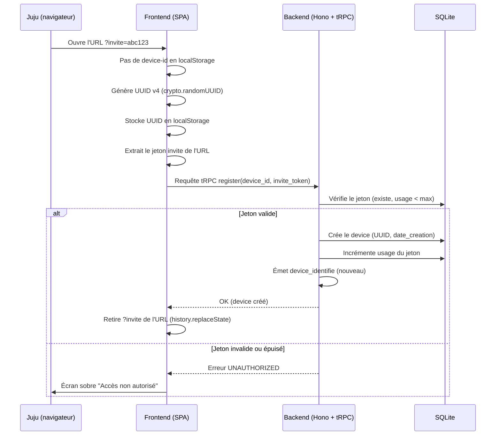
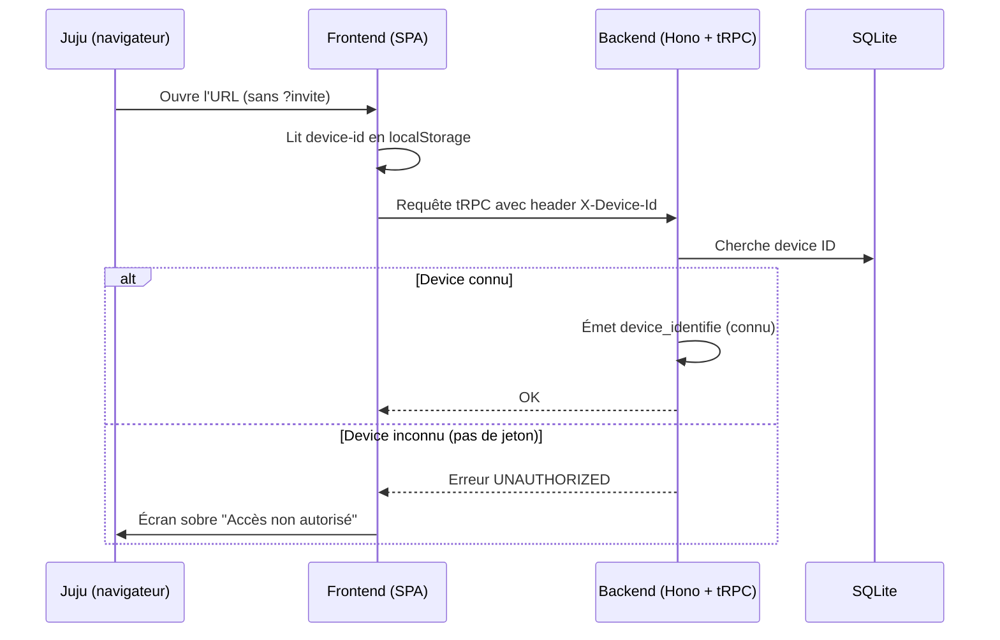

# Sécurité — juju-aviatrice

> Document de référence sécurité. Source de vérité pour l'implémentation — le code est généré en fonction de ce document.

## Décisions structurantes (références ADR)

| Domaine | ADR |
|---|---|
| Authentification (device ID + jeton d'invitation) | [ADR-005](adr/adr-005-authentification.md) |
| Autorisation (device ID valide = accès complet) | [ADR-006](adr/adr-006-autorisation.md) |
| Multi-tenancy (mono-tenant) | [ADR-002 §Multi-tenancy](adr/adr-002-stack-applicative.md) |
| Gestion des secrets (.env) | [ADR-007](adr/adr-007-gestion-secrets.md) |
| Logs et audit | [ADR-008](adr/adr-008-observabilite.md) |

---

## 1. Authentification

### Stratégie

| Paramètre | Valeur |
|---|---|
| **Provider** | Custom (aucun provider externe) |
| **Protocole** | Device ID (UUID v4 en localStorage) + jeton d'invitation pour la création |
| **Token** | Pas de JWT — le device ID fait office d'identifiant permanent |
| **Stockage client** | `localStorage` (clé : `device-id`) |
| **Transport** | Header HTTP `X-Device-Id` sur chaque requête tRPC |
| **Création device** | Protégée par jeton d'invitation (`?invite=<token>` dans l'URL, usage limité) |
| **MFA / SSO / Logout** | Non applicables |

### Flux d'identification — Première visite (avec jeton)

### Flux d'identification — Visite ultérieure (sans jeton)

### Cas limites

| Situation | Comportement |
|---|---|
| Header `X-Device-Id` absent | Erreur tRPC `UNAUTHORIZED` — écran sobre |
| UUID inconnu + pas de jeton d'invitation | Erreur `UNAUTHORIZED` — pas de création automatique |
| UUID inconnu + jeton valide | Création du device, incrémentation du compteur du jeton |
| UUID inconnu + jeton épuisé (max utilisations atteint) | Erreur `UNAUTHORIZED` |
| localStorage vidé par Juju | Nouveau UUID généré → nécessite un jeton valide pour recréer. Si le jeton est épuisé, Papa génère un nouveau jeton ou migre les données en base |

---

## 2. Autorisation

### Modèle

**Pas de modèle d'autorisation formel** (ni RBAC, ni ABAC). Un device ID valide en base donne accès à toutes les fonctionnalités.

### Rôles fonctionnels

| Rôle | Description | Persona |
|---|---|---|
| Utilisatrice (implicite) | Tout device ID valide en base | Juju |

Papa n'a pas de rôle dans l'app — il gère le contenu en code/fichiers et le déploiement via CI/CD.

### Matrice des permissions

| Ressource (BC) | Device ID valide | Device ID absent/invalide |
|---|---|---|
| Chapitres, exercices, fiches méthode (contenu) | Lecture ✅ | ❌ |
| Sessions (entrainement) | Lecture/Écriture ✅ (scopé par device) | ❌ |
| Profil progression, avatar, déblocages | Lecture/Écriture ✅ (scopé par device) | ❌ |
| Suggestion | Lecture ✅ | ❌ |
| Onboarding | Lecture/Écriture ✅ (scopé par device) | ❌ |

### Isolation des données

Chaque requête tRPC est scopée par le device ID du header. Les repositories filtrent systématiquement par `device_id` — un device ne peut pas accéder aux données d'un autre device.

---

## 3. Sécurité opérationnelle

### Rate limiting

| Catégorie | Limite | Fenêtre | Action |
|---|---|---|---|
| API authentifiée (device ID valide) | 60 requêtes | 1 min | `429 Too Many Requests` |
| Tentatives de création device (register) | 5 requêtes | 15 min | `429` + bannissement IP 30 min |
| Requêtes sans device ID | 10 requêtes | 1 min | `429` |

Middleware Hono avec compteur en mémoire (pas besoin de Redis pour 1 utilisatrice).

### Audit des actions sensibles

| Événement | Champs tracés | Rétention |
|---|---|---|
| Nouveau device créé | device_id, invite_token (masqué), ip, user_agent, timestamp | Durée de vie des logs Docker |
| Tentative de création refusée (jeton invalide/épuisé) | ip, user_agent, invite_token (masqué), timestamp | Durée de vie des logs Docker |
| Device ID invalide (tentative d'accès) | ip, user_agent, timestamp | Durée de vie des logs Docker |

Pas d'audit détaillé des actions métier (exercices, sessions) — les données de progression ne sont pas exposées à Papa (ENF-SEC-005).

### RGPD et protection des données

| Exigence | Implémentation |
|---|---|
| **ENF-SEC-004** : Pas de trackers tiers | Aucun script tiers (pas de GA, Hotjar, Sentry). Pas de cookies tiers |
| **ENF-SEC-005** : Pas de surveillance | Aucune API ni écran n'expose le détail des sessions/scores/heures de Juju. Métriques de régularité uniquement pour le moteur de suggestion |
| **Données stockées** | Device ID (UUID), progression (compteurs effort, état avatar, chapitres), historique sessions |
| **Données NON stockées** | Nom, email, mot de passe, géolocalisation, heures de connexion détaillées |
| **Consentement** | Implicite — Papa est le builder et le représentant légal de Juju (mineure) |
| **Droit à l'effacement** | Suppression manuelle en base par Papa si demandé |

---

## 4. Bounded contexts concernés

| Bounded context | Règle de sécurité |
|---|---|
| **bc-identite** | Génération device ID, validation jeton d'invitation, middleware tRPC central |
| **bc-contenu** | Lecture seule, filtré par device ID valide. Contenu identique pour tous les devices |
| **bc-entrainement** | Écriture scopée par device ID (sessions, exercices) |
| **bc-progression** | Écriture scopée par device ID (avatar, compteurs, déblocages). Données non exposées à Papa |
| **bc-suggestion** | Lecture progression du device. Pas d'exposition hors contexte |
| **bc-onboarding** | Écriture scopée par device ID (état onboarding) |

## Traçabilité

| Dépendance | Référence |
|---|---|
| ADR sécurité | [ADR-005](adr/adr-005-authentification.md), [ADR-006](adr/adr-006-autorisation.md), [ADR-007](adr/adr-007-gestion-secrets.md) |
| exigences sécurité | [req-securite](../0-requirements/non-fonctionnelles/req-securite.md) |
| personas | [Juju](../../02-discovery/personas/persona-juju-utilisatrice.md), [Papa](../../02-discovery/personas/persona-papa-porteur.md) |
| bounded contexts | [context-map](../1-domain/context-map.md) |
