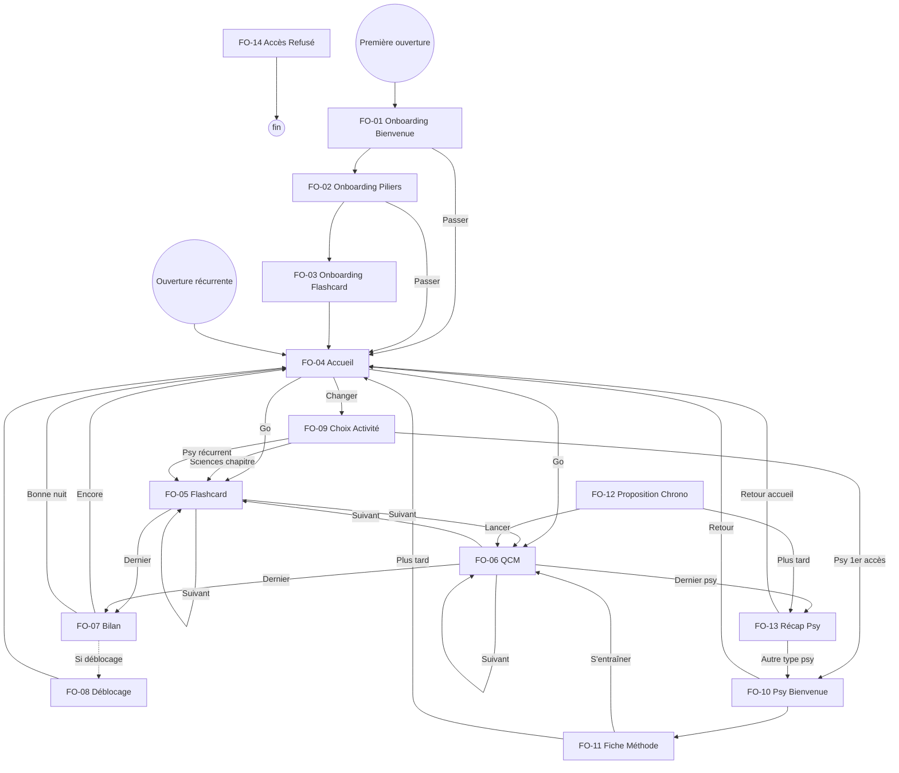

# Navigation — juju-aviatrice M0

## Arbre de navigation

## Inventaire des écrans

| ID | Nom | Type | Journey | Spec |
|---|---|---|---|---|
| FO-01 | Onboarding Bienvenue | Onboarding | J1 étape 1 | [spec](spec-ecran-onboarding-bienvenue.md) |
| FO-02 | Onboarding Piliers | Onboarding | J1 étape 2 | [spec](spec-ecran-onboarding-piliers.md) |
| FO-03 | Onboarding Flashcard | Onboarding | J1 étapes 3-5 | [spec](spec-ecran-onboarding-flashcard.md) |
| FO-04 | Accueil | Hub | J2 étape 1 | [spec](spec-ecran-accueil.md) |
| FO-05 | Flashcard | Exercice | J2 étape 3 | [spec](spec-ecran-flashcard.md) |
| FO-06 | QCM | Exercice | J2 étape 3 / J3 étapes 4+7 | [spec](spec-ecran-qcm.md) |
| FO-07 | Bilan Mini-session | Bilan | J2 étape 4 | [spec](spec-ecran-bilan.md) |
| FO-08 | Déblocage | Célébration | J2 étape 6 | [spec](spec-ecran-deblocage.md) |
| FO-09 | Choix Activité | Navigation | J2 alt 1 | [spec](spec-ecran-choix-activite.md) |
| FO-10 | Psy Bienvenue | Onboarding psy | J3 étape 1 | [spec](spec-ecran-psy-bienvenue.md) |
| FO-11 | Fiche Méthode | Contenu | J3 étape 2 | [spec](spec-ecran-fiche-methode.md) |
| FO-12 | Proposition Chrono | Interstitiel | J3 étape 6 | [spec](spec-ecran-proposition-chrono.md) |
| FO-13 | Récap Séquence Psy | Bilan | J3 étape 8 | [spec](spec-ecran-recap-psy.md) |
| FO-14 | Accès Refusé | Sécurité | — | [spec](spec-ecran-acces-refuse.md) |

## Couverture des journeys

| Journey | Écrans couverts | Couverture |
|---|---|---|
| J1 — Première utilisation | FO-01, FO-02, FO-03 → FO-04 | 100% |
| J2 — Soir semaine smartphone | FO-04, FO-05, FO-06, FO-07, FO-08, FO-09 | 100% |
| J3 — Découverte psychotechniques | FO-10, FO-11, FO-06, FO-12, FO-13 | 100% |
| Sécurité | FO-14 | 100% |

## Périmètre M0

- **Back-office** : aucun écran BO — le contenu est géré en code (hardcodé ou fichiers de données).
- **Emails transactionnels** : aucun — pas de notifications, pas de relance.
- **Responsive** : smartphone uniquement (mobile-first, pas de layout desktop spécifique).

## Traçabilité

| Dépendance | Référence |
|---|---|
| journey J1 | [Première utilisation](../../02-discovery/journeys/journey-premiere-utilisation.md) |
| journey J2 | [Soir semaine smartphone](../../02-discovery/journeys/journey-soir-semaine-smartphone.md) |
| journey J3 | [Découverte psychotechniques](../../02-discovery/journeys/journey-decouverte-psychotechniques.md) |
| wireframes HTML | [Index wireframes](html-wireframes/index.html) |
