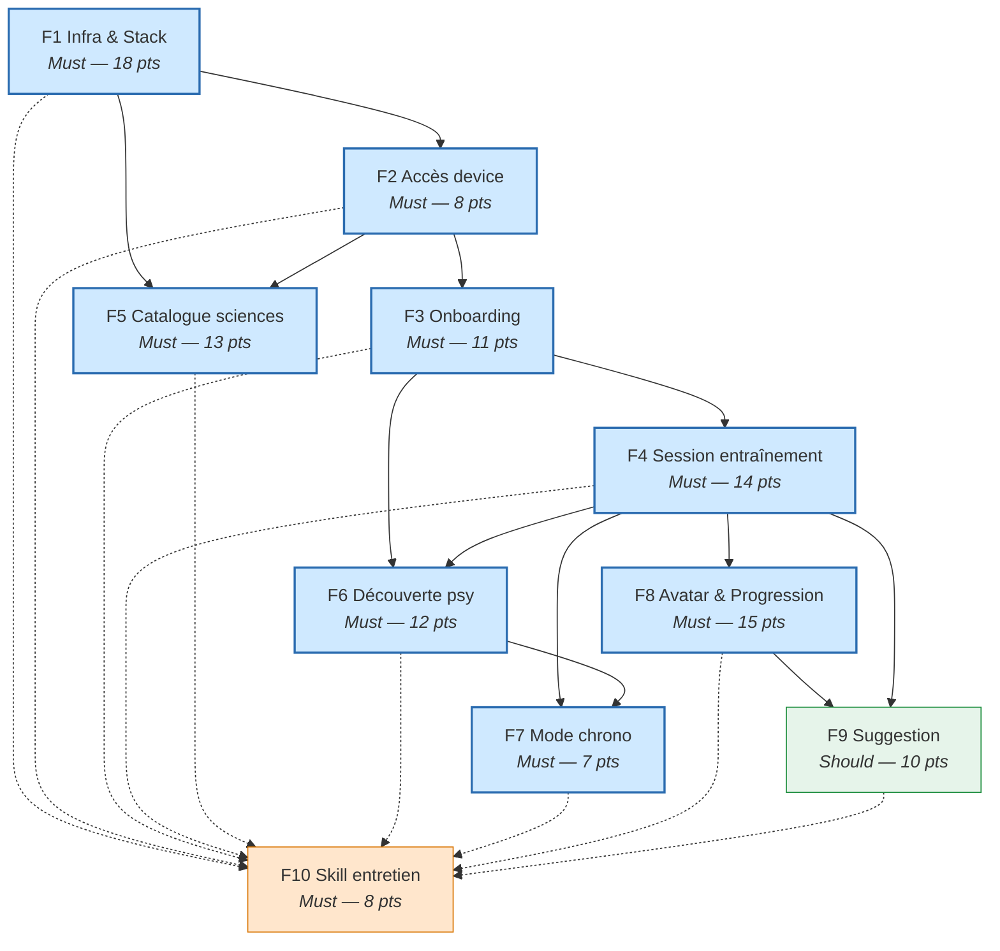

# Plan — Vue d'ensemble — juju-aviatrice

> Dashboard synthétique du plan d'implémentation M0. Mis à jour via `pbm-plan-overview`.
> **2026-06-13** — Thomas (Papa) avec Claude

## Indicateurs

| Métrique | Valeur |
|----------|--------|
| Features | 11 (6 terminées) |
| User stories (US) | 28 |
| Stories techniques (TS) | 23 |
| Total stories | 51 |
| Points totaux | 122 |
| **Points livrés** | **70 / 122 (57 %)** |
| **Stories terminées** | **30 / 51 (59 %)** |

## Avancement par statut

| Statut | Features | Stories | Points |
|--------|----------|---------|--------|
| Terminée | 6 (F1, F2, F3, F4, F5, F11) | 30 | 70 |
| En cours | 0 | 0 | 0 |
| À faire | 5 (F6–F10) | 21 | 52 |
| Bloquée | 0 | 0 | 0 |

## Features par priorité

| Prio | Feature | Stories | Points | Statut |
|------|---------|---------|--------|--------|
| **Must** | [F1 — Infrastructure & Stack](features/f1-feature-infra-stack.md) | 0 US + 7 TS | 18 | Terminée |
| **Must** | [F2 — Accès sécurisé par device](features/f2-feature-auth-device.md) | 2 US + 2 TS | 8 | Terminée |
| **Must** | [F3 — Parcours de bienvenue](features/f3-feature-onboarding-bienvenue.md) | 5 US + 0 TS | 11 | Terminée |
| **Must** | [F4 — Session d'entraînement courte](features/f4-feature-session-entrainement.md) | 5 US + 1 TS | 14 | Terminée |
| **Must** | [F5 — Catalogue contenu scientifique](features/f5-feature-catalogue-scientifique.md) | 2 US + 3 TS | 13 | Terminée |
| **Must** | [F6 — Découverte psychotechniques](features/f6-feature-decouverte-psy.md) | 4 US + 1 TS | 12 | À faire |
| **Must** | [F7 — Mode chronométré](features/f7-feature-mode-chrono.md) | 3 US + 0 TS | 7 | À faire |
| **Must** | [F8 — Avatar & Progression](features/f8-feature-avatar-progression.md) | 3 US + 3 TS | 15 | À faire |
| **Should** | [F9 — Suggestion contextuelle](features/f9-feature-suggestion.md) | 2 US + 2 TS | 10 | À faire |
| **Must** | [F10 — Skill entretien jalon M0](features/f10-feature-skill-entretien.md) | 0 US + 3 TS | 8 | À faire |
| **Must** | [F11 — Diagnostic de version](features/f11-feature-version-diagnostic.md) | 1 US + 2 TS | 6 | Terminée |

## Planning

| Ordre | Feature | Dépend de | Points | Initiatives |
|-------|---------|-----------|--------|-------------|
| 1 | [F1 — Infrastructure & Stack](features/f1-feature-infra-stack.md) | — | 18 | I-T.1 |
| 2 | [F2 — Accès sécurisé](features/f2-feature-auth-device.md) | F1 | 8 | I-T.1 |
| 3 | [F3 — Parcours de bienvenue](features/f3-feature-onboarding-bienvenue.md) | F1, F2 | 11 | I-3.1.1 |
| 4 | [F5 — Catalogue scientifique](features/f5-feature-catalogue-scientifique.md) | F1, F2 | 13 | I-1.1.1 à I-1.1.5 |
| 5 | [F6 — Découverte psy](features/f6-feature-decouverte-psy.md) | F1, F2, F3, F4 | 12 | I-2.1.1 à I-2.1.4 |
| 6 | [F4 — Session d'entraînement](features/f4-feature-session-entrainement.md) | F1, F2, F3 | 14 | I-3.1.3 |
| 7 | [F8 — Avatar & Progression](features/f8-feature-avatar-progression.md) | F1, F2, F3, F4 | 15 | I-4.1.1, I-4.1.2, I-4.1.3, I-3.1.2 |
| 8 | [F7 — Mode chronométré](features/f7-feature-mode-chrono.md) | F4, F6 | 7 | I-2.1.5 |
| 9 | [F9 — Suggestion contextuelle](features/f9-feature-suggestion.md) | F1, F2, F4, F8 | 10 | I-3.1.3 |
| 10 | [F10 — Skill entretien M0](features/f10-feature-skill-entretien.md) | Toutes M0 livrées | 8 | I-3.1.5 |

**Chemin critique** : F1 → F2 → F3 → F4 → F8 → F9 (66 pts) + F10 en fin de chaîne.

**Parallélisable** : F5 (catalogue sciences) peut avancer en parallèle de F3 dès que F1+F2 sont posés. F6 (psy) en parallèle de F8 dès que F4 est prêt.

## Dépendances entre features

**Légende** : bleu = Must · vert = Should · orange = Entretien (fin de chaîne). Trait plein = dépendance directe · trait pointillé = F10 dépend de tout M0.

## Répartition par estimation

| Taille | Points | Nombre | % |
|--------|--------|--------|---|
| XS | 1 | 1 | 2% |
| S | 2 | 25 | 52% |
| M | 3 | 22 | 46% |
| L | 5 | 0 | 0% |
| XL | 8 | 0 | 0% |

## Alertes

- **Aucune story XL** — le découpage est satisfaisant.
- **Aucune dépendance circulaire** — le graphe est un DAG propre.
- **Aucune feature > 8 stories** — maximum 7 (F1).
- **F9 Suggestion est Should** — seule feature non Must. Un stub (suggestion par défaut hardcodée) suffit pour les features Must qui en dépendent (F4 S1 utilise un Go avec suggestion stub).
- **F10 est le dernier maillon** — ne peut être validé qu'après ~3-4 semaines d'usage réel de Juju sur M0.

---

## Transition vers l'implémentation

### Prérequis

1. **Choix des 3+3 chapitres avec Juju** (F5 S4/S5) — mai-juin 2026
2. **Charte de ton rédigée** (I-3.1.1) — à intégrer dans F3/F4/F6 dès les premiers écrans
3. **VPS Scaleway provisionné** + DNS configuré (F1 S7)
4. **Smartphone de Juju identifié** (modèle, OS, navigateur) pour ENF-INT-001

### Risques

| Risque | Impact | Mitigation |
|--------|--------|------------|
| Chapitres non choisis avec Juju | F5 bloqué | Prévoir des chapitres par défaut, ajuster après |
| Performance SPA sur smartphone ancien | ENF-PERF-001 échoué | Tester tôt (F1 S3), tree-shaking agressif |
| Contenu psy inadapté au niveau Juju | J3 échoue | Relecture par Papa, ajustement itératif |
| Avatar non engageant visuellement | Pilier 4 manqué | Valider maquettes avec Juju avant implem (F8 S4) |

### Recommandations

1. **Démarrer par F1 + F2** (26 pts) pour poser le socle et tester tôt sur device réel
2. **Lancer F5 S4/S5 (contenu sciences) en parallèle** — la génération de contenu via skills est indépendante du code
3. **Intégrer la charte de ton dès F3** — les formulations sont structurantes et impactent F4, F6, F7, F8
4. **Tester sur smartphone de Juju à chaque feature livrée** (ENF-AUT-005 + ENF-INT-001)

---

## Traçabilité

| Dépendance | Référence |
|------------|-----------|
| features | [Features](features/) |
| definition-of-done | [DoD](definition-of-done.md) |
| initiatives | [Initiatives](../01-strategy/initiatives.md) |
| exigences | [Exigences fonctionnelles](../03-design/0-requirements/fonctionnelles/), [ENF](../03-design/0-requirements/non-fonctionnelles/) |
| architecture | [ADR](../03-design/2-architecture/adr/) |
| wireframes | [Navigation](../03-design/3-wireframes/navigation.md) |
| API | [API tRPC](../03-design/4-api/index.md) |
